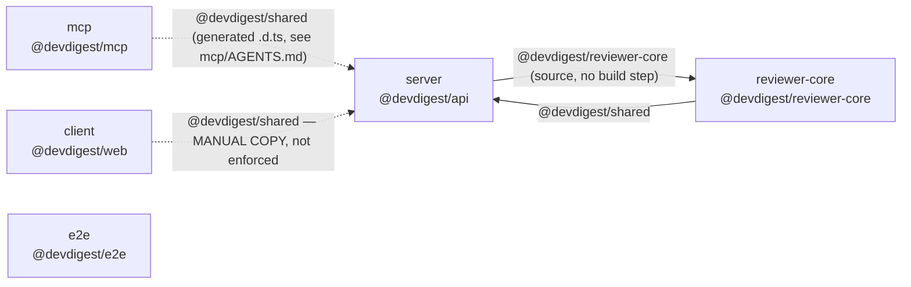

# Dependency Checker

This repo is **not a monorepo** — independent `package.json` + lockfiles per
package (`server/`, `client/`, `reviewer-core/`, `e2e/`, `mcp/`, per root
`CLAUDE.md` — and root `CLAUDE.md` is not guaranteed to be current: this repo
has grown a package it forgot to add to that table before), each installed
separately. Any dependency audit that looks at only a remembered list will
miss the interesting findings: the same heavy package installed twice at
different versions, or a size/weight problem in one package that a decision
in another package caused — **or an entire package nobody updated the docs
about.** Root `CLAUDE.md`'s package table is a hint about where to start
looking, never the ground truth for what exists.

The bar for this skill is that the report is *the same shape every time* —
a developer who has seen one run should be able to jump straight to the
section they care about in the next one, without re-reading the whole thing.
Follow the template in **Report structure** below exactly; don't reorder or
rename its sections.

## Step 0 — Discover packages, don't assume the list

Find every directory at the repo root that has its own `package.json`,
excluding anything under `node_modules`:

```bash
find . -maxdepth 2 -name package.json -not -path '*/node_modules/*'
```

Use *this* list for every step below — not `server`/`client`/`reviewer-core`/
`e2e`/`mcp` from memory or from root `CLAUDE.md`'s table. If the discovered
list differs from that table (a package the docs don't mention, or one the
table lists that no longer exists), that mismatch is itself a finding — put
it in **Findings**, don't just quietly use the corrected list and move on.

## Step 1 — Collect raw numbers with the bundled script

Don't hand-roll `du` and `package.json` parsing per package — it's the same
work repeated for every package and easy to get subtly wrong (scoped package
paths, `.d.ts`-only deps that round to 0 KB, tsconfig files that contain `//`
comments). Run the bundled script once per discovered package instead:

```bash
node .claude/skills/dependency-checker/scripts/collect-sizes.mjs <package-dir>
```

Each call prints JSON: `packageName`, `totalNodeModulesKB`, `depCount` (prod/
dev/peer), a `deps[]` array already sorted heaviest-first (`name`, `type`,
`versionRange`, `installed`, `sizeKB` — `sizeKB: null` means the script
couldn't find or measure that dep locally, `installed: false` usually means
it's hoisted or optional and only resolvable at a different path), and
`internalAliases[]` from that package's `tsconfig.json` `paths` — these are
the **cross-package edges**, not npm packages, and feed the graph in Step 3.

If `node_modules` is missing for a package (never installed / freshly
cloned), say so plainly in the report instead of guessing sizes — don't run
`pnpm install` yourself just to produce numbers; that's a side effect the
user didn't ask for.

## Step 2 — Layer on what the script can't measure

Run per package, best-effort, and note in the report when one can't run
(offline, no lockfile, etc.) rather than silently omitting it:

**Package manager consistency** — this repo's stack is pnpm (root
`CLAUDE.md`). For each discovered package, check what's actually committed,
not what you'd expect:

```bash
ls <pkg>/pnpm-lock.yaml <pkg>/package-lock.json <pkg>/yarn.lock 2>/dev/null
cat <pkg>/.npmrc 2>/dev/null
```

A package with no `pnpm-lock.yaml` isn't automatically "not installed yet" —
check whether it has a *different* lockfile instead (npm's
`package-lock.json`, or yarn's), which means it's actually being installed
with the wrong tool for this repo, not merely missing a lockfile. A package
with **two** different lockfiles committed is its own finding — it means two
different tools have written state there at different times. An `.npmrc`
setting `node-linker=hoisted` explains why that package's `node_modules`
holds real directories instead of pnpm's usual `.pnpm`-symlink layout —
worth a one-line note in that package's breakdown so the size numbers don't
look mysteriously different from a sibling package for no stated reason.

**Vendored-copy drift** — root `CLAUDE.md` calls out `@devdigest/shared` as
existing in two places on purpose (`server/src/vendor/shared` is canon,
`client/src/vendor/shared` is a manually-synced copy) with a rule, not a
tool, keeping them equal ("change the canon, sync the copy in the same
commit"). A rule that isn't enforced by anything can be broken silently, so
check it every run rather than trusting the rule holds:

```bash
diff -rq server/src/vendor/shared client/src/vendor/shared
```

Any files it reports differing are real, present-day drift — not a
hypothetical risk to mention in passing. Name the specific files in
**Findings**, and if there are any, this is CRITICAL-tier: the two copies
are supposed to be the same contract and currently aren't. If any *other*
vendored duplication exists in the repo (check `*/src/vendor/**` broadly,
not just this one pair the docs happen to name), diff that too.

**Outdated versions** — `cd <pkg> && pnpm outdated --format json`. Exits
non-zero when things *are* outdated (that's normal, not a failure) but
prints valid JSON either way. Skip this for a package that isn't on pnpm
(see above) — its own package manager's equivalent command applies instead,
or just note that outdated-checking wasn't run and why.

**Candidate-unused deps** — for each *direct* dependency, grep that
package's source for the import specifier, e.g.:

```bash
grep -rl '"lucide-react"\|from .lucide-react' client/src client/*.config.* 2>/dev/null
```

Check `*.config.*` files and `package.json`'s own `scripts` too — plenty of
deps (`tailwindcss`, `eslint-*`, `drizzle-kit`, `postcss`) are used only from
config or a CLI script, never `import`ed. A dependency with zero hits
anywhere is a *candidate* for removal, not a confirmed one — type-only
imports, dynamic `require()`, and re-exports can all produce false
positives. Report these as SUGGESTION-tier and phrase them as "verify and
remove", never as an instruction to remove outright, and never remove
anything yourself as part of running this skill — it's an audit, not a
cleanup.

**Duplicates across packages** — from every discovered package's `deps[]`
list, group by package name and flag any that appear in ≥2 packages at
different major versions (e.g. `zod ^3.24.1` everywhere is fine and worth
noting as consistent; two different majors of the same lib is the actual
finding).

## Step 3 — Draw the component graph

Two diagrams, both Mermaid, both go in the report even when small — the
point is a stable place to look, not a proof of complexity:

**Package graph** — one node per *discovered* package directory (Step 0 —
not a remembered list), one edge per `internalAliases` entry pointing at
another package's source tree (e.g. `reviewer-core`'s alias resolving into
`../server/src/vendor/shared`) plus one dashed edge per vendored-copy pair
found in Step 2 (e.g. `client/src/vendor/shared` manually synced from
`server/src/vendor/shared`), labeled "manual sync" and marked with whether
Step 2's diff found current drift. An alias that resolves inside the same
package (`@/*` in client, most of the time) is not a graph edge — it's just
a local path shortcut, skip it.

**Heaviest external deps per package** — a simple graph, one subgraph per
package, showing only each package's top 3–5 deps by `sizeKB`. This is
about spotting "this package is heavy because of these three libraries" at
a glance, not an exhaustive tree.

Example shape (adapt the actual nodes/edges to what Step 0/1 found — don't
copy this verbatim, and don't assume it's exactly these five packages):



## Step 4 — Classify, don't just list

For every dependency, the report must make three things legible at a glance:
**prod vs dev vs peer** (from `package.json`), **direct vs transitive** (this
script only measures direct deps — say so if a duplicate/size concern
actually lives in a transitive dep and needs `pnpm why <name>` to confirm,
and offer that command rather than guessing at the transitive tree), and
**internal vs external** (an `internalAliases` entry is a same-repo
component boundary, not a supply-chain dependency — never mix it into the
"heaviest external deps" table).

## Report structure

Always use this exact structure, in this order:

```markdown
# Dependency Audit — dev-digest (<date>)

## 1. Package inventory

| Package | package.json name | prod | dev | peer | node_modules | package manager |
|---|---|---|---|---|---|---|
| server | @devdigest/api | 23 | 8 | 0 | 239 MB | pnpm |
...

Every row here is a package Step 0 actually found — not a fixed list. Note
in prose, right after the table, if this run's discovery disagrees with
root `CLAUDE.md`'s package table (a package it doesn't mention, or one it
lists that's gone) — that disagreement is a finding in its own right, not
a detail to fix quietly and move past.

## 2. Component graph

<package-to-package Mermaid diagram from Step 3, plus 1-2 sentences
calling out anything non-obvious it shows — e.g. the vendored @devdigest/shared
duplication, or a package with zero internal edges>

## 3. Per-package breakdown

### server (239 MB, 23 prod + 8 dev)

<heaviest external deps Mermaid or table — pick whichever renders the
comparison more clearly for the number of deps involved>

| Dependency | Type | Size | Note |
|---|---|---|---|
| typescript | dev | 22.8 MB | ...|

<internal aliases table: alias → target → what package it resolves into>

(repeat this subsection per package, same column order every time)

## 4. Findings

Group under exactly these three headings, using DevDigest's own severity
vocabulary (CRITICAL / WARNING / SUGGESTION — the same tiers this repo's
review agents already use, so the report reads consistently with everything
else DevDigest produces) so a developer instantly knows how urgent each
item is:

### CRITICAL
<duplicated deps at incompatible majors that can actually break at runtime,
deprecated packages still in prod dependencies, a vendored-copy pair Step 2's
diff found actually differing right now (name the files), anything pnpm
outdated or the deprecation flag surfaced that is a real risk — not just
"old">

### WARNING
<same package at different minor/patch versions across packages, unusually
large deps relative to what they're used for, a package using the wrong
package manager or carrying two different lockfiles, an internal alias that
quietly changed what it points to, anything otherwise inconsistent with root
CLAUDE.md's stated rules (e.g. an unintended THIRD copy of shared code)>

### SUGGESTION
<candidate-unused deps pending manual verification, outdated non-breaking
versions, opportunities to dedupe or replace a heavy dep with a lighter one>

Every finding cites the package + dependency name + evidence (the number,
the grep result, the pnpm outdated line) — no finding without a number
behind it. If a category is empty, write "None found" under it; don't omit
the heading.

## 5. Prioritized recommendations

A numbered list, most actionable/highest-impact first, each 1-2 lines:
what to do, and the concrete benefit (install time, bundle size, avoided
breakage, reduced attack surface). This is the section a developer reads
first — write it last, once findings are in, and don't repeat the findings
verbatim here; synthesize.
```

Keep prose between sections short — this is a scan-and-act document, not a
narrative. Numbers and tables carry the report; sentences only explain what
isn't obvious from the numbers.

## What this skill is not

- Not a security scanner. If the user wants CVEs, point them at `pnpm audit`
  as a follow-up command — don't fold it into this report's findings.
- Not a bundle analyzer for `client`'s shipped JS (that's what
  `next build`'s own output / `@next/bundle-analyzer` is for) — `sizeKB`
  here is installed-on-disk size, not what reaches the browser. Say so if
  the user seems to conflate the two.
- Never modifies `package.json`, runs `pnpm install`, or deletes anything.
  It reports; the developer decides.
