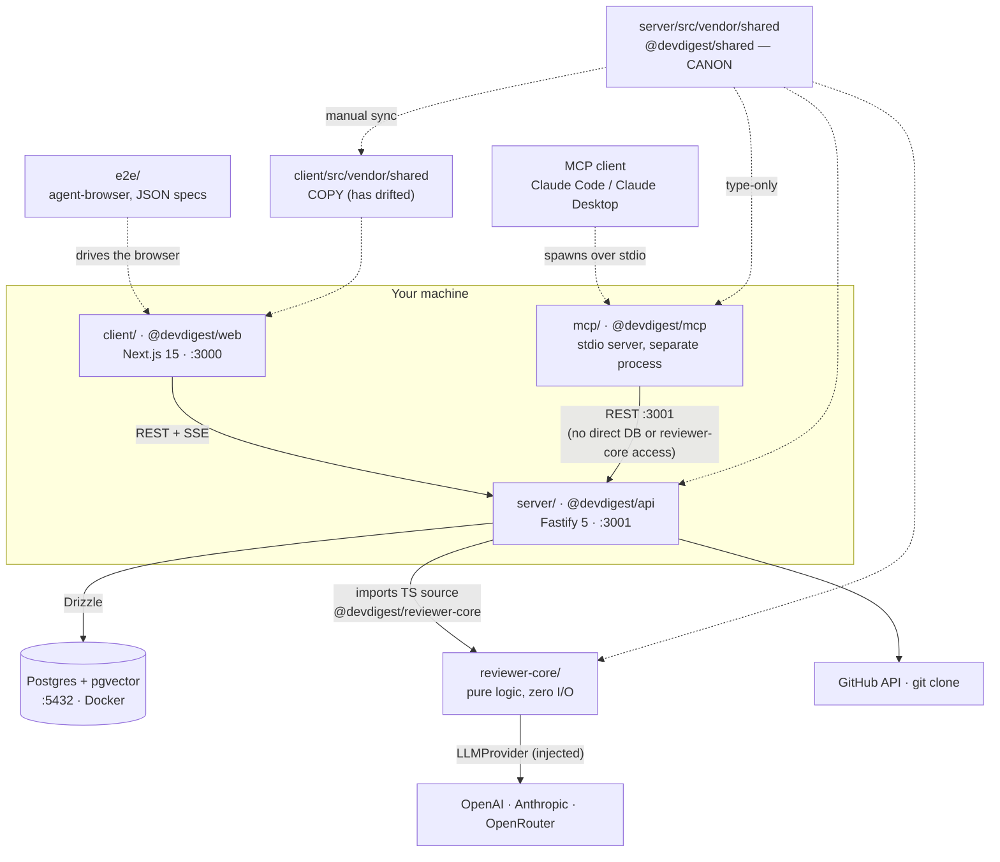
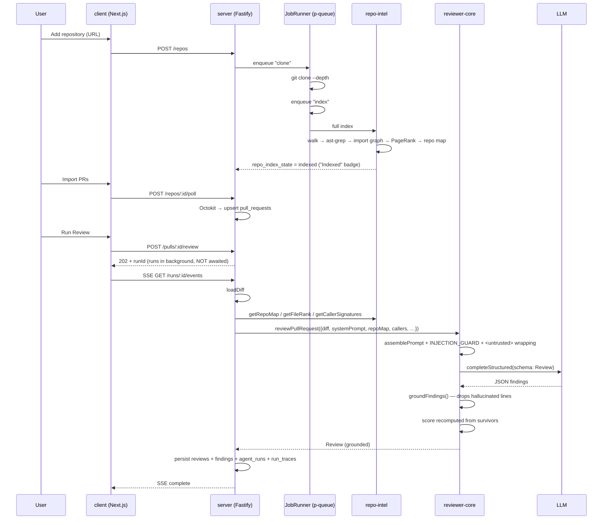
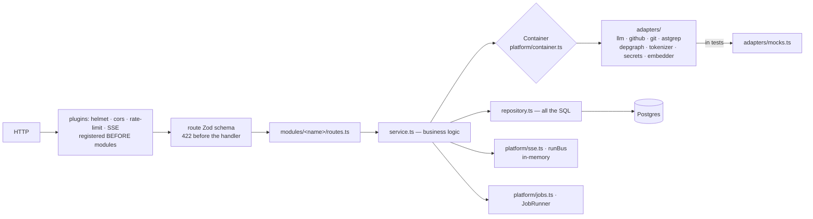

# Onboarding to DevDigest

A practical map of the project for someone seeing it for the first time: what it
is, what it's made of, how the parts talk to each other, and what deserves a
closer look.

Nearby references: [`README.md`](README.md) (how to run) ·
[`server/README.md`](server/README.md) (API map + DI) ·
[`reviewer-core/README.md`](reviewer-core/README.md) (review pipeline) ·
[`server/src/modules/repo-intel/README.md`](server/src/modules/repo-intel/README.md) (the indexer) ·
[`TESTING.md`](TESTING.md) (testing strategy).

---

## 1. What the project is for

**Local-first AI pull-request review.** Add a GitHub repository → the server
clones and indexes it → import a PR → press **Review** → an LLM agent returns
structured findings with a severity and a score.

More important than the feature set: **this is a course starter template**, not a
finished product. It does exactly one thing end to end, and each lesson (L01–L08)
adds back one thing that was cut — the lesson map is in
[`README.md`](README.md#what-you-build-in-the-course).

That explains most of what looks odd here: empty tables, unused fields,
references to directories that don't exist.

Only two calls leave the machine: **GitHub** (PR data) and the **LLM**.
Everything else is local.

---

## 2. Tech stack

| Layer | Technologies |
|---|---|
| **Backend** | Fastify 5, Drizzle ORM, Postgres + pgvector, `postgres.js`, Zod (via `fastify-type-provider-zod`), pino, `fastify-sse-v2`, p-queue |
| **Frontend** | Next.js 15 (App Router), React 19, TanStack Query, Tailwind 4, next-intl, recharts, mermaid, react-markdown |
| **Indexer** | `@ast-grep/napi`, `@vscode/ripgrep`, `dependency-cruiser`, `graphology` (PageRank), `js-tiktoken` |
| **LLM** | OpenAI SDK, Anthropic SDK, OpenRouter (through the OpenAI-compatible API) |
| **Git / GitHub** | `simple-git`, `octokit` |
| **Tests** | Vitest everywhere; testcontainers (Postgres) for integration; Vercel `agent-browser` (CDP) for e2e |
| **Infra** | Docker for Postgres only; API and web run on the host. pnpm ≥ 10, Node ≥ 22 |

---

## 3. Package map and how they connect

Five **independent** packages — this is **not** a pnpm workspace. Each has its
own `package.json` and its own lockfile. Code is shared between them **only
through tsconfig path aliases**, not through published modules.

| Folder | Package | What it is | Port |
|---|---|---|---|
| `server/` | `@devdigest/api` | Fastify API + Drizzle/Postgres | 3001 |
| `client/` | `@devdigest/web` | Next.js 15 web studio | 3000 |
| `reviewer-core/` | `@devdigest/reviewer-core` | pure review engine, zero I/O | — |
| `e2e/` | `@devdigest/e2e` | deterministic browser flows | — |
| `mcp/` | `@devdigest/mcp` | MCP server (stdio), HTTP client of the API | — |
| `server/src/vendor/shared` | `@devdigest/shared` | Zod contracts for everyone | — |



The things worth internalising immediately:

- **`reviewer-core` is never compiled to JS.** Its `build` is just
  `tsc --noEmit`. The server pulls its TypeScript **sources** directly (tsx in
  dev, vitest in tests) via the alias `@devdigest/reviewer-core` →
  `../reviewer-core/src`.
- **`reviewer-core` knows nothing about the DB, GitHub, or the filesystem.** Its
  only side effect is calling an injected `LLMProvider`. That is what makes it
  trivially mockable in tests.
- **`repo-intel` is not a separate package** — it's a module inside the server:
  [`server/src/modules/repo-intel`](server/src/modules/repo-intel).
- **`mcp/` is a separate process, not a request path into the other three.** An
  MCP client (Claude Code, Claude Desktop) spawns it over **stdio**; it never
  touches Postgres or `reviewer-core` directly, and reaches everything else by
  being a thin HTTP client of the API on `:3001` — see
  [`mcp/docs/request-lifecycle.md`](mcp/docs/request-lifecycle.md).
- **`@devdigest/shared`** holds Zod contracts that double as Fastify route
  schemas: one definition drives both request validation and response
  serialization.

---

## 4. The end-to-end flow



**Reading order for the code** (I recommend exactly this sequence):

1. [`server/src/app.ts`](server/src/app.ts) — bootstrap
2. [`server/src/modules/index.ts`](server/src/modules/index.ts) — module registry
3. [`server/src/modules/reviews/routes.ts`](server/src/modules/reviews/routes.ts)
4. [`server/src/modules/reviews/service.ts`](server/src/modules/reviews/service.ts)
5. **[`server/src/modules/reviews/run-executor.ts`](server/src/modules/reviews/run-executor.ts)** — this is the heart
6. [`reviewer-core/src/review/run.ts`](reviewer-core/src/review/run.ts)
7. [`reviewer-core/src/prompt.ts`](reviewer-core/src/prompt.ts)
8. [`reviewer-core/src/grounding.ts`](reviewer-core/src/grounding.ts)

---

## 5. How the server is built



Every module has the same three-layer shape, and it is followed consistently:

```
modules/<name>/
  routes.ts       HTTP + Zod schemas, no business logic
  service.ts      business logic, no SQL and no HTTP
  repository.ts   SQL, no HTTP
  constants.ts    literals
  helpers.ts      pure transforms
```

Starter modules: `settings`, `repos`, `pulls`, `polling`, `workspace`, `agents`,
`reviews`, `repoIntel`.

The `repo-intel` indexer exposes everything through a single facade
([`service.ts`](server/src/modules/repo-intel/service.ts)) — consumers never
touch the pipeline internals:

| Method | What it gives | Used by |
|---|---|---|
| `getRepoMap(repoId)` | the cached repo skeleton | review prompt (starter) |
| `getFileRank(repoId, files)` | importance percentile per file | review prompt (starter) |
| `getCallerSignatures(...)` | callers of changed symbols | review prompt (starter) |
| `getBlastRadius(...)` | impacted symbols | L04 |
| `getUnresolvedReferences(...)` | phantom-symbol detection | L06 |
| `getConventionSamples(...)` | top files for convention extraction | L02 |

---

## 6. What's normal here — don't waste time being surprised

- A classic three-layer module plus a DI container with lazily constructed
  adapters behind interfaces. Tests inject mocks via `ContainerOverrides`.
- Zod as the single source of truth for cross-package contracts.
- TanStack Query with string query keys and careful `invalidateQueries`.
- Next.js pages are thin; logic lives in colocated `_components/<Name>/` folders
  with the test next to the component.
- Background work goes through p-queue, mirrored into a `jobs` table (timeouts
  plus retries).
- Secrets never touch git or the database: `~/.devdigest/secrets.json`, mode
  `0600`, with `process.env` as a fallback. The single read chokepoint is
  [`adapters/secrets/local.ts`](server/src/adapters/secrets/local.ts).
- Every package has its own CI workflow with a path filter.

---

## 7. What's odd here — and why

### 7.1. Not a monorepo, yet with cross-package imports

Five separate install boundaries — four `pnpm-lock.yaml` (`server/`, `client/`,
`e2e/`, `mcp/`) plus `reviewer-core/`'s own `package-lock.json` — while `server`
imports `reviewer-core`'s TypeScript sources through a tsconfig alias.
Consequence: changing `reviewer-core` requires no build — but breaking the
server is easy, and no package manager will warn you.

### 7.2. `@devdigest/shared` exists in two copies, and they have already drifted

The canon is `server/src/vendor/shared`, the copy is `client/src/vendor/shared`.
There is no sync script. Current drift (5 files):

| File | Missing from the client copy |
|---|---|
| `adapters.ts` | `'openrouter'` in `LLMProvider.id`, the `sessionId` field, `CommitFile` / `CommitFilesPayload` |
| `contracts/productionize.ts` | `'openrouter'` in the provider enum |
| `contracts/eval-ci.ts` | the whole `AgentManifest` schema |
| `contracts/knowledge.ts` | `AgentVersionConfig` |
| `contracts/trace.ts` | comment differences only |

So the client's types believe OpenRouter doesn't exist, while the server supports
it fully. This is the first thing you'll trip over.

### 7.3. The DB has 40 tables, ~16 of which are never read

`ci_runs`, `ci_installations`, `eval_cases`, `eval_runs`, `conformance_checks`,
`composed_reviews`, `memory`, `code_chunks`, `digests`, `installed_plugins`,
`onboarding`, `conventions`, `multi_agent_runs`, `pr_brief`, `skill_versions`,
`workspace_members`.

This is **intentional** — the schema is complete from day one and the lessons
fill it in. Don't delete and don't "fix" it.

### 7.4. Comments are stuffed with internal task codes

`T1.3`, `T3`, `T2.2`, `F1`, `A2`, `acceptance #10`, `L01`–`L08`. Without the
course material they mean nothing — read them as noise.

### 7.5. `costUsd` is computed all the way through and written nowhere

The providers compute it,
[`reviewer-core/src/review/run.ts`](reviewer-core/src/review/run.ts) accumulates
it across chunks and returns it in `ReviewOutcome` — and `run-executor.ts` simply
ignores it. Commit `d45ab0d` ("remove per-PR/run cost, keep model pricing") cut
the consumer and left the producer. It returns in L01 ("Run cost badge").

### 7.6. `.gitignore` protects a directory that doesn't exist

The lines about `agent-runner/dist/` — the folder itself was cut from the starter
(it returns in L06, "Export to CI"). The `reviewer-core` README also references a
"CI runner" that isn't in the tree yet.

### 7.7. `@fastify/autoload` is a dependency but is never imported

Modules are registered statically in
[`modules/index.ts`](server/src/modules/index.ts) — a deliberate choice: native
dynamic `import()` of `.ts` files isn't portable across tsx / bundler / vitest.
The dependency is simply dead.

### 7.8. The model does not score itself

Its `score` is thrown away and recomputed deterministically from the findings
that survived grounding ([`run.ts:208`](reviewer-core/src/review/run.ts)). Its
`verdict` does not block CI — blocking is derived from severities via
`countBlockers`. This is a feature, not a bug, but it is counter-intuitive.

### 7.9. The grounding gate drops findings citing lines that don't exist

If a finding doesn't intersect any diff hunk for the same file, it is dropped
([`grounding.ts:52`](reviewer-core/src/grounding.ts)). The exception is
"full-file" kinds (`secret_leak`, `lethal_trifecta`, `phantom`, `hook`): those
only need the file to be present in the diff.

### 7.10. Prompt-injection defense is one block of text, with no keyword scanning

`INJECTION_GUARD` ([`prompt.ts:16-28`](reviewer-core/src/prompt.ts)) is appended
to every agent's system prompt. Deliberately **no** denylists: the comment
explains that a denylist only ever catches one phrasing in one language. All
untrusted content is wrapped in `<untrusted source="…">`, and attempts to close
the tag are escaped.

### 7.11. Migrations are NOT applied on boot

The number-one cause of first-run errors (`relation ... does not exist`). Run it
yourself:

```sh
cd server && pnpm db:migrate
```

### 7.12. `runBus` is an in-process singleton

[`platform/sse.ts`](server/src/platform/sse.ts). Event buffers, run cancellation,
and subscriptions all live in `Map`s and `Set`s. So horizontal scaling would
break both the SSE stream and cancellation. Fine for a local-first studio, not
for production.

### 7.13. e2e is neither Playwright nor Cypress

It's JSON specs (`e2e/specs/*.flow.json`) on top of Vercel `agent-browser` (a CDP
CLI), plus a homegrown runner [`e2e/run.ts`](e2e/run.ts). The specs are
deterministic, run on seeded data, and never call an LLM.

### 7.14. Test splitting is done by filename suffix

`*.it.test.ts` spins up a real Postgres via testcontainers; everything else is
hermetic. Add a DB-backed test without that suffix and the CI split breaks
silently.

### 7.15. The `polling` module doesn't poll

It performs a manual PR-list sync and never triggers a review. The name is
misleading; reviews are always manual.

### 7.16. `.claude/skills/` holds third-party skills with a `skills-lock.json`

Copied from public GitHub repos (`mcollina/skills`, `vercel-labs/next-skills`,
`wshobson/agents`, …) with content hashes. This is tooling for AI agents, not
product code.

### 7.17. Agent prompts are duplicated

The runtime canon is the `agents.system_prompt` column in the DB; the
human-readable originals are in [`docs/agent-prompts/`](docs/agent-prompts/).
Syncing is manual: edit the file, then `PUT /agents/:id`.

---

## 8. Getting started

```sh
./scripts/dev.sh          # Postgres + .env + deps + migrations + seed + API + web
```

Then open http://localhost:3000. Flags: `--no-seed`, `--no-client`, `--db-only`,
`--help`.

You don't need keys to boot — `loadConfig` marks every secret optional; you enter
them in the Settings UI at runtime.

Manual steps, if you want them one at a time:

```sh
docker compose up -d                      # Postgres + pgvector
cd server && pnpm install
pnpm db:migrate                           # required — NOT run on boot
pnpm db:seed                              # idempotent demo data
pnpm dev                                  # API :3001
cd ../client && pnpm install && pnpm dev  # web :3000
```

### Common traps

| Symptom | Cause |
|---|---|
| `relation ... does not exist` | migrations not applied → `pnpm db:migrate` |
| port 5432 in use | another Postgres; change the host port in `docker-compose.yml` |
| `vector` type errors | pgvector is enabled by migration `0000` — make sure you migrated the same DB |
| full reset | `docker compose down -v`, then `./scripts/dev.sh` |
