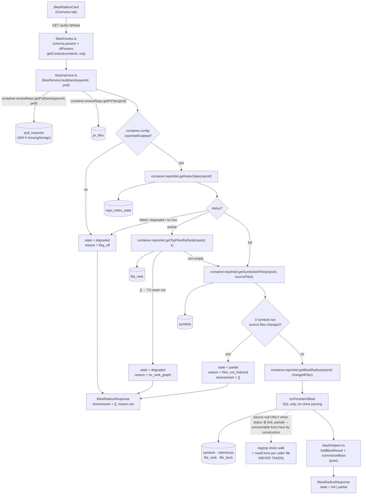

Explanation — this is the shipped design of Blast Radius (L06) and why it is
built this way; not a how-to, not an API reference.

# Blast Radius (L06)

A reviewer looking at a twelve-line change to `limiter.ts` has no cheap way to
answer the question that decides whether the change is safe: *what else touches
this?* Blast Radius answers it from data the indexer already wrote — which
symbols the PR's changed files declare, who calls them, and which HTTP endpoints
or scheduled jobs those callers serve.

It was built to the plan in `specs/l06-blast-radius.md`; read that first for the
inventory, the constraints, the risks accepted and the acceptance criteria. This
document explains the mechanism as it exists in the tree, for someone who will
read the code next week.

**No model is involved anywhere in this feature, and no code is parsed during a
request.** Both are design decisions with teeth, and the second is the harder
one — see §The gate.

## The request path

The slice has four files and **no `repository.ts`**: nothing is persisted and
nothing is cached, so there is no SQL of its own to own. Every read goes through
`container.repoIntel` or `container.reviewRepo` — the sanctioned channel between
slices — and the service never touches `container.db`.

## The state truth table

`state` is not a summary of how the request went; it is a statement about **how
much of the answer the persisted index could support**. `decideBlastState`
(`server/src/modules/blast/helpers.ts`) is an ordered sequence of early returns,
first match wins:

| # | Condition | `state` | `reason` |
|---|---|---|---|
| 1 | `!flagOn` | `degraded` | `flag_off` |
| 2 | `indexStatus === 'failed'` | `degraded` | `index_failed` |
| 3 | `indexStatus === 'degraded'` and `lastIndexedSha === ''` | `degraded` | `no_index` |
| 4 | `indexStatus === 'degraded'` | `degraded` | `index_failed` |
| 5 | `indexStatus === 'partial'` and `!rankGraphPresent` | `degraded` | `no_rank_graph` |
| 6 | `sourceFileCount > 0` and `indexedSymbolCount === 0` | `partial` | `files_not_indexed` |
| 7 | `indexStatus === 'partial'` | `partial` | `index_partial` |
| 8 | otherwise | `full` | `null` |

The order is load-bearing, which is why it is written as returns rather than as a
lookup: row 1 outranks row 2 (a switched-off installation should not be told its
index failed), and row 6 outranks row 7 (a PR whose own files are unindexed gets
the actionable reason, not the generic one).

**Row 5 is the row this feature exists for.** `repo_index_state.status =
'partial'` has two very different meanings. It can mean a working index that ran
out of budget partway; it can also mean the whole tier-3 block was skipped, so
`file_edges`, `file_rank` and `file_facts` were never written at all. In the
second case `getResolvedCallers` INNER JOINs to `file_rank` and returns zero
rows — which is byte-identical to "this symbol has no callers". Without row 5 the
card would confidently show an empty blast radius for a repository it knows
nothing about. `getTopFilesByRank(repoId, 1)` is the capability probe that tells
them apart, and it is asked **only** when the status is `partial`, because
`status='full'` already implies the rank step succeeded.

`state` is carried on `BlastRadiusResponse`, a `.extend()` of the existing
`BlastRadius` — **not** on `BlastRadius` itself. `BlastRadius` is embedded in
`PrBrief`, the declared shape of the `pr_brief.json` jsonb column, and a newly
*required* field there would reject every document a later lesson writes without
it (root `INSIGHTS.md` 2026-08-02). `reason` is `.nullish()` on the wrapper,
because the `full` path has none.

## The gate — why the order of operations is the feature

`RepoIntel.getBlastRadius` has two implementations behind one name. The fast one,
`tryPersistentBlast`, is pure Postgres. The fallback walks the entire git clone
with ripgrep, asks for references per symbol, and reads every caller file off
disk — at request time. `tryPersistentBlast` returns `null` (and the fallback
runs) when the flag is off, or when `repo_index_state` has no row or a status
outside `{full, partial}`.

So `BlastService` consults `getIndexState` and the `repoIntelEnabled` flag
**before** calling `getBlastRadius`, and calls it only when the state is not
`degraded`. With the flag on and the status in `{full, partial}`, the fallback is
unreachable by construction. That invariant is named in a comment beside the
gate, and it is asserted rather than assumed: `server/test/blast.it.test.ts`
injects a `codeIndex` whose `symbols()` and `references()` **throw**, so any
request that entered the ripgrep path would fail rather than merely be slow.

An `LLMProvider` whose every method throws is injected for all three provider ids
in the same file, which is what makes "no model call" a test result instead of a
claim.

## Folding, and the two things the facade does not do

`foldBlastResult` turns the facade's flat caller list into one `DownstreamImpact`
per changed symbol. Three behaviours are worth knowing:

- **A caller inside the symbol's own declaring file is excluded.** The ripgrep
  path filters these; the persistent path does not. "Who else calls this" is the
  question, and a reference inside the declaration is not a downstream consumer.
- **The cap is per changed symbol, 20 by default.** L06 also changed
  `tryPersistentBlast` to clamp per symbol rather than over the flattened list —
  a combined cap of 20 handed every symbol after the first zero callers, which the
  UI would have rendered as "no callers found". Both sorts are made total
  (`rank` DESC, then `file` ASC, then `line` ASC) so the clamp is reproducible;
  `rank` ties constantly, since every value is `0` whenever the hotness-free
  PageRank collapses.
- **A symbol with zero callers is still emitted**, with empty arrays, so the card
  can show a `0` badge rather than dropping the symbol silently.

`DownstreamImpact.file` carries each entry's own declaring file, added because
`symbol` alone is not a unique key: two changed symbols can share a bare name
from different files (two test suites each with a local `renderWithIntl`
helper is a real case, not a hypothetical one). Without it, the client's React
key collided and the UI silently mis-attributed which declaring file a caller
group belonged to. `BlastCallerRow.viaSymbol` is itself a bare name —
`getResolvedCallers` resolves references by name, not by declaration id — so
`foldBlastResult` genuinely cannot tell which of two same-named declarations a
given caller reaches; both entries end up sharing the same caller group by
construction. What it CAN fix is which files count as "the symbol's own
declaring file": `declFilesBySymbol` collects every file a name is declared in,
not just the first, so a self-reference is excluded regardless of which
same-named declaration it sits in.

`rank` never reaches the wire. It is an uncalibrated absolute PageRank number
with no units a reviewer could read, and `BlastCaller` has no field for it — it
is a sort key and nothing else.

Endpoints and crons come from `file_facts`, precomputed by the indexer, and are
attributed **per symbol** from the facts of that symbol's own retained callers
rather than as one flat union.

## `summary` is a template

`summarizeBlast` is a deterministic string builder: two identical requests return
byte-identical text. It is rendered by the card as *data*, the same class as
`intent.intent`, not as an i18n string — the card's own labels come from
`messages/en/blast.json`. Nothing about this feature touches an agent's
`system_prompt`, and root `INSIGHTS.md` (2026-08-02) is the reason: a convention
block added to one made the review measurably worse.

## The UI, and the one place the plan corrected a design decision

The card lives on the **Overview** tab beside `IntentCard` — not as a fourth tab.
It takes resolved data plus flags, never a `prId` it fetches from; the tab owns
the query. Every count on screen is derived during render.

Caller rows navigate, and **where they navigate depends on whether the caller
file is part of this PR**:

| Condition | Affordance |
|---|---|
| `changedPaths.has(file)` | a button → `?tab=diff&goto=<path>:<line>` |
| otherwise, with `repoFullName` and `headSha` | a link to `githubBlobUrl(...)` at the head commit |
| otherwise | plain text |

The branch is not a hedge. Blast callers are cross-file by construction and the
declaring file is excluded, while the Diff tab renders only the PR's own patches
and sets a line anchor id only for lines that exist in a patch. An in-app jump is
therefore *possible* only for a caller the PR itself changed. Making every row
navigate in-app would need a source-file viewer this repo does not have.

The handoff itself is two search params set in **one** `router.replace`:
`PrDetailView` owns every param on the screen, including clearing `goto` once
`DiffTab` reports it consumed — which is also what makes a second click on the
same row work, since the param has to be absent for the next identical value to
register as a change. The scroll orchestration is `useDiffLineTarget`, promoted
into `components/diff-viewer/` in this change because Blast Radius is its second
consumer; `SmartDiffViewer`'s findings badge is the first.

## Over MCP

`get_blast_radius` was a placeholder in L05 and is a real tool as of L06: one
`GET /pulls/:id/blast` beyond resolution, shaped by `toConciseBlast` into caller
strings, a `caller_count` that is never truncated, and a `truncated` marker when a
cap bites. Its `isError` semantics inverted with the implementation — a
`degraded` state now **does** set `isError: true`, because the fix is a user
action the message names ("re-analyze the repository"), where the placeholder
never set it because nothing could have made it succeed. No UUID, `confidence` or
`rationale` field appears anywhere in the result, asserted as a recursive field
check rather than a regex over the serialized text.

## Two limitations, stated rather than hidden

1. **Caller line numbers come from the indexed commit, not the PR head.**
   `references.line` is written against `repo_index_state.lastIndexedSha` (the
   repository's default branch), so in a file the PR itself edits the line can be
   off by the size of the edit. Re-resolving lines against the PR head would mean
   parsing at request time, which is exactly what this feature forbids.
2. **A cron badge shows the stored string verbatim.** `extractCrons` emits either
   a raw cron expression or `job:<kind>`; a human-readable job name and its
   cadence exist nowhere in `file_facts`, and inventing one in the UI would be a
   guess about a job's identity.

## What was deliberately not built

**The two-level reverse import-graph walk.** `getEdges(repoId)` returns *every*
edge for the repository unfiltered, so a reverse traversal today means loading
the whole graph and building an adjacency map per request — "rebuild the import
graph during the request", the thing the acceptance criteria forbid. And it would
be additive at best: `file_facts` already attributes endpoints and crons to the
files that *directly* call a changed symbol, which is the semantics
`endpoints_affected` describes. `file_edges_repo_to_idx` consequently remains an
index no query uses. That is a documented state, not an oversight to fix by
inventing a consumer.

**Prior PRs touching these files.** `PrHistory` stays unused, reserved for a
later lesson. `pr_brief` no longer stays empty — it is written by the PR Risk
Brief (`docs/pr-risk-brief.md`).

## Where things are

| Thing | Path |
|---|---|
| Wire contract | `server/src/vendor/shared/contracts/review-api.ts` (`BlastState`, `BlastStateReason`, `BlastRadiusResponse`) + the client copy |
| Truth table, fold, summary (pure) | `server/src/modules/blast/helpers.ts` |
| Caps | `server/src/modules/blast/constants.ts` |
| Orchestration and the gate | `server/src/modules/blast/service.ts` |
| HTTP edge | `server/src/modules/blast/routes.ts`, registered in `server/src/modules/index.ts` |
| Per-symbol caller clamp | `server/src/modules/repo-intel/service.ts` (`tryPersistentBlast`) |
| Proofs | `server/test/{blast-helpers,repo-intel-blast-clamp}.test.ts`, `server/test/blast.it.test.ts` |
| Query hook + paired invalidation | `client/src/lib/hooks/blast.ts`, `client/src/lib/hooks/repo-intel.ts` |
| The card | `client/src/app/repos/[repoId]/pulls/[number]/_components/BlastRadiusCard/` |
| Scroll orchestration | `client/src/components/diff-viewer/useDiffLineTarget.ts` |
| Copy | `client/messages/en/blast.json`, plus `brief.block.blast` |
| MCP tool | `mcp/src/{tools,handlers,shape,types,constants}.ts` |
