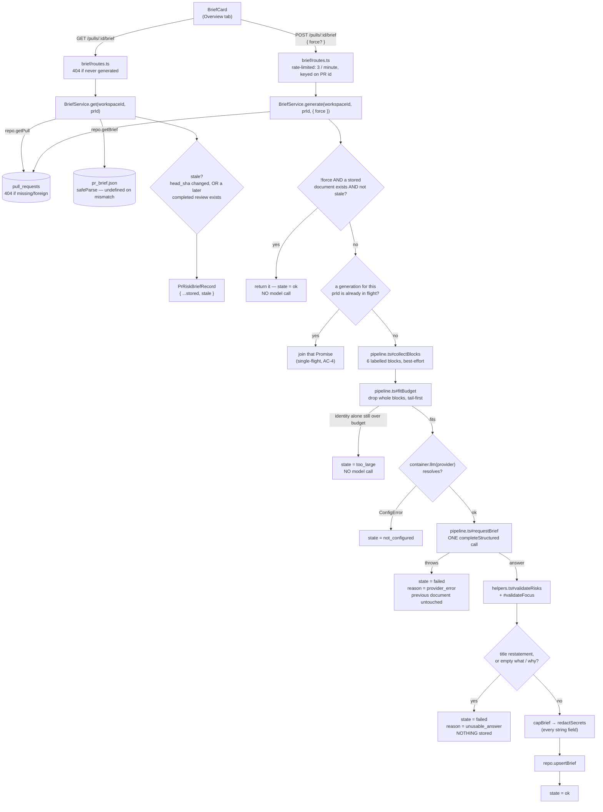

Explanation — this is the shipped design of the PR Risk Brief (SPEC-02) and why
it is built this way; not a how-to, not an API reference.

# PR Risk Brief (SPEC-02)

A reviewer opening a pull request sees a diff, not a reading of it. The Risk
Brief turns the PR's own identity, its derived intent (L03), its blast radius
(L06), its findings, its linked issue and its linked specs into one bounded,
cached, on-demand model call: a what/why statement, a `high`/`medium`/`low`
risk level, up to five validated risks and up to five "read this first" entries
that navigate straight into the reviewer-ordered diff (L04).

It was built to the plan in `specs/2026-08-16-pr-why-risk-brief.md`; read that
first for the inventory, the constraints, the risks accepted and the
acceptance criteria. This document explains the mechanism as it exists in the
tree, for someone who will read the code next week.

**No numeric risk score exists anywhere in this feature, deliberately.**
`risk_level` is the only severity signal the model produces, and the system
prompt states so explicitly (AC-25) — the same reasoning that keeps
`findings.confidence` out of every prompt this repo assembles (root
`INSIGHTS.md` 2026-08-02).

## The request path



The slice follows the three-layer shape every module here does:
`routes.ts` (Zod + rate limit, no logic) → `service.ts` (cache, single-flight,
staleness, validation order — reads `container.<port>`, never `container.db`)
→ `repository.ts` (the only Drizzle in the slice). `pipeline.ts` sits beside
`service.ts` in ring 2: block assembly, budget fitting and the one model call,
taking every row as a parameter so it stays free of SQL.

## The six inputs, and the order they are dropped in

`collectBlocks` gathers six labelled blocks, in this priority order. Every
step is best-effort — an absent source degrades to `missing`, never to a
thrown error (AC-37, NFR-6):

| # | Label | Source | If absent |
|---|---|---|---|
| 1 | `pr_identity` | Number, title, branch, base, and up to 50 changed paths with `+a/−d` and changed-line ranges; the remainder folds into one aggregate line (AC-14) | never absent |
| 2 | `derived_intent` | L03's already-rendered `promptBlock` via `container.intent.get()` | `missing` |
| 3 | `blast_radius` | L06's `summary`, endpoint/cron names, and its `state`/`reason` via `container.blast.build()` — so an incomplete index is *stated*, not inferred from an empty list (AC-36) | `missing` (defensive; `BlastService.build` does not normally throw) |
| 4 | `findings` | The most recent completed review's findings — `severity`, `title`, `file`, start line **only**; `rationale`, `suggestion` and `confidence` are never even read (AC-9, AC-10) | `missing` |
| 5 | `linked_issue` | GitHub issues the PR body closes, fetched best-effort via `container.github()` | `missing` |
| 6 | `linked_spec` | Allowlisted repo-relative `.md`/`.mdx` paths mentioned in the PR body, read via `container.git.readFile` | `missing` |

**No raw hunk body ever leaves this slice (AC-8).** `collectBlocks` reads only
`changedRanges` — parsed `@@ ... @@` headers — never a patch's added, removed
or context lines; that function is the enforcement point, the same role
`hunkHeaders` plays for L03.

`fitBudget` fits the assembled input to `BRIEF_TOKEN_BUDGET` (8 000 tokens,
NFR-3) by dropping **whole blocks**, never mid-content, from
`BRIEF_DROP_ORDER`. Read the array's *declaration* order left to right and it
reads `linked_spec, linked_issue, findings, blast_radius, derived_intent` —
but the loop that consumes it walks from the **last** index to the first, so
the actual drop sequence, least-protected first, is the reverse:

```
derived_intent  →  blast_radius  →  findings  →  linked_issue  →  linked_spec
(dropped first)                                            (dropped last)
```

`pr_identity` is deliberately absent from `BRIEF_DROP_ORDER` — that omission
*is* how "never drop the identity block" (AC-14) is expressed, as data rather
than as a conditional in `pipeline.ts`. If the identity block alone still
overflows the budget once every droppable block is gone, no model call is
made at all — the result is `too_large`, carrying the identity-only token
count and the budget it exceeded (AC-15). (`server/INSIGHTS.md` 2026-08-17
records the reading-order trap the drop order itself is easy to misread.)

## The state machine

`BriefGenerationResult` is a discriminated union on `state`, answered as a
**200** for every case — `too_large`, `failed` and `not_configured` are states
the card renders, never HTTP errors, the same shape `ContextListing` already
uses:

| State | Reached when | Persisted? | Card offers |
|---|---|---|---|
| `ok` | a fresh generation succeeded, or a cached document is still current | yes | the full brief |
| `too_large` | the identity block alone still overflows `BRIEF_TOKEN_BUDGET` after every optional block was dropped | no — no model call was made | no retry (the PR itself would need to shrink) |
| `failed` / `provider_error` | the model call threw | no — the previous stored document, if any, is left exactly as it was (AC-38) | retry, naming regenerate |
| `failed` / `unusable_answer` | the answer restated the PR title, or carried an empty `what`/`why` (AC-22, AC-23) | no — same as above | retry |
| `not_configured` | `container.llm(provider)` threw `ConfigError` — no credential configured | no | no retry; names the Settings screen instead (AC-39) |

## Validate, then cap, then redact, then persist — in that order

The order the answer passes through after the model call matters, and it is
fixed rather than incidental:

1. **Validate** (`helpers.ts#validateRisks`, `#validateFocus`) — nothing the
   model claims about a file, a line or an endpoint is trusted until it is
   checked against the PR's own data. A risk naming a file outside the diff or
   an endpoint `blast_radius` never surfaced is dropped (AC-19); a focus entry
   whose path is not one of the PR's changed files is dropped (AC-17, exact
   match, no basename fallback); one whose line falls outside every changed
   range is **kept but retargeted** to that file's first changed line rather
   than dropped (AC-18). Both counts feed `dropped_refs` (AC-20).
2. **Reject the unusable** — a title restatement or an empty `what`/`why`
   becomes `failed`/`unusable_answer` here, **before** anything below runs
   (AC-22, AC-23). An empty, *validated* `review_focus` is not this case — it
   survives as an explicit empty list (AC-21).
3. **Cap** (`helpers.ts#capBrief`) — five risks, five focus entries, the
   model's own order preserved (AC-42); explanations truncated to 240
   characters, reasons to 160 (NFR-3). Capping happens **after** validation,
   so a dropped entry never displaces a kept one from the five-item limit.
4. **Redact** (`helpers.ts#redactSecrets`) — every string field, matched
   against the eight secret shapes in `constants.ts#SECRET_PATTERNS` (AWS,
   GCP, GitHub, npm and Slack tokens; a PEM private key block; a generic
   `key:`/`password=` assignment; a `mongodb(+srv)://` URI). This is the
   feature's own enforcement point for AC-24 — this repo's first redaction
   surface (`rg -n redact` returned nothing before this slice existed).
5. **Persist** (`repository.ts#upsertBrief`) — an insert-or-replace keyed on
   `pr_id`, the same shape `upsertIntent` uses. One row per PR; no version
   history (NFR-8).

## The cache key, staleness, and single-flight

`pr_brief.json` holds one document per PR (`pr_id` is the primary key); there
is no migration and no schema edit for this feature — the column already
existed, reserved and empty, since the initial migration.

**`stale` is never stored.** It is attached at read time from two independent
facts (AC-34, AC-35), in `BriefService.isStale`:

- the stored `head_sha` no longer matches the pull's current `headSha`
  (new commits landed), **or**
- the most recent completed review's `createdAt` is after the stored
  `generated_at` (a review superseded it).

The client repeats this recompute rather than trusting the server's `stale`
bit once it sits in the query cache — the identical belt-and-braces
`OverviewTab.tsx` already applies to `PrIntentRecord`, folded into the record
it passes to `BriefCard` rather than a separate prop
(`client/INSIGHTS.md` 2026-08-09, 2026-08-17).

**Single-flight de-duplication** (AC-4, NFR-7) is a module-level
`Map<prId, Promise<BriefGenerationResult>>` in `service.ts`, not an instance
field — a `BriefService` is constructed fresh per request, so an instance
field would never see the second of two concurrent requests. This collapses
concurrency within **one Node process only**; DevDigest is local-first
single-process, so that scope is accepted rather than solved with a
distributed lock (`server/INSIGHTS.md` 2026-08-17).

## Focus, and the one place this feature changed two shipped lessons

Activating a "read this first" entry (AC-30) reuses the exact `?goto=`
handoff L06 already built: one `router.replace` carrying `tab` and `goto`
together, consumed and cleared by `DiffTab`, with the target file's collapsed
group forced open before scrolling (AC-31 — already-shipped behaviour; this
feature only added the test that pins it as a criterion).

**What this feature added, and where it reached past its own slice:**
`useDiffLineTarget`'s navigation Effect now moves keyboard focus onto the
target file's heading, after the scroll, for **every** consumer — not only
this feature's — because the spec's own non-goals rule out changing L04/L06
behaviour, and this is a deliberate, explicitly-authorised exception to that
rule:

| | Before | After |
|---|---|---|
| L04 — findings badge | scrolls the diff; keyboard focus stays on the badge button | focus moves onto the target file's heading; the next Tab continues from inside the diff |
| L06 — Blast Radius caller rows (`?goto=`) | scrolls the diff; focus is wherever the tab switch left it | focus moves onto the target file's heading, including on a browser back/forward that re-supplies `?goto=` |
| L06 — rows linking to GitHub | unaffected | unaffected — those are anchors, not `goTo` calls |

The justification: focus following a programmatic scroll is the accessible
behaviour in all three cases, and the previous behaviour — scroll the
viewport, leave focus behind — was a latent accessibility defect rather than
a designed choice neither L04 nor L06 had a test asserting. `fileHeadingId`
sits beside `lineAnchorId` in `components/diff-viewer/helpers.ts`, the file
card's heading carries `tabIndex={-1}` so it can receive focus without
joining the tab order, and the Effect calls `focus({ preventScroll: true })`
strictly after `scrollIntoView`, in that order — `focus()` on an off-screen
element scrolls it into view in several browsers, which would otherwise fight
the smooth, centred scroll.

## Copy, and what is rendered as data

Every fixed label on the card comes from `messages/en/brief.json`'s
`riskBrief` namespace (AC-45). The `what`, `why`, each risk's `title` and
`explanation`, and each focus entry's `reason` are model-authored text and are
rendered as plain data — a `{value}` in JSX — never looked up as a message
key, the same rule `blast.summary` and `intent.intent` already follow.
`risk_level` is shown as a text label beside its colour, never colour alone
(AC-28); an unattributable `cost_usd` reads "unknown", never "$0.00" (AC-40,
root `INSIGHTS.md` 2026-08-02); a zero-risk answer states so explicitly rather
than rendering an empty area (AC-43).

## Where things are

| Thing | Path |
|---|---|
| Wire contracts | `server/src/vendor/shared/contracts/review-api.ts` (`BriefAnswer`, `StoredRiskBrief`, `PrRiskBriefRecord`, `BriefGenerationResult`) + the client copy |
| Budget, caps, drop order, prompt, secret patterns | `server/src/modules/brief/constants.ts` |
| Pure validation, redaction, ranges, caps | `server/src/modules/brief/helpers.ts` |
| Block assembly, budget fit, the one model call | `server/src/modules/brief/pipeline.ts` |
| The only Drizzle in the slice | `server/src/modules/brief/repository.ts` |
| Cache, single-flight, staleness, orchestration | `server/src/modules/brief/service.ts` |
| HTTP edge | `server/src/modules/brief/routes.ts`, registered in `server/src/modules/index.ts` |
| `container.blast` / `container.intent` — the sanctioned cross-slice channel | `server/src/platform/container.ts` |
| Proofs | `server/test/brief-helpers.test.ts`, `server/test/brief.it.test.ts` |
| Query hook + cache write | `client/src/lib/hooks/brief.ts` |
| The card | `client/src/app/repos/[repoId]/pulls/[number]/_components/BriefCard/` |
| Focus after navigation (shared with L04/L06) | `client/src/components/diff-viewer/useDiffLineTarget.ts`, `helpers.ts#fileHeadingId`, `FileCard/` |
| Copy | `client/messages/en/brief.json` (`riskBrief` namespace) |
