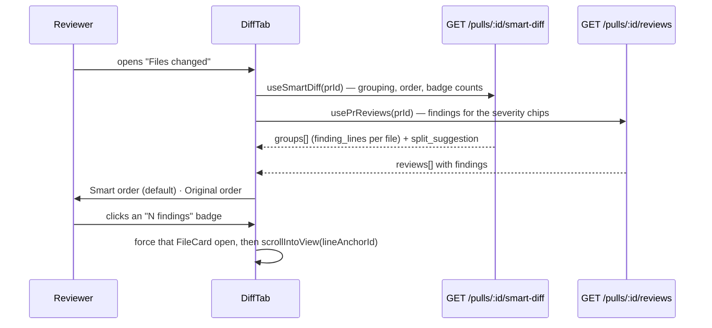

Explanation — this is the shipped design of Smart Diff (L04) and why it is
built this way; not a how-to, not an API reference.

# Smart Diff (L04)

"Files changed" used to be an alphabetical list, so a 30 000-line
`pnpm-lock.yaml` sat above the twenty lines that actually needed reading. Smart
Diff orders a PR's files by how much attention each deserves — `core`,
`wiring`, `boilerplate` — by joining two things the database already holds: the
PR's files and the findings of its reviews.

It was built to the plan in `specs/l04-smart-diff.md`; read that first for the
inventory, the constraints, the risks accepted and the acceptance criteria.
This document explains the mechanism as it exists in the tree, for someone who
will read the code next week.

**No model is involved anywhere in this feature.** The classification is a list
of regular expressions and the ordering is a comparison chain. That is a design
decision, not a shortcut: root `INSIGHTS.md` (2026-08-02) records a convention
block added to an agent's `system_prompt` making the review measurably worse,
and there is no reason to spend a model call on a question a regex answers the
same way every time.

## The three sources, and what each contributes

| Source | Table | Contributes |
|---|---|---|
| The PR's changed files | `pr_files` (`path`, `additions`, `deletions`) | which files exist, and how big each change is |
| The findings of **every** review of the PR | `findings` (`file`, `start_line`) via `reviews` | which lines a reviewer flagged |
| The pattern lists | `server/src/modules/smart-diff/constants.ts` | which role each path gets |

Two exclusions are deliberate.

**`pr_files.patch` is dropped in the service and never reaches the response.**
The client already holds every patch body from `GET /pulls/:id`; re-sending
them would double the payload to say nothing new. What crosses the wire is
paths, counts and line numbers — asserted negatively in
`server/test/smart-diff.it.test.ts`.

**`findings.confidence` is never read.** It is not calibrated — root
`INSIGHTS.md` (2026-08-02) records `1.0` on a hallucination — so nothing here
sorts, filters or ranks by it. The only finding-derived signal is the number of
distinct flagged lines.

## Every review, not the latest one

The brief says "the findings of the latest review". The implementation unions
**all** of a PR's reviews, because one "Run Review" click produces one `reviews`
row *per agent*: "the latest review" would silently show a single agent's
findings and disagree with everything else on the page. The PR-list severity
rollup already made this exact choice
(`server/src/vendor/shared/contracts/platform.ts`, "findings of EVERY review of
this PR, tallied"). Flipping to latest-only is one line in
`SmartDiffService.build` — `reviewsForPull` already orders newest-first.

## The classification table

First match wins, in this order. The order **is** the rule: it is why a lock
file can never be anything but `boilerplate`, and why `dist/index.js` is build
output rather than a wiring barrel.

| Role | Matched by | Why |
|---|---|---|
| **1. `boilerplate`** | lock files (`pnpm-lock.yaml`, `package-lock.json`, `yarn.lock`, `bun.lockb`, `Cargo.lock`, `poetry.lock`, `composer.lock`, `go.sum`, `Gemfile.lock`); manifests (`package.json`, `pnpm-workspace.yaml`); build output (`dist/`, `build/`, `out/`, `.next/`, `coverage/`, `node_modules/`); vendored trees (`/vendor/`); snapshots (`__snapshots__/`, `*.snap`); generated output (`*.min.js`, `*.min.css`, `*.generated.*`, `*.pb.go`); binaries and assets (`png jpg jpeg gif svg ico woff woff2 ttf pdf`) | generated or mechanical — there is nothing to review line by line |
| **2. `wiring`** | barrels (`index.ts/tsx/js`); config (`*.config.{ts,js,mjs,cjs}`, `tsconfig*.json`, `.eslintrc*`, `.env*`); CI and containers (`.github/workflows/`, `Dockerfile*`, `docker-compose*`); migrations (`migrations/`, `*.sql`); ambient types (`*.d.ts`); tests (`*.test.*`, `*.spec.*`, `test/`, `tests/`, `__tests__/`); Markdown (`*.md`, `*.mdx`) | real changes that hook the core into the app, rather than being the substance of it |
| **3. `core`** | everything else | the substance of the change — review closely |

Two placements in that table are judgement rather than deduction, and are
stated as such in `constants.ts` so they can be argued with:

- **Tests and Markdown are `wiring`.** They are a supporting change. Worth
  reading; not worth reading first.
- **`package.json` is `boilerplate`.** A dependency bump is mechanical, and it
  belongs next to the lock file it moves with.

Both are a one-line change in `constants.ts`, which is exactly why every
pattern and every threshold lives there and nowhere else. `helpers.ts`,
`service.ts` and `routes.ts` contain no path literal and no number.

Paths are normalized before matching (`./`, `a/` and `b/` prefixes stripped), so
a model-authored `findings.file` carrying a diff prefix still lines up with the
`pr_files.path` it meant. Matching a finding to a file is **exact** — there is
no basename fallback, because half of any repo is called `index.ts` and a
fallback would hang one directory's findings off another's.

That stripping is positional, not diff-aware, which is a genuine sharp edge: a
repo whose real top-level directory happens to be named `a` or `b` has that
segment stripped too, because `PATH_PREFIX_PATTERN` cannot tell "the diff's `a/`
side marker" from "a directory that is really called `a`". A file at
`a/pnpm-lock.yaml` in such a repo normalizes to `pnpm-lock.yaml` and is treated
as a repo-root lock file. Nothing in this feature works around it — it is a
property of the normalization rule, not a bug in it.

## Ordering inside a group

Fully deterministic, three keys, no ties left to insertion order:

1. more `finding_lines` first;
2. then more changed lines (`additions + deletions`);
3. then `path`, ascending.

All three groups are emitted even when empty, so the UI renders three stable
sections instead of a layout that moves with the PR.

## Split suggestion

A structural hint about size, computed from the same data:

| Threshold | Value | Meaning |
|---|---|---|
| `SPLIT_TOO_BIG_LINES` | 400 | total changed lines, **all** files, past which the PR is flagged |
| `SPLIT_TOO_BIG_CORE_FILES` | 10 | `core` file count past which it is flagged regardless of size |
| `SPLIT_MIN_FILES_PER_PROPOSAL` | 2 | a proposal naming one file is noise |
| `SPLIT_MAX_PROPOSALS` | 4 | cap |
| `SPLIT_DIR_DEPTH` | 1 | proposals are named after the leading path segment |
| `SPLIT_ROOT_GROUP_NAME` | `.` | the proposal name for a `core` file with fewer path segments than `SPLIT_DIR_DEPTH` (a repo-root file has no leading directory to name it after) |

Proposals group **core** files only: splitting a PR by moving its lock file
achieves nothing. The suggestion says where the seams are, never what the code
does.

**`split_suggestion` is computed and returned on every response, and rendered
nowhere.** `SmartDiffViewer` reads `groups` only (`SmartDiffViewer.tsx`); no
client code reads `split_suggestion`, `too_big` or `proposed_splits`. It is a
server-side field with no UI consumer today — a future lesson's screen can pick
it up, but as of L04 a reviewer never sees it.

## What the client does with it

Four things in that picture are load-bearing:

- **Ordering is enrichment.** While `useSmartDiff` is loading or has failed,
  `DiffTab` falls back to the plain `DiffViewer`. A reviewer never loses the
  diff because a sort could not be built.
- **The badge and the chip are two different reads.** The "N findings" badge
  count is `entry.finding_lines.length`, taken from the smart-diff response
  (`useSmartDiff`, query key `["smart-diff", prId]`). The per-line severity
  chip is rendered from `findings` passed down from `usePrReviews` (query key
  `["reviews", prId]`). `hooks/reviews.ts` invalidates `["reviews", prId]` on
  run completion, review deletion and finding actions; it does not touch
  `["smart-diff", prId]`. The asymmetry is written into `useSmartDiff`'s
  docblock, because grouping, order and the badge count all come from the key
  that nothing refreshes.
- **A repeat click on the same badge scrolls again.** The click target is
  `{ path, line, seq }`; `seq` is a monotone counter bumped on every click
  (`(prev?.seq ?? 0) + 1`), not `Date.now()` — it exists only to make the
  `useEffect` dependency change, not to carry a timestamp.
- **Boilerplate stays collapsed whatever it contains**, findings included. That
  is the point of the group, and 30 000 lines of generated YAML expanding on a
  flagged line would bury everything above it.

`lineAnchorId(path, line)` is defined once, in the shared diff-viewer, and
exported from its barrel: the element that carries the DOM id and the code that
scrolls to it read the same function. Two copies of that rule drift silently —
the anchor still renders and the scroll simply does nothing. The id is sanitized
to `[A-Za-z0-9-]`, so a path can never put a selector metacharacter into it.

## Nothing is persisted

There is no table, no `pr_brief` write, no cache and no migration. The response
is recomputed per request from two indexed reads (`pr_files_pr_id_idx`,
`findings_review_id_idx` + `reviews_pr_kind_idx`). `SmartDiff` is a wire DTO
only — `PrBrief` is `{intent, blast, risks, history}` and does not contain it.

`pseudocode_summary` is always `null`. Filling it needs a model call, which this
feature forbids by definition; a later lesson can pick it up.

## What this does not claim

Smart Diff changes no model output, so it cannot make a review better or worse
and `docs/l02-experiment.md` does not apply to it. Whether ordering a diff makes
a *human* review better is a question about people, and nothing here measures
it.

## Where to look next

| File | What it holds |
|---|---|
| `server/src/modules/smart-diff/constants.ts` | every pattern and threshold |
| `server/src/modules/smart-diff/helpers.ts` | `classifyFile`, `buildSmartDiff`, `suggestSplit` — pure |
| `server/src/modules/smart-diff/service.ts` | the two reads, through `container.reviewRepo` |
| `server/src/modules/smart-diff/routes.ts` | `GET /pulls/:id/smart-diff`, Zod params, workspace scoping |
| `server/test/smart-diff-helpers.test.ts` | the classification table, pinned |
| `server/test/smart-diff.it.test.ts` | the endpoint, the "no patch text" and "no model call" negatives, the 404 |
| `client/src/lib/hooks/smart-diff.ts` | `useSmartDiff`, and the invalidation note |
| `client/src/components/diff-viewer/findings.ts` | the optional findings overlay |
| `client/src/app/repos/[repoId]/pulls/[number]/_components/SmartDiffViewer/` | the grouped view |
| `specs/l04-smart-diff.md` | the plan, its risks and its acceptance criteria |
