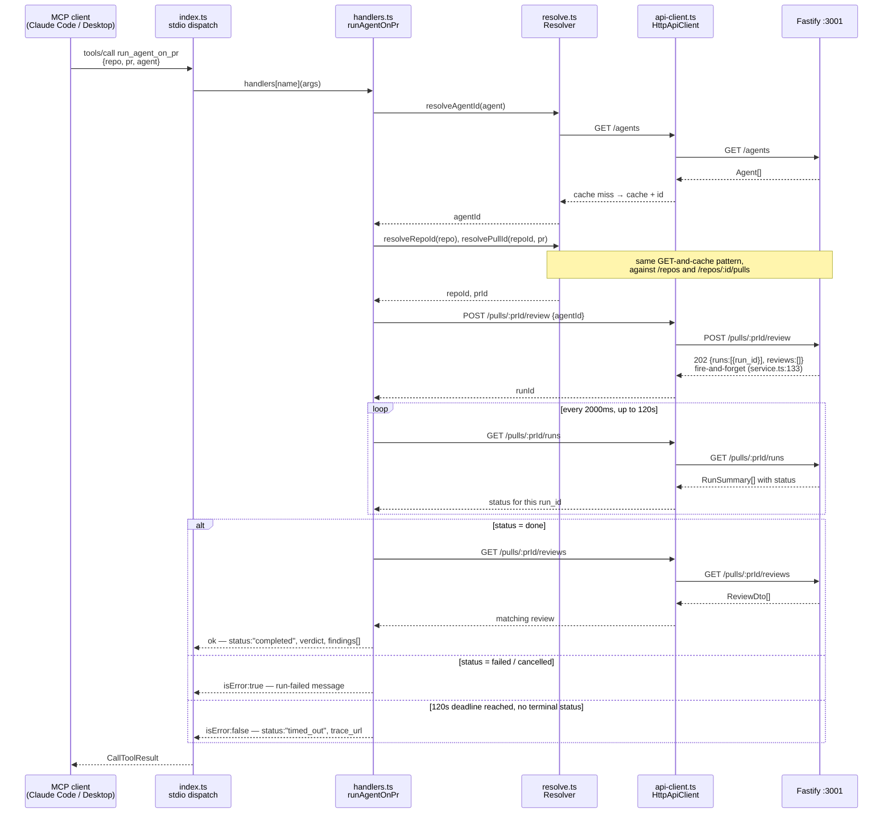

# The `run_agent_on_pr` request lifecycle, and the design constraints behind it

**Explanation.** Why the MCP server is shaped the way it is — not a how-to, not
a reference. For the tool contracts and conventions themselves, read
[`../AGENTS.md`](../AGENTS.md) and [`../../specs/l05-mcp-server.md`](../../specs/l05-mcp-server.md);
this document does not repeat either.

## The request path, end to end

`run_agent_on_pr` is the one tool that talks to the API more than once, so it is
the request that shows every layer of the package: transport → dispatch →
application logic → resolution → the one HTTP boundary → the API — and back,
through a poll loop the tool owns entirely.

The dispatch step is a flat lookup, not a router: `CallToolRequestSchema`'s
handler reads `request.params.name`, indexes `handlers[name]`, and calls it with
the raw `arguments` object cast to a record — `mcp/src/index.ts:92-103`. Every
downstream module name in the diagram is real: `runAgentOnPr` is
`mcp/src/handlers.ts:157-215`, the three `resolve*` calls are
`mcp/src/resolve.ts:82-140` (`Resolver`, with its three process-lifetime `Map`
caches), and `api-client.ts:70-121` (`HttpApiClient.request`) is confirmed to be
the **only** place `fetch` is called in the package — every arrow crossing into
the `API` lane in the diagram passes through that one function.

The four read tools (`list_agents`, `get_findings`, `get_conventions`,
`get_blast_radius`) are the same shape with the loop removed: dispatch →
handler → zero or one resolution call → zero or one `api.get` → shape → return.
`get_blast_radius` skips the last two steps entirely — it returns the constant
placeholder without touching `Resolver` or `HttpApiClient`
(`mcp/src/handlers.ts:266-270`), so a stub costs nothing against the API's rate
limit.

## Why `run_agent_on_pr` blocks by polling, not by SSE

`POST /pulls/:id/review` is fire-and-forget on the API side: the service creates
the `agent_runs` rows, fires `void this.executor.executeRuns(...)` without
awaiting it, and returns immediately with `{ runs, reviews: [] }`
(`server/src/modules/reviews/service.ts:131-137`). Nothing blocks on the server,
so if this tool is going to return a finished review at all, the 120-second wait
has to live in the MCP server.

`GET /runs/:id/events` (SSE) looks like the obvious mechanism for that wait, and
it is deliberately not used. It works correctly for a subscriber in the same
process the run started in — `runBus`'s buffer-and-replay logic
(`platform/sse.ts`) handles a late subscriber fine. What it cannot survive is the
**API process restarting mid-run**: `runBus`'s in-memory buffers and emitters are
gone, a fresh subscription fabricates an empty emitter, and the SSE connection
hangs forever with no event and no terminating `done` — while the database row
for that same run gets reaped to a terminal status on the next boot
(`server/src/app.ts:80-85`). An SSE-based wait would hang in exactly the case
where the truth is sitting in the database the whole time. Polling
`GET /pulls/:id/runs` reads that row directly, so it sees the truth whether the
API restarted or not — this is the case SSE cannot cover, not a stylistic
preference. `server/AGENTS.md`'s own gotcha about `runBus` being an in-process
singleton is what raised the question; the answer is narrower than "don't use
SSE from another process."

## Why the poll interval is 2000 ms

It is rate-limit arithmetic, not a tuning choice. `server/src/app.ts:96`
registers a **global** limit of 120 requests per minute, and `/pulls/:id/runs`
carries no per-route override, so every poll counts against it. At 2000 ms, a
full 120-second wait is 60 polls — 30/min, a quarter of the budget — leaving room
for the three resolution calls, the create (itself capped at 10/min), the final
read, and a second concurrent tool call without tripping the limiter. At
1000 ms the same wait would already be 60/min on its own, one concurrent call
away from a 429 the model has no way to fix. The comment carrying this exact
arithmetic lives next to the constant: `mcp/src/constants.ts:21-31`
(`POLL_INTERVAL_MS`).

## Why the deadline never cancels the run, and why the timeout is not `isError`

At the 120-second mark, `run_agent_on_pr` does not call `POST /runs/:id/cancel`
(`mcp/src/handlers.ts:186-211`). The run is still executing on the server and
will persist its review whenever it finishes; cancelling would throw away LLM
work the user already paid for and leave a `cancelled` row that `get_findings`
can never satisfy — there would be no way to ever read that result.

The timeout result itself sets `isError: false`
(`{"status":"timed_out", "message": …, "trace_url": …}`,
`mcp/src/handlers.ts:207-211`). This is deliberate, not an oversight: `isError`
is the MCP signal for "the model can fix this by trying again," and the one
retry a model would attempt here is calling `run_agent_on_pr` a second time —
which starts a **second paid run** for a review that is already in flight. The
message instead points at `get_findings` with the same three arguments, which is
a call the model has already made once, so recovery does not require learning a
fourth identifier.

## The token budget as a design constraint, not an afterthought

Running `mcp/test/token-budget.test.ts` against the shipped `TOOLS` array
measures the actual `tools/list` payload at **597 / 1200 `cl100k_base` tokens**,
with `instructions` (echoed once at `initialize`, not per request) at 78 / 150:

| Tool | Measured tokens |
|---|---:|
| `list_agents` | 78 |
| `run_agent_on_pr` | 166 |
| `get_findings` | 145 |
| `get_conventions` | 89 |
| `get_blast_radius` | 116 |
| **total** | **597** |

The 1200 ceiling is headroom, not a target: the `cl100k_base` tokenizer is a
proxy for Anthropic's own and can be off by roughly 20% either way, and a later
lesson implementing `get_blast_radius` for real will grow that one entry —
`mcp/src/constants.ts:46-55` states both reasons next to
`TOOL_DEFINITION_TOKEN_BUDGET`.

That measured total is also why the five tools carry no MCP tool-search /
progressive-disclosure machinery. Lazy tool loading pays off once a server's
definitions run past roughly 10 tools or 10k tokens — five tools at 597 tokens
sits an order of magnitude under either threshold, so upfront loading is
strictly cheaper, and search machinery would only add its own per-request
definition on top of a catalogue that does not need finding
(`specs/l05-mcp-server.md` §"Why no MCP tool search / progressive disclosure").

The same logic is why no tool carries an `outputSchema`. It is serialized into
every `tools/list` response — a permanent per-request cost that roughly doubles
a tool's definition size — and it buys nothing here, since every one of these
five tools is read by the model, not constructed by it; nothing pipes
`structuredContent` on the other end. The decision is recorded so it is not
re-litigated as a gap (`../AGENTS.md` §Gotchas, "No `outputSchema` on any
tool").

## The untrusted-content position, and its two honest limits

Finding titles and suggestions, PR text, and convention rule text all reach this
process as **data**: LLM output plus prose written by external pull-request
authors, about to be handed into a *second* model's context. They are run
through `fenceUntrusted` (`mcp/src/sanitize.ts:49-52`) — control characters
stripped, any `<untrusted>`-lookalike neutralised, the text hard-capped, then
wrapped in `<untrusted kind="…">…</untrusted>` — before they enter any tool
result.

Two limits are stated deliberately rather than left implicit, because both would
otherwise read as stronger guarantees than they are:

1. **A delimiter is a mitigation, not a control.** It is a hint a model may
   choose to honour, not an enforcement boundary — the same framing this repo
   already applies to `reviewer-core`'s own untrusted wrapping.
2. **The receiving model is a third-party client whose system prompt this
   package does not write.** `reviewer-core` pairs every `<untrusted>` wrapper
   with `INJECTION_GUARD` in the same prompt, telling the model what the fence
   means and that it must ignore instructions found inside it
   (do-not-touch, per root `AGENTS.md`). Here there is no equivalent on the
   other side of the protocol boundary — the `initialize` `instructions` field
   states the rule once, and not every MCP client even surfaces that field to
   its model. So the fence is the only signal this package can control, and it
   is honest about not being the only signal that matters.

The actual controls this design leans on are procedural, not textual: the tool
set is read-mostly, the one write tool (`run_agent_on_pr`) only creates a review
the user explicitly asked for, and no tool executes anything it is handed. This
is also why `wrapUntrusted` is a ~15-line local function in `sanitize.ts` rather
than an import from `reviewer-core` — widening that package's public barrel for
a consumer no review path calls was rejected on the same reasoning recorded in
root `INSIGHTS.md` (2026-08-09, "Purity is not an address").
