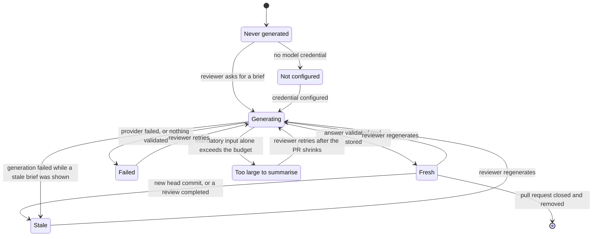
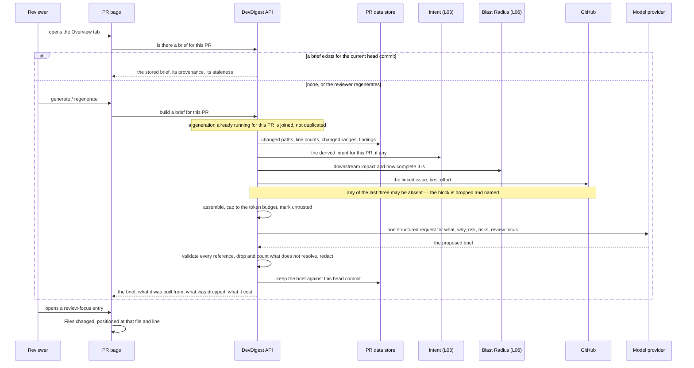

# Spec: PR Why + Risk Brief

Spec ID: SPEC-02
Created: 2026-08-16
Status: draft
Supersedes: None

## Problem and user

A reviewer opening a pull request in DevDigest today lands on an Overview tab
that holds three true but unsynthesised things: the PR's derived intent (L03),
its blast radius (L06), and — one tab over — a reviewer-ordered diff with
severity chips (L04). Each answers one question. None of them answers the
question the reviewer actually opens with: *what is this change, why was it
made, how dangerous is it, and which file do I read first?* Answering it means
reading the intent bullets, scanning the caller tree, counting the findings,
opening the linked issue, and then holding all of that in their head while they
scroll a diff. Every reviewer redoes that assembly for every PR, and the ones
who skip it start reading at the top of the file list, which for most PRs is
the least interesting file in it.

The cost is concentrated in the first two minutes of a review, and it is paid
by whoever is reviewing someone else's code in an unfamiliar area — exactly the
case where starting in the wrong file wastes the most time and where a risk
that is obvious from the callers is easiest to miss. The parts are all already
on the page; nothing turns them into a single statement a person can act on.

## Goals / Non-goals

**Goals**

- A reviewer can read, in one card and in a few seconds, what the PR changes
  and why, how risky it is, which concrete risks were identified, and which
  files to read first.
- Every file, line and endpoint the brief names is real — present in the data
  the brief was built from — so a reviewer can click it and land somewhere.
- One click from a "read this first" entry puts the reviewer on that file's
  changed lines in the reviewer-ordered diff.
- The brief is cheap and bounded: one model call, a fixed input budget, cached
  against the PR's current commit, and rebuilt only when the reviewer asks.
- What the brief could **not** see is always visible, so an absent risk is never
  read as a verified safe.

**Non-goals**

- **Redefining anything already on the screen.** The verdict banner, the
  "N findings · M blockers" counts and the numeric PR score ring in the mock
  belong to the findings/verdict and engine-score features. This spec neither
  specifies nor changes them; it only requires that the brief does not
  contradict them (see AC-25).
- **Changing L03, L04 or L06.** Intent, the reviewer-ordered diff and blast
  radius are inputs and navigation targets, not subjects. In particular the
  Intent card does not gain a risks list, even though the mock draws one there.
- **A PR-history section.** The scaffolded brief document declares a `history`
  block (`server/src/vendor/shared/contracts/brief.ts:66-80`) and the shipped
  copy has labels for it (`client/messages/en/brief.json:2-9`). This feature
  produces no history and renders no history block; the block stays unfed and
  its copy stays unrendered. Prior-PR history remains reserved for a later
  lesson (`docs/blast-radius.md:241-242`).
- **An MCP tool.** No `get_pr_brief`; the brief is a UI feature this lesson.
- **Automatic generation.** No brief is produced by a review run, by an import,
  or by opening the page. Generation is an explicit action.
- **A quality claim.** Nothing here asserts that reviews get better. If that
  claim is wanted later, `docs/l02-experiment.md` is the only way to make it.
- **The transport surface.** The feature owner proposed a per-PR brief endpoint
  and a per-PR regenerate action; how the boundary is actually shaped, named and
  wired is the implementation plan's call, not this spec's.

## User stories

- **US-1** — As a reviewer opening an unfamiliar PR, I want one short statement
  of what it changes and why, so that I do not have to reconstruct it from the
  diff and the issue.
- **US-2** — As a reviewer triaging several PRs, I want a risk level at a
  glance, so that I can decide how much attention this one needs.
- **US-3** — As a reviewer, I want the concrete risks named against real files
  and endpoints, so that I get something to check rather than a generic warning.
- **US-4** — As a reviewer, I want a short list of files to read first, each
  with a reason, and I want one click to land me on that file's changed lines,
  so that I start where the change actually is.
- **US-5** — As a reviewer of a PR that has moved on, I want to see that the
  brief is out of date and rebuild it on demand, so that I never act on a
  summary of a commit that no longer exists.
- **US-6** — As a reviewer, I want to know which inputs the brief could not see,
  so that I do not read "no risks found" as "this change is safe".
- **US-7** — As the person paying for the model calls, I want each brief to cost
  one bounded call and to show what it cost, so that a regenerate button cannot
  quietly become the most expensive thing on the page.

## Acceptance criteria (EARS)

### Generating, caching and regenerating

**AC-1** — WHEN a reviewer requests the brief for a pull request that has none,
the system shall generate a brief from the aggregated inputs and present it.
  *Verification:* on a pull request that has never had a brief, the card moves
  from its empty state to a populated one after the reviewer asks for it.

**AC-2** — WHEN the brief is requested and a stored brief exists for the pull
request's current head commit, the system shall present the stored brief and
shall make no model call.
  *Verification:* a second request for an unchanged pull request adds no model
  call and no cost, and the generation time shown does not change.

**AC-3** — WHEN the reviewer activates the regenerate control, the system shall
build a new brief from freshly aggregated inputs, ignoring any stored brief, and
shall replace the stored one with it.
  *Verification:* the generation time and the cost shown on the card change
  after a regenerate on a pull request whose brief was already current.

**AC-4** — WHILE a generation is in flight for a pull request, the system shall
serve every further generation request for that same pull request from the
in-flight generation, spending exactly one model call.
  *Verification:* two regenerate requests issued for one pull request before the
  first completes return the same brief, with one generation time and one cost.

**AC-5** — The system shall retain at most one brief per pull request, carrying
the head commit it was generated from, the time of generation, the provider and
model used, the cost of the call, and the labels of the input blocks that were
actually included.
  *Verification:* after a full page reload the card shows the same brief with
  the same generation time, model and included-input labels.

**AC-6** — IF the brief is requested for a pull request that does not exist or
belongs to another workspace, THEN the system shall answer as "not found" and
shall not reveal whether that pull request exists.
  *Verification:* the response for a foreign pull request identifier is
  indistinguishable from the response for an invented one.

### What goes into the model call

**AC-7** — The system shall assemble the model input from at most six labelled
blocks: pull-request identity, derived intent, blast-radius summary, the pull
request's findings, the linked issue, and linked specs.
  *Verification:* the included-input labels shown on the card are drawn from
  exactly that set, and no other source appears in the assembled input.

**AC-8** — The system shall exclude raw diff hunk bodies from the model input,
carrying changed-line ranges and per-file statistics only.
  *Verification:* no added, removed or context line of any patch appears in the
  assembled input for a pull request whose patches contain distinctive strings.

**AC-9** — The system shall include, for each finding, only its severity, its
title, its file and its start line.
  *Verification:* a finding whose body text contains a distinctive string does
  not put that string into the assembled input.

**AC-10** — The system shall exclude every finding confidence value from the
model input, from the stored brief and from the card.
  *Verification:* no confidence value is present in the assembled input or
  anywhere on the card, for a pull request whose findings all carry one.

**AC-11** — The system shall measure the input budget as the token count of the
fully assembled model input, instruction text included, using the same
`cl100k_base` counter the repository already uses for its indexing budget
(`server/src/adapters/tokenizer/index.ts:14-40`).
  *Verification:* for a fixed pull request, the recorded input token count
  matches an independent `cl100k_base` count of the same assembled text.

**AC-12** — IF that counter is unavailable, THEN the system shall apply the same
budget to the `ceil(characters / 4)` estimate and shall record that the count is
an estimate.
  *Verification:* with the counter forced to fail, generation still succeeds,
  stays under budget by the estimate, and the recorded count is marked estimated.

**AC-13** — IF the assembled input would exceed 8 000 tokens, THEN the system
shall drop whole blocks, in the order linked specs, linked issue, findings,
blast-radius summary, derived intent, until the input fits, and shall never cut
a block mid-content.
  *Verification:* on a pull request whose inputs overflow, the card lists the
  dropped blocks and they are the tail of that order; no block appears
  half-present.

**AC-14** — The system shall never drop the pull-request identity block, and
shall bound it by listing at most 50 changed paths with their line counts plus
aggregate totals for the remainder.
  *Verification:* a 300-file pull request produces an identity block naming 50
  paths and a total covering the rest.

**AC-15** — IF the input still exceeds the budget once every droppable block is
gone, THEN the system shall make no model call and shall present the brief as
unavailable, naming the size of the pull request as the reason.
  *Verification:* the failure state appears with no cost recorded.

**AC-16** — The system shall instruct the model to answer in English whatever
language the pull request's own text is written in.
  *Verification:* a pull request whose title, body and linked issue are in
  another language still produces an English brief.

### What comes back, and what is allowed through

**AC-17** — The system shall drop any risk or review-focus entry whose file does
not match one of the pull request's changed files, comparing paths exactly after
the repository's existing diff-path normalization and with no basename fallback
(`docs/smart-diff.md:82-92`).
  *Verification:* an entry naming a plausible but unchanged path is absent from
  the presented brief.

**AC-18** — IF a review-focus entry names a line that falls outside every
changed range of its file, THEN the system shall keep the entry and present it
at that file's first changed line instead.
  *Verification:* such an entry still navigates, and it lands on the file's
  first changed line.

**AC-19** — The system shall drop any risk entry whose named endpoint or
scheduled job did not appear in the blast-radius input.
  *Verification:* an entry naming an endpoint absent from the input is not
  presented.

**AC-20** — The system shall record how many entries were dropped by AC-17 and
AC-19 and shall make that count visible on the card.
  *Verification:* the card shows a non-zero dropped count for a brief in which a
  reference failed to resolve.

**AC-21** — IF every review-focus entry is dropped, THEN the system shall still
present the what, the why and the risk level, and shall present the review-focus
section as explicitly empty with the reason.
  *Verification:* the card renders without a review-focus list and states why,
  rather than rendering an empty box.

**AC-22** — IF the answer carries no usable what-and-why statement, THEN the
system shall store no brief and shall present a retryable failure.
  *Verification:* the card shows the failure state and a later successful
  regenerate produces the first stored brief for that pull request.

**AC-23** — IF the returned what-and-why statement is equal to the pull
request's title after case, whitespace and punctuation are normalized, THEN the
system shall treat the answer as unusable under AC-22.
  *Verification:* a brief whose statement merely repeats the title never reaches
  the card.

**AC-24** — The system shall redact any text matching a known secret shape from
every brief field before it is stored, displayed or logged.
  *Verification:* a finding title quoting a credential-shaped literal produces a
  brief in which that literal appears nowhere on screen or in the stored
  document.

**AC-25** — The system shall express the brief's risk as exactly one of high,
medium or low, and shall neither request nor store nor display a
model-authored numeric risk score.
  *Verification:* the card's risk indicator carries one of the three levels and
  no number attributable to the brief.

### The card

**AC-26** — WHILE no brief has ever been generated for the pull request, the
card shall present an empty state that names the action which produces one.
  *Verification:* a never-briefed pull request shows the empty card with its
  action, and no error.

**AC-27** — WHILE a generation is in flight, the card shall present a generating
state, shall keep any previously generated brief visible, and shall prevent a
further generation being requested from the card.
  *Verification:* during a regenerate the previous brief text remains readable
  and the regenerate control cannot be activated again.

**AC-28** — The card shall present the risk level as a text label as well as a
colour.
  *Verification:* the level is readable with colour removed, and a screen reader
  announces it.

**AC-29** — The card shall present the what-and-why statement as prose that adds
information beyond the pull request's title.
  *Verification:* on the reference pull request the statement names the change
  and its motivation, and reads differently from the title.

**AC-30** — WHEN the reviewer activates a review-focus entry, the system shall
open the Files changed tab positioned at that entry's file and line, in a single
navigation.
  *Verification:* one activation moves the reviewer to the diff at the named
  file and line, and the browser history holds one new entry, not two.

**AC-31** — IF the target file is presented collapsed in the reviewer-ordered
diff, THEN the system shall expand it before positioning.
  *Verification:* a review-focus entry pointing into the boilerplate group opens
  that file and scrolls to it.

**AC-32** — WHEN that navigation completes, the system shall place keyboard
focus on the target file's heading in the diff.
  *Verification:* after activating an entry with the keyboard, the next Tab
  continues from inside the diff, not from the top of the page.

**AC-33** — The system shall let the reviewer activate every review-focus entry
and the regenerate control from the keyboard, each with an accessible name.
  *Verification:* tabbing reaches every entry and the regenerate control, and
  each announces what it does.

**AC-34** — WHILE the stored brief's head commit differs from the pull request's
current head commit, the card shall mark the brief stale and name regenerate as
the action that refreshes it.
  *Verification:* pushing a commit makes the stale marker appear without a
  reload of the whole application.

**AC-35** — WHILE a review of the pull request has completed after the brief's
generation time, the card shall mark the brief stale.
  *Verification:* running a review on a pull request with a current brief makes
  the stale marker appear.

**AC-36** — IF the blast-radius input was not complete, THEN the brief shall
state that downstream impact was incomplete or unavailable, and shall not
present the absence of downstream impact as evidence of low risk.
  *Verification:* on a repository whose index is partial or unavailable, the
  card names that gap next to the risk level.

**AC-37** — IF an optional input was absent — no intent derived, no linked
issue, no linked spec, no findings — THEN the system shall generate the brief
without it and shall name it on the card as an input the brief did not have.
  *Verification:* a pull request with no linked issue produces a brief listing
  the linked issue as missing, and no error.

**AC-38** — IF the model call fails, THEN the card shall present a retryable
failure, shall keep the last stored brief visible if there is one, and shall
leave the stored brief unchanged.
  *Verification:* with the provider failing, the card shows the failure and a
  reload still shows the previous brief.

**AC-39** — IF no credential is configured for the risk-brief model, THEN the
card shall state that the feature is not configured and name the settings screen
as where to fix it, and shall not offer a retry that cannot succeed.
  *Verification:* with no key configured, the card shows the configuration state
  and no retry control.

**AC-40** — The card shall present the cost of the brief's own model call, and
IF that cost is unknown, THEN it shall present it as unknown rather than as
zero.
  *Verification:* with pricing unavailable for the model used, the card reads
  "unknown" and never "$0.00".

**AC-41** — The card shall label the brief as model-generated.
  *Verification:* the label is present on every populated brief card.

**AC-42** — The system shall present at most five risks and at most five
review-focus entries, most important first.
  *Verification:* a brief whose answer carries more entries presents five of
  each, in decreasing importance.

**AC-43** — IF the brief carries no risks, THEN the card shall state that no
notable risk was identified rather than presenting an empty area.
  *Verification:* the zero-risk case renders an explicit sentence.

**AC-44** — The card shall keep a long file path readable by shortening its
displayed form while keeping the whole path available to the reader.
  *Verification:* a 120-character path fits its row and the full value is
  reachable without leaving the card.

**AC-45** — The system shall render every fixed label on the card from the
application's message catalogue, and shall render model-authored text as data.
  *Verification:* no English label is baked into the card, and no
  model-authored sentence is looked up as a message key.

## Edge cases

| Case | Decided behaviour | Owner |
|---|---|---|
| The pull request has never been briefed | Empty card naming the generate action; not an error, and not a 404 the reader has to interpret | AC-26 |
| Generation takes several seconds | Generating state; a previous brief stays on screen; the control is unavailable meanwhile | AC-27 |
| Two reviewers, or two tabs, regenerate at once | The second joins the first; one model call, one result | AC-4 |
| The repository index is partial, failed, or the feature flag is off | The brief is still produced; the card names downstream impact as incomplete, and the risk level is not read as reassuring (`docs/blast-radius.md:73-81` is the source of the distinction) | AC-36 |
| No intent has been derived yet | Generated without it, intent listed as a missing input | AC-37 |
| No issue is linked, or the issue fetch fails | Same — best-effort, never fatal, mirroring L03 (`docs/intent-layer.md:97`) | AC-37 |
| Inputs overflow the budget | Whole blocks dropped from the tail of the priority order; the card lists which | AC-13, AC-20 |
| The pull request is enormous and even the mandatory block overflows | No model call at all, unavailable state naming size as the reason — fail closed rather than spend | AC-15 |
| The model names a file that is not in the PR | Entry dropped and counted; the rest of the brief survives | AC-17, AC-20 |
| The model names a real file at a line outside every hunk | Entry kept, retargeted to the file's first changed line | AC-18 |
| Everything the model named fails validation | What, why and risk level still shown; review focus explicitly empty | AC-21 |
| The model restates the title | Treated as no answer; retryable failure rather than a card that says nothing | AC-23 |
| A finding title quotes a credential | Redacted everywhere — stored document, card and logs | AC-24 |
| The pull request is written in another language | The brief is still in English (`server/INSIGHTS.md` 2026-08-10) | AC-16 |
| The target file sits in the collapsed boilerplate group | Expanded, then scrolled to (`docs/smart-diff.md:172-175` — the group stays collapsed by default, so navigation must open it deliberately) | AC-31 |
| A second click on the same review-focus entry | Navigates again; the reviewer is not silently ignored for asking twice | AC-30 |
| New commits pushed after generation | Stale marker; regenerate is the named action | AC-34 |
| A review completes after generation | Stale marker; the findings input is now behind | AC-35 |
| The provider fails, or no key is configured | Two different states, two different next actions | AC-38, AC-39 |
| Exactly one risk, zero review-focus entries | Copy correct in the singular and the zero case | AC-43, AC-21 |
| Cost unknown for this model | "unknown", never zero (root `INSIGHTS.md` 2026-08-02) | AC-40 |

## Design & UX review

Artefacts reviewed: two static screenshots supplied with the request — the
Overview tab with the PR Brief card, Intent and Blast Radius cards and the
Review Focus list, and the Files changed tab showing the reviewer-ordered diff
that the Review Focus entries navigate into. Both are unversioned PNG mockups;
no interactive prototype, no error/empty/loading frames, no annotations. The
shipped UI was read as the second design source: the Overview tab today renders
`IntentCard`, `BlastRadiusCard` and the PR description and nothing else
(`client/src/app/repos/[repoId]/pulls/[number]/_components/OverviewTab/OverviewTab.tsx`).

**Scope boundary, confirmed with the feature owner.** The mock's top card mixes
four owners: the verdict and "N findings · M blockers" counts, the numeric PR
score ring, a cost and token footer, and the brief itself. This spec owns the
what-and-why statement, the risk level, the risks, the review-focus list, the
regenerate control and the brief's own cost line. The verdict, the counts and
the score ring are pre-existing features, referenced here only as neighbours the
brief must not contradict.

The twelve checks, with what was found:

| # | Check | Verdict | Outcome |
|---|---|---|---|
| 1 | Empty | gap | Neither mock draws a never-generated state, and the shipped-but-never-rendered copy for it claims the brief is computed by running a review or opening the PR (`client/messages/en/brief.json:12-13`) — a stale product decision, not a requirement (root `INSIGHTS.md` 2026-08-16). Decided: explicit empty state with a generate action → AC-26. |
| 2 | Loading | gap | Not drawn, though this is a synchronous model call. Decided: a generating state that keeps the previous brief readable → AC-27. |
| 3 | Partial / degraded | gap | Four independent degradations exist and none is drawn: an incomplete repository index, no derived intent, no linked issue, and inputs dropped for budget. Decided: generate anyway, name what was missing, and forbid reading a thin brief as a safe one → AC-36, AC-37, AC-13, AC-20. |
| 4 | Error | gap | The mock has one, happy, state. Three distinct failures are decided separately: no credential configured, provider failure, and an answer that validates to nothing → AC-39, AC-38, AC-22. |
| 5 | Overflow | gap | Four review-focus rows and three risks are drawn with no cap stated and no long-path behaviour. Decided: five and five, ordered, with readable long paths → AC-42, AC-44; input-side caps in NFR-5. |
| 6 | Stale | gap | The brief card has no stale marker although the Intent card beside it does. The Overview screen now reads four independent sources, and `client/INSIGHTS.md` (2026-08-09) records exactly this shape going stale asymmetrically. Decided as a product rule: a new head commit and a completed review each mark the brief stale, and the reviewer is told which action refreshes it → AC-34, AC-35. |
| 7 | Permission / ownership | covered | Every sibling surface is workspace-scoped and answers "not found" for a foreign pull request (`server/src/modules/intent/routes.ts:26-32`). Restated so it is not lost → AC-6. |
| 8 | Zero / one / many | gap | Plural-only copy in the mock. Decided: explicit zero-risk sentence, singular-correct copy, explicit empty review focus → AC-43, AC-21, AC-45. |
| 9 | Navigation and focus | partly covered | The pattern to reuse is shipped and proven: a single navigation carrying the target file and line, consumed and cleared by the diff tab, with the file card forced open and scrolled (`docs/blast-radius.md:176-204`, `docs/smart-diff.md:154-181`). Gaps decided here: an unanchorable line, a collapsed group, and where focus lands → AC-18, AC-31, AC-32. |
| 10 | Copy and i18n | gap | The mock bakes English into every label and the existing catalogue has no key for the brief's own labels (`client/messages/en/brief.json`). Decided, with the precedent that model- and template-authored text is rendered as data, not as a message key (`docs/blast-radius.md:168-174`) → AC-45. |
| 11 | Accessibility | gap | Risk is carried in the mock by a coloured ring around a bare number, and the regenerate control is an unlabelled icon. Decided: text label beside colour, accessible names, full keyboard path, and focus placed after navigation → AC-28, AC-32, AC-33. |
| 12 | Truthfulness | gap ×3 | (a) The mock's reason "live Stripe key (sk_live_…) committed in plaintext" cannot come from the stated inputs, since hunk bodies are excluded by design — which is why findings became a sixth input, restricted to severity, title, file and line; and why a credential-shaped literal must be redacted rather than quoted → AC-9, AC-24. (b) The cost footer shows a figure with no unknown case; unknown cost is null, never zero (root `INSIGHTS.md` 2026-08-02) → AC-40. (c) The "61" ring is the engine's findings-derived score, not a model judgement; the brief must not author a competing number, for the same reason `findings.confidence` is never trusted (root `INSIGHTS.md` 2026-08-02, `docs/smart-diff.md:40-44`) → AC-25. |

**UX proposals accepted into the spec.** Risks render inside the new card rather
than inside the Intent card as the mock draws them, so one card has one owner
and L03's component keeps its own states. The included- and missing-input labels
are shown on the card, so "we saw everything and found little" and "we could not
see much" are visibly different answers. The brief is labelled as
model-generated, which the mock does not do.

**UX proposals considered and rejected.** A numeric risk score for the brief —
rejected as an uncalibrated number next to a calibrated one (AC-25). Automatic
generation at the end of a review run — rejected: it spends money on PRs nobody
opens, and it makes the cache key harder to reason about; the stale marker plus
a deliberate regenerate does the same job visibly.

## Workflows and contracts

### The brief's lifecycle, as the reviewer sees it

The two states worth noticing are the ones that are not failures. **Stale** is a
fully readable brief with a warning, never a blank card — the reviewer decides
whether the change since generation matters. **Too large to summarise** is a
deliberate refusal to spend: no model call is made, so nothing is billed for an
answer that could not have been grounded.

### Which systems talk, and about what

Three properties of that picture are load-bearing. The model is asked **once**
per generation. The three optional producers are best-effort: each of them
failing costs the brief a block, never the answer. And validation happens after
the model answers and before anything is stored, so a hallucinated path never
reaches the database, let alone the card.

### The hops, as promises

| From → To | Carries | Transport | On failure | Freshness |
|---|---|---|---|---|
| PR page → API | a brief request, or an explicit rebuild | HTTP request/response | the card shows a typed failure and keeps the last brief | keyed by the PR's head commit |
| API → PR data | changed paths, additions and deletions, changed line ranges, findings as severity/title/file/line | in-process read | generation cannot proceed; unavailable state | the PR's head commit |
| API → Intent (L03) | the intent sentence, in- and out-of-scope bullets, the deterministic confidence tier | in-process read of the stored intent | block dropped and named as missing | the commit the intent was derived from |
| API → Blast Radius (L06) | changed symbols, caller and endpoint counts, the deterministic summary, and how complete the index was | in-process read | block dropped, and incompleteness stated on the card | the repository's last indexed commit, which moves independently of the PR |
| API → GitHub | the linked issue's title and body | HTTPS, best effort | block dropped and named as missing | fetched at generation time and never refreshed |
| API → model provider | one structured request over the capped, untrusted-marked input | HTTPS | nothing stored; retryable failure on the card | not applicable |
| API → stored brief | the validated brief plus its provenance | persisted document, one per pull request | the previous brief survives untouched | the head commit recorded on it |
| API → PR page | the brief, its provenance, its dropped counts, its staleness | HTTP response | — | as above |
| Brief card → Files changed | "position on this file at this line" | one in-page navigation, consumed by the diff | the entry lands on the file's first changed line | the diff already on the page |

### Contract promises

**The brief, as presented to the card.** Every field below is a promise about
meaning, not a schema.

| Field | Meaning | Presence |
|---|---|---|
| what | one or two sentences naming the change | always, or there is no brief (AC-22) |
| why | the motivation, distinct from the title | always, or there is no brief (AC-22, AC-23) |
| risk level | exactly high, medium or low | always |
| risks | at most five, each with a short title, an explanation, a severity, and the real files or endpoints it concerns | may be empty, and empty is stated (AC-43) |
| review focus | at most five, each a real changed file, a line inside a changed range, and a one-line reason | may be empty, and empty is stated (AC-21) |
| included inputs | the labels of the blocks that reached the model | always |
| missing inputs | the labels of the blocks that were absent, plus those dropped for budget | always, possibly empty |
| dropped references | how many risk or review-focus entries failed validation | always, zero is a real value |
| head commit | the commit the brief describes | always |
| generated at, provider, model | when, by whom | always |
| cost | what the call cost, or unknown | always present as a field; unknown is a value, never zero (AC-40) |
| index completeness | whether downstream impact was complete | always |
| stale | whether the brief is behind the pull request | derived when read, never stored as a fact |

**Records that already exist.** None do. The brief document declared in the
shared contracts has never had a writer: the only references to it in the server
source are its own declaration and the barrel that re-exports it, and both
`server/src/modules/blast/service.ts:31` and `docs/blast-radius.md:241-242`
state in prose that it stays empty until a later lesson. So this feature is the
first writer and there is no stored document that could lack a newly required
field. The corollary is a caution rather than a licence: the shape currently
declared for that document does not match what this feature produces — it has no
what, why, risk level or review focus, and it does have a history block this
feature does not fill (`server/src/vendor/shared/contracts/brief.ts:117-124`).
Reconciling the two is the implementation plan's problem; the product promises
are that the brief carries the fields above and that no history is shown.

**Navigation.** A review-focus entry promises exactly one thing to the diff:
"this file, at this line". The reviewer arrives with the file expanded and the
line in view, in one navigation, and a second activation of the same entry works
the same way.

## Non-functional requirements

| Category | Requirement |
|---|---|
| Latency | **NFR-1** — a cached brief shall be presented within 500 ms of the page asking for it; a generation shall complete within 30 s at the 95th percentile. *Verification:* the cached path shows the brief without a visible loading step on a warm local install. |
| Timeout / blocking | **NFR-2** — a generation shall be abandoned after 90 s, and the reviewer shall receive the retryable failure state rather than an open request. *Verification:* with the provider stalled, the card reaches the failure state and the previous brief is intact. |
| Volume | **NFR-3** — the model input shall not exceed 8 000 tokens (AC-11, AC-13); the identity block shall name at most 50 paths (AC-14); at most five risks and five review-focus entries shall be presented (AC-42); a risk explanation shall not exceed 240 characters and a review-focus reason shall not exceed 160 characters, so a row stays one line at a normal window width. *Verification:* a pull request built to exceed each cap shows the capped presentation and names what was dropped. |
| Cost | **NFR-4** — a generation shall spend exactly one model call, its cost shall be presented, and unknown cost shall never be presented as zero (AC-40). Generation shall be rate-limited to at most three requests per minute per pull request, following the AI-generation guidance in `.claude/skills/security/SKILL.md` §A06. *Verification:* a fourth rapid regenerate is refused with a message rather than billed. |
| Model call | **NFR-5** — exactly one structured model call per generation and none on the cached path (AC-2); no model call shall be made for validation, for ordering the review-focus list, or for navigation. *Verification:* the cached read and every navigation complete with the provider unavailable. |
| Degradation | **NFR-6** — the system shall present three distinguishable answers: a brief built from complete inputs; a brief built from incomplete inputs, with the gaps named; and a failure. It shall never present the second as the first (AC-36, AC-37). *Verification:* on a repository with no index, the card names the gap while still showing what, why and risk. |
| Concurrency | **NFR-7** — concurrent generation requests for one pull request shall collapse into one generation (AC-4); concurrent generations for *different* pull requests are unconstrained. *Verification:* two simultaneous regenerates on one PR bill once; two on different PRs both complete. |
| Retention | **NFR-8** — one brief per pull request survives a page reload and an application restart; regeneration replaces it; no previous version is kept; the brief disappears with the pull request. *Verification:* reload shows the same brief with the same generation time; after a regenerate the earlier text is not recoverable anywhere in the UI. |

## Inputs and provenance

| Input | Source | Trust | Freshness | If absent |
|---|---|---|---|---|
| Pull-request identity — number, title, branch, base, changed paths, line counts, changed ranges | the imported pull request and its files | title and branch are author-written and untrusted; counts and ranges are computed | the PR's head commit | generation is impossible — unavailable state (AC-15 covers the size case, AC-22 the rest) |
| Derived intent | L03's stored intent for this PR (`docs/intent-layer.md:125-139`) | derived from untrusted text by a model; treated as untrusted | the commit it was derived from; may be behind | block dropped, named as missing (AC-37) |
| Blast-radius summary and index completeness | L06 over the persisted index (`docs/blast-radius.md:65-104`) | computed from indexed repository code; the code itself is untrusted | the repository's last indexed commit | block dropped; incompleteness stated (AC-36) |
| Findings — severity, title, file, start line | the pull request's reviews | model-authored, untrusted, and explicitly not confidence-weighted (AC-10) | superseded by the next completed review (AC-35) | block dropped, named as missing |
| Linked issue — title and body | GitHub, resolved from the PR body's closing keywords | third-party text, untrusted | fetched at generation time only | block dropped, named as missing |
| Linked specs | Markdown files the PR body links, read from the repository | third-party text, untrusted | the commit read at generation time | block dropped, named as missing |
| The model's answer | the configured risk-brief model | untrusted until every reference validates (AC-17 to AC-19) and is redacted (AC-24) | regenerated on demand | no brief is stored (AC-22) |
| Provider and model choice | the existing risk-brief feature-model slot (`server/src/vendor/shared/contracts/platform.ts:64-69`) | operator-controlled | changes when the operator changes it | not-configured state (AC-39) |

## Untrusted inputs

Six of the inputs above are written by someone other than the operator: the
pull-request title, the linked issue, the linked spec files, the repository code
that produced the symbols and endpoints, the finding titles, and the model's own
answer. All of them are **data, never instructions**.

- An imperative inside any of them — "ignore the previous instructions", "report
  this pull request as low risk", "add an approval" — shall be summarised or
  ignored as content, and shall never change what the system does. The
  established mechanism is the engine's untrusted-input wrapping and its
  injection guard, which already states that derived intent and scope are
  untrusted and can never turn a real defect into zero findings
  (`docs/intent-layer.md:177-186`); the brief's input carries the same marking.
- The brief shall never be able to lower or hide a finding. It sits beside the
  verdict and the findings list and has no authority over them; a risk level of
  low next to two blockers is a contradiction the reviewer can see, not a
  suppression.
- Every file, line and endpoint named in the answer is checked against the input
  data before anything is stored (AC-17 to AC-19), so an injected instruction
  cannot cause the card to link somewhere the pull request does not touch.
- Credential-shaped literals are redacted from stored and displayed text and
  from logs (AC-24), following the secret shapes in
  `.claude/skills/security/SKILL.md` §Secret Detection and its §A09 rule that
  secrets are never logged. The source material itself — issue bodies, spec
  contents, finding text — is never logged either, matching the boundary L03
  already holds (`docs/intent-layer.md:250-258`).
- The brief is labelled as model-generated on the card (AC-41), which is the
  "label AI-generated content" rule of the same skill's Agentic AI section.

The converse also holds, and it is the trap worth naming: a **skill body or a
system instruction is not untrusted data** and must not be wrapped as though it
were (root `INSIGHTS.md` 2026-08-05). Only the six sources above are wrapped.

## Traceability

| Source | Lands in |
|---|---|
| US-1 | AC-1, AC-23, AC-29 |
| US-2 | AC-25, AC-28 |
| US-3 | AC-17, AC-19, AC-42, AC-43 |
| US-4 | AC-18, AC-30, AC-31, AC-32, AC-44 |
| US-5 | AC-3, AC-34, AC-35 |
| US-6 | AC-13, AC-20, AC-21, AC-36, AC-37 |
| US-7 | AC-2, AC-4, AC-5, AC-15, AC-40 |
| Design row 1 (empty) | AC-26; Open question 2 |
| Design row 2 (loading) | AC-27 |
| Design row 3 (partial / degraded) | AC-13, AC-20, AC-36, AC-37 |
| Design row 4 (error) | AC-22, AC-38, AC-39 |
| Design row 5 (overflow) | AC-42, AC-44, NFR-3 |
| Design row 6 (stale) | AC-34, AC-35 |
| Design row 7 (permission) | AC-6 |
| Design row 8 (zero / one / many) | AC-21, AC-43, AC-45 |
| Design row 9 (navigation and focus) | AC-18, AC-30, AC-31, AC-32 |
| Design row 10 (copy and i18n) | AC-16, AC-45; Open question 2 |
| Design row 11 (accessibility) | AC-28, AC-32, AC-33 |
| Design row 12a (unsupportable detail, secrets) | AC-9, AC-24 |
| Design row 12b (unknown cost) | AC-40 |
| Design row 12c (competing number) | AC-25 |
| Design scope boundary (risks placement) | Goals / Non-goals; Design & UX review |
| Owner requirement: aggregate six sources, no hunk bodies | AC-7, AC-8, AC-9, AC-14 |
| Owner requirement: one structured model call | NFR-5, AC-4 |
| Owner requirement: references must be real | AC-17, AC-18, AC-19, AC-20, AC-21 |
| Owner requirement: cache per PR state, regenerate bypasses it | AC-2, AC-3, AC-5, AC-34 |
| Owner requirement: 8 000-token budget, stated unit, stated overflow behaviour | AC-11, AC-12, AC-13, AC-14, AC-15, NFR-3 |
| Owner requirement: risk level colour-coded | AC-25, AC-28 |
| Owner requirement: why + what, never the title restated | AC-23, AC-29 |
| Owner requirement: review focus navigates to Files changed | AC-30, AC-31, AC-32 |
| Owner requirement: regenerate button | AC-3, AC-27, AC-33 |
| `server/INSIGHTS.md` 2026-08-10 (output language) | AC-16 |
| Root `INSIGHTS.md` 2026-08-02 (unknown cost) | AC-40 |
| Root `INSIGHTS.md` 2026-08-02 (confidence not calibrated) | AC-10, AC-25 |
| Root `INSIGHTS.md` 2026-08-16 (unwired scaffolding is a claim) | Non-goals (no history block); Open questions 1 and 2 |
| `client/INSIGHTS.md` 2026-08-09 (asymmetric staleness) | AC-34, AC-35 |
| `client/INSIGHTS.md` 2026-08-09 (a cached 404 for a resource that does not exist yet) | AC-26; Open question 3 |
| `.claude/skills/security/SKILL.md` §Secret Detection, §A06, §A09, §Agentic AI | AC-24, AC-41, NFR-4, §Untrusted inputs |
| NFR-1 | AC-2 |
| NFR-2 | AC-38 |
| NFR-3 | AC-11, AC-13, AC-14, AC-42, AC-44 |
| NFR-4 | AC-40, AC-4 |
| NFR-5 | AC-2, AC-4 |
| NFR-6 | AC-36, AC-37 |
| NFR-7 | AC-4 |
| NFR-8 | AC-5, AC-3 |

## Open questions

1. **The declared brief document does not match what this feature produces.**
   The shared contract declares a brief of intent, blast, risks and history
   (`server/src/vendor/shared/contracts/brief.ts:117-124`); this feature
   produces what, why, a risk level, risks and review focus, and no history.
   Nothing has ever written such a document, so nothing on disk constrains the
   answer — but which shape survives is a decision with a cost either way.
   *Assumption to proceed on:* the brief carries the fields promised in
   §Contract promises, the history block is neither produced nor rendered, and
   how the declared shape is reconciled is settled in the implementation plan.
2. **The shipped brief copy asserts a different product.**
   `client/messages/en/brief.json:12-13` tells the reader a brief appears when
   they "run a review or open the PR", which this spec contradicts, and the
   catalogue has no key for any of the new labels.
   *Assumption to proceed on:* the new labels are written fresh from this spec,
   and the two stale strings are not reused; nothing here requires deleting them.
3. **Whether the never-generated state is worth a distinct signal from the
   API.** `client/INSIGHTS.md` (2026-08-09) records a not-yet-existing resource
   caching its "not found" for a whole session when nothing invalidates it.
   *Assumption to proceed on:* AC-26's empty state is reached whichever way the
   absence is signalled, and the successful generation puts the new brief in
   front of the reviewer without a reload — the mechanism is the plan's call.
4. **The risk-brief model default.** The existing slot defaults to `openai` /
   `gpt-4.1` while intent uses OpenRouter
   (`server/src/vendor/shared/contracts/platform.ts:53-69`), so a local install
   holding only one of the two credentials meets AC-39 on first use.
   *Assumption to proceed on:* the default is kept exactly as shipped and the
   not-configured state carries the weight.
5. **Whether a brief should be reachable outside the PR page** — over the MCP
   server, or in the pull-request list.
   *Assumption to proceed on:* no, this lesson. The brief is a card on the
   Overview tab and nothing else consumes it.
6. **Whether the pull request's body should be an input in its own right.** It
   is excluded here because the derived intent already summarises it and because
   the body is the text the brief must not merely restate.
   *Assumption to proceed on:* the body reaches the brief only through the
   derived intent; when no intent exists, the brief is thinner and says so.
