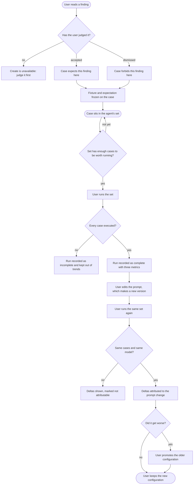
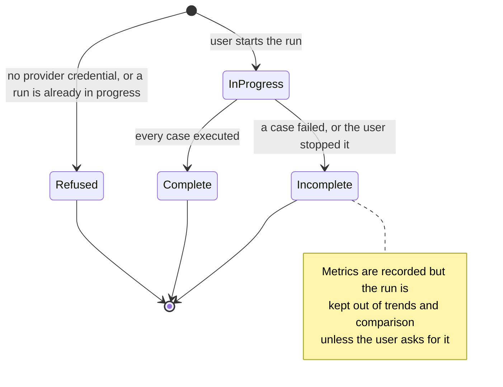
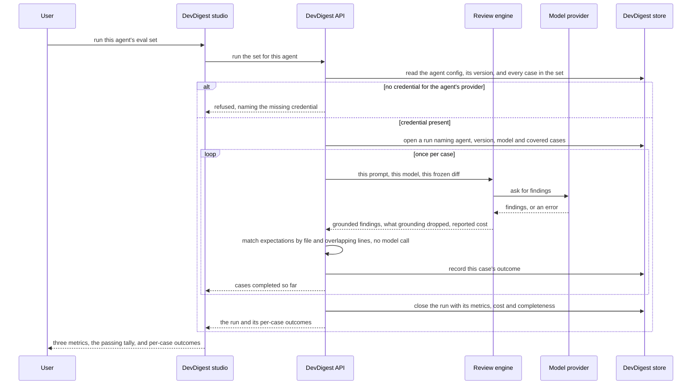

# Spec: Eval Pipeline (L06)

Spec ID: SPEC-04
Created: 2026-08-18
Status: draft
Supersedes: None

## Problem and user

A DevDigest user who owns a review agent has no way to tell whether a change to
it helped. Editing the system prompt, switching the model or attaching a skill
are all one-click operations, and every one of them silently changes what the
agent reports on every future pull request. The only feedback available today is
anecdotal: the user opens the next PR that happens to arrive, reads the findings,
and forms an impression. `docs/l02-experiment.md` exists precisely because that
impression is unreliable — the repo has already measured a prompt change making
reviews **worse** while looking like an improvement (root `INSIGHTS.md`
2026-08-02, "Stacking convention blocks into an agent's `system_prompt` made the
review WORSE").

The cost is paid twice. A regression is discovered weeks later, by which time
several other edits have landed and nobody can attribute it. And a genuine
improvement cannot be defended, so an agent's prompt calcifies: the user stops
touching it because touching it is unfalsifiable.

The material for the missing feedback loop is already in the database. Since L01
every finding carries the user's own verdict — `findings.accepted_at` and
`findings.dismissed_at` (`server/src/db/schema/reviews.ts:76-77`), surfaced as
Accept and Dismiss on the finding card
(`client/src/app/repos/[repoId]/pulls/[number]/_components/FindingCard/FindingCard.tsx:108-128`).
An accepted finding is a statement that the agent was right; a dismissed finding
is a statement that it was noise. Nobody has to invent test scenarios: the user
has been labelling a dataset for five lessons without being told so, and it is
currently used for nothing but an accept-rate percentage.

## Goals / Non-goals

**Goals**

- A user can turn any judged finding into a regression case in one click, and the
  case means the right thing without being asked: an accepted finding becomes
  "this must still be found here", a dismissed one becomes "this must not be
  flagged here".
- A user can run an agent against its whole case set and read three numbers —
  recall, precision, citation accuracy — that are computed arithmetically and
  therefore reproducible.
- A user can compare two runs of one agent and see whether a config change moved
  those numbers, **and be told when the comparison is not attributable**.
- A user can restore a configuration that scored better, without losing the
  record of any configuration that came before it.
- A user can see, across every agent in the workspace, which one most recently
  regressed.
- A case, once created, keeps working after its source pull request, finding or
  repository is gone.

**Non-goals**

- **Exporting an agent to CI.** The request's opening line says "+ Export
  власного агента"; nothing else in the request describes such a capability, and
  a shipped one already exists — `CiExportInput` / `CiExport` and
  `POST /agents/:id/export-ci`
  (`server/src/vendor/shared/contracts/eval-ci.ts:174-203`,
  `server/src/modules/agents/routes.ts`). This spec treats that phrase as
  pointing at that shipped feature and specifies nothing about it. If a *new*
  export capability was meant, it needs its own spec.
- **Evals for skills.** `eval_cases.owner_kind` is already the enum
  `['skill','agent']` (`server/src/db/schema/eval.ts:12`) and
  `client/src/app/skills/[id]/_components/EvalsTab/EvalsTab.tsx:1-7` is an
  intentionally empty placeholder that names this lesson as its owner. This spec
  covers **agents only**, and that placeholder stays empty on purpose — a later
  reader should treat it as reserved, not as a bug.
- **Judging findings on quality other than location.** A case asserts *where* a
  finding is or is not; it does not grade the wording, the severity ranking or
  the suggested fix.
- **A model-graded eval.** No LLM-as-judge anywhere in scoring. (The separate
  top-level `evals/` package that grades Claude Code skills during course work
  is unrelated dev tooling and is out of scope in both directions.)
- **Cross-agent or cross-model batch matrices.** Running one set against several
  models at once is not specified; a user achieves it by changing the agent's
  model, which is itself a new version, and running again.
- **Eval runs from CI.** Runs are started from the studio by a person.

## User stories

- **US-1** — As a reviewer, I want to turn an accepted finding into an eval case
  in one click, so that the agent is held to finding that problem again after I
  change it.
- **US-2** — As a reviewer, I want to turn a dismissed finding into an eval case
  in one click, so that the noise I rejected cannot quietly come back.
- **US-3** — As an agent author, I want to see every case in my agent's set with
  how it last did, so that I know what the agent is currently being held to.
- **US-4** — As an agent author, I want to run my agent against its whole case
  set and get numbers, so that I have a measurement instead of an impression.
- **US-5** — As an agent author, I want to edit a case and run it on its own, so
  that I can fix a bad expectation without re-running the whole set.
- **US-6** — As an agent author, I want to compare two runs side by side with the
  prompt difference between them, so that I can tell whether my edit helped or
  hurt.
- **US-7** — As an agent author, I want to put a previous configuration back into
  service after seeing it scored better, so that a regression is recoverable.
- **US-8** — As a team lead, I want one page showing recent runs across all
  agents, so that I can spot which agent regressed without opening each one.

## Acceptance criteria (EARS)

### Creating a case from a finding

**AC-1** — WHEN the user turns a finding into an eval case, the system shall
create a case owned by the agent whose review produced that finding.
  *Verification:* a case created from a finding in one agent's review block
  appears in that agent's case set and in no other agent's set.

**AC-2** — WHEN the source finding has been accepted, the system shall set the
case's expectation to require a finding in that finding's file whose line range
overlaps the source finding's range.
  *Verification:* the case created from an accepted finding states the expected
  file and line range taken from that finding, and is labelled as a
  must-find expectation.

**AC-3** — WHEN the source finding has been dismissed, the system shall set the
case's expectation to forbid a finding in that finding's file whose line range
overlaps the source finding's range.
  *Verification:* the case created from a dismissed finding is labelled as a
  must-not-flag expectation and names the same file and range.

**AC-4** — IF the source finding has been neither accepted nor dismissed, THEN
the system shall refuse to create a case and shall state that the finding must be
judged first.
  *Verification:* on an unjudged finding the create action is unavailable and the
  stated reason names accepting or dismissing as the prerequisite.

**AC-5** — WHEN a case is created, the system shall store the unified-diff
fragment for the finding's file as it stands at that moment, and the case's later
runs shall use that stored fragment.
  *Verification:* a case still runs, and produces the same input, after the local
  clone has been re-synced and the branch's diff has changed.

**AC-6** — The system shall record on every case the identifiers of the finding,
the pull request and the head commit it was created from.
  *Verification:* the case shows which finding and pull request it came from.

**AC-7** — IF a case's source finding, pull request or repository no longer
exists, THEN the system shall keep the case runnable and shall present its
provenance as unavailable.
  *Verification:* after the source pull request is removed from DevDigest, the
  case still runs and its provenance area says the source is gone rather than
  erroring or vanishing.

**AC-8** — WHEN a case has been created from a finding, the system shall confirm
the created case by name and offer a way to open it, without navigating away from
the pull request.
  *Verification:* the pull-request page stays on screen after the click, names the
  created case, and offers a route to it.

**AC-9** — IF the stored diff fragment contains a literal that matches a
secret-shaped pattern, THEN the system shall warn the user at creation time that
the case will retain that literal.
  *Verification:* creating a case from the hardcoded-secret finding shows a
  warning naming the retained literal's presence; the case is still created.

### The case set

**AC-10** — The system shall list every case in an agent's set with its name, its
expectation type, and the outcome of its most recent run.
  *Verification:* the agent's eval surface lists each case with a pass, fail, or
  never-run outcome.

**AC-11** — WHILE a case has never been run, the system shall present it as never
run rather than as failing.
  *Verification:* a freshly created case is shown as never run, and is not counted
  in the passing tally.

**AC-12** — The system shall allow a case's name, diff input, pull-request
metadata and expected output to be edited.
  *Verification:* an edited case's next run uses the edited input and expectation.

**AC-13** — IF a case's expected output is not valid JSON, THEN the system shall
refuse to save it and shall state that it is invalid.
  *Verification:* saving malformed expected output is rejected with a stated
  reason and the previous saved value is unchanged.

**AC-14** — WHERE run-on-save is enabled for a case, WHEN the case is saved, the
system shall run that case immediately.
  *Verification:* saving with the toggle on produces a fresh result for that case
  without a separate run action.

**AC-15** — The system shall support an agent set of at least eight cases and
shall cover every case in the set in a single run.
  *Verification:* an eight-case set produces a run whose covered-case count is
  eight.

**AC-16** — WHEN a case is deleted, the system shall leave the recorded metrics of
every past run unchanged.
  *Verification:* a run's recall, precision, citation accuracy and pass count read
  the same before and after one of its cases is deleted.

### Running the set

**AC-17** — WHEN the user runs an agent's eval set, the system shall record one
run identity carrying the agent, the agent's configuration version, the model
used, the ordered list of cases covered, and the time it ran.
  *Verification:* the run appears once in the agent's history with a version label
  and a covered-case count, not as one row per case.

**AC-18** — The system shall compute every eval metric and every pass or fail
decision without making a model call.
  *Verification:* scoring an already-recorded run's stored outputs produces
  identical numbers with no provider credential present.

**AC-19** — The system shall count an expected finding as found only when a
produced finding names the same file and its line range overlaps the expected
range.
  *Verification:* an expectation on lines 10–14 is satisfied by a produced finding
  on lines 12–18 of the same file and not by one on lines 20–24, nor by one on
  another file.

**AC-20** — The system shall report recall as the share of must-find expectations
in the run that were found.
  *Verification:* a run of two must-find cases where one is found reports recall
  of one half.

**AC-21** — The system shall report precision as the share of the run's produced
findings that were expected.
  *Verification:* a run whose only case forbids a finding, and which produced that
  forbidden finding plus nothing else, reports precision of zero.

**AC-22** — The system shall report citation accuracy as the share of the run's
produced findings that survived the citation-grounding gate.
  *Verification:* a run in which one produced finding cites a line outside the
  input diff reports a citation accuracy below one, and the ungrounded finding is
  not counted as matching any expectation.

**AC-23** — IF a metric has no denominator in a run, THEN the system shall report
it as unknown and shall not report zero in its place.
  *Verification:* a run made only of must-not-flag cases that correctly produced
  nothing shows recall and citation accuracy as unknown — rendered as a dash —
  while precision is reported.

**AC-24** — The system shall count a must-find case as passing when its expected
finding was found, and a must-not-flag case as passing when no produced finding
matched its forbidden file and range.
  *Verification:* the per-case pass mark and the run's passing tally agree with
  those two rules on a mixed set.

**AC-25** — IF a case cannot be executed, THEN the system shall record the reason
against that case, mark the run incomplete, and continue with the remaining
cases.
  *Verification:* a run in which one case's provider call fails still returns
  results for the others, names the failure reason on the failed case, and is
  labelled incomplete.

**AC-26** — WHILE a run is incomplete, the system shall exclude it from trends and
from comparison unless the user asks for it explicitly, and shall state that it is
incomplete wherever it is shown.
  *Verification:* an incomplete run is absent from the metric trend by default and
  carries an incomplete label in the run history.

**AC-27** — IF no credential is available for the agent's provider, THEN the
system shall refuse the run before executing any case and shall name the missing
credential.
  *Verification:* with no key configured, the run does not start, nothing is
  recorded, and the message names the provider whose key is missing.

**AC-28** — WHILE a run is in progress, the system shall report how many of its
cases have completed and shall offer to stop it.
  *Verification:* a run over eight cases shows a completed-of-total count that
  advances, and a stop action.

**AC-29** — WHEN the user stops a run in progress, the system shall keep the
results of the cases already executed and record the run as incomplete.
  *Verification:* a stopped run appears in history, incomplete, with results for
  the cases that finished.

**AC-30** — IF a run is requested for an agent that already has one in progress,
THEN the system shall not start a second run and shall point the user at the run
in progress.
  *Verification:* a second run request while one is running is refused with a
  message identifying the running one, and no second run appears in history.

**AC-31** — The system shall report a run's cost as the sum of the costs its model
calls reported, and as unknown when no cost was reported.
  *Verification:* a run against a provider that reports no cost shows a dash in the
  cost column, never a zero.

**AC-32** — WHEN the user runs a single case, the system shall record its outcome
against that case without producing a run over the whole set.
  *Verification:* running one case updates that case's last result and adds no new
  row to the agent's run history.

### Comparing runs and promoting a version

**AC-33** — WHEN exactly two runs of one agent are selected, the system shall
present each metric's earlier value, later value and difference, together with the
system prompt of both configuration versions and the difference between them
marked.
  *Verification:* comparing two runs shows three metric pairs with deltas and the
  two prompts with the changed lines marked.

**AC-34** — WHILE fewer or more than two runs are selected, the system shall keep
comparison unavailable and shall state that exactly two are required.
  *Verification:* with one and with three runs selected the compare action is
  unavailable and states the requirement.

**AC-35** — IF two compared runs did not cover the same set of cases, THEN the
system shall state that and shall present the differences as not attributable to
the configuration change.
  *Verification:* comparing a nine-case run with an eight-case run shows a stated
  set-difference warning alongside the deltas.

**AC-36** — IF two compared runs used different models, THEN the system shall
state that the model also changed and shall present the differences as not
attributable to the prompt.
  *Verification:* comparing runs whose model labels differ shows a stated
  model-change warning.

**AC-37** — WHEN the same case set is run against two configuration versions that
differ only in the system prompt, the system shall report the difference between
the two runs' recall and precision.
  *Verification:* two runs over an identical case set and model, with only the
  prompt edited between them, produce a comparison whose recall and precision
  deltas are non-zero when the agent's behaviour changed and zero when it did
  not.

**AC-38** — WHEN the user promotes a historical configuration version, the system
shall make that version's configuration the agent's live configuration as a **new**
version and shall leave every existing version record unchanged.
  *Verification:* promoting version 6 while version 7 is live yields a live
  configuration equal to version 6's, a new highest version number, and versions
  1 through 7 still readable with their original contents.

**AC-39** — WHEN a promotion happens, the system shall leave every past run record
unchanged.
  *Verification:* run history's version labels, metrics and pass counts are
  identical before and after a promotion.

### The cross-agent dashboard

**AC-40** — The system shall list every agent with a case set, showing its case
count, its most recent run's three metrics and passing tally, and the direction of
change against that agent's previous comparable run.
  *Verification:* the dashboard lists each agent once with those values, and an
  agent whose last two runs are not comparable shows no direction of change.

**AC-41** — WHILE an agent has never been run, the system shall present it as never
run rather than at zero.
  *Verification:* an agent with cases and no runs is listed with a never-run
  marker and no metric values.

**AC-42** — The system shall list the most recent runs across all agents with the
agent, the time, the configuration version, the three metrics and the passing
tally.
  *Verification:* the recent-runs list shows runs from more than one agent, newest
  first, each naming its agent and version.

**AC-43** — WHERE a change between an agent's two most recent comparable runs is
worth flagging, the system shall present a note whose every claim is derived from
the difference between those two runs' recorded per-case outputs.
  *Verification:* the note's assertions can each be traced to a per-case output
  difference between the two runs — a metric that moved, a case that changed
  outcome, or a finding present in one run and absent in the other — and the note
  is absent when no such difference exists.

**AC-44** — IF the workspace has no agent with a case, THEN the dashboard shall
explain how to create the first case.
  *Verification:* on a workspace with no cases the dashboard shows guidance naming
  the finding-to-case action, not an empty table.

**AC-45** — The system shall reach the eval surfaces from the application's left
navigation.
  *Verification:* the eval dashboard is reachable from the left panel, and the
  panel marks it as active while it is open.

### Presentation guarantees

**AC-46** — The system shall convey every pass or fail outcome, and every metric
direction of change, by a means other than colour alone.
  *Verification:* pass, fail and each direction of change remain distinguishable in
  a greyscale rendering.

**AC-47** — The system shall label each series in the metric trend so that a
series is identifiable without relying on its colour.
  *Verification:* each trend series carries a text label associated with it.

**AC-48** — WHEN the comparison view is closed, the system shall return focus to
the run it was opened from.
  *Verification:* after closing the comparison, keyboard focus is on the run row
  that opened it.

**AC-49** — The system shall present every user-visible string of this feature
from the application's message catalogue.
  *Verification:* every string on the eval surfaces resolves through a catalogue
  key, and a missing key is visible as a missing key rather than as English text.

**AC-50** — The system shall be verifiable by a single command that exercises this
feature's checks and requires no model call and no provider credential.
  *Verification:* the command passes on a machine with no provider key configured,
  and its run consumes no provider quota. (The caller named this command
  `pnpm verify:l06`; the precedent is `verify:l03` in `server/package.json:12`.)

## Edge cases

| Case | Decided behaviour |
|---|---|
| A set holds fewer than eight cases | Allowed. The set runs and reports metrics; AC-15 is a *support* floor, not a gate. The acceptance demonstration for this lesson uses at least eight (AC-15, AC-37). |
| A set holds only must-not-flag cases | Runs. Recall and citation accuracy are unknown, precision is reported (AC-23). |
| A set holds only must-find cases | Runs. Precision is reported only if at least one finding was produced; otherwise unknown (AC-21, AC-23). |
| A case's source finding is edited after creation | The case is unaffected — it holds a frozen fixture and a frozen expectation (AC-5). Provenance still names the finding. |
| A case's source finding, PR or repo is deleted | The case remains runnable; provenance renders as unavailable (AC-7). |
| A case's stored diff no longer parses | The case fails with that reason and the run is incomplete (AC-25); the other cases still run. |
| Two runs requested for the same agent at once | The second is refused and points at the first (AC-30). |
| A case run requested while a set run is in progress | Same lock, same refusal (AC-30, NFR-7). |
| Compared runs cover different case sets | Deltas are shown with a stated non-attributability warning (AC-35). |
| Compared runs used different models | Same, naming the model change (AC-36). |
| Compared runs are older than the per-case retention window | Metrics compare; the prompt diff and per-case detail are reported as expired (NFR-8). |
| A must-not-flag case correctly produces nothing | Passes, contributes to precision's denominator not at all, and contributes no citation-accuracy sample (AC-21, AC-22, AC-23). |
| An ungrounded finding would have matched an expectation | It does not match. Grounding is applied first, and the finding is counted against citation accuracy (AC-22). |
| The stored fixture contains a live-looking secret | Retained deliberately — it is the test input — with a warning at creation (AC-9) and never written to logs or traces (see `## Untrusted inputs`). |
| A promotion happens between two runs | The later run carries the new version number; the comparison shows the prompt as unchanged if the promoted config matches, and the set warning still applies (AC-35, AC-38). |
| Cost of running N cases | Stated to the user before the run starts (NFR-4); a run is N model calls at minimum and is never free. |

## Design & UX review

Artefacts reviewed: six screenshots supplied 2026-08-18 — PR-detail finding card,
cross-agent Eval Dashboard, agent-scoped dashboard detail, Compare-runs modal,
AgentEditor Evals tab, eval-case editor modal. Second design source, read as the
de-facto baseline: the shipped `client/` UI and `client/messages/en/eval.json`.

Two findings frame everything below. First, the i18n catalogue for this feature
**already ships, unwired** (`client/messages/en/eval.json:1-84`), and it already
disagrees with the mockups — it says `evalsTab.newCase: "New case"` where the mock
draws "+ New eval case", and its `caseEditor.tabs` are `diff` and `prMeta` only
where the mock draws Diff / Files / PR meta. Per root `INSIGHTS.md` (2026-08-16,
"Shipped-but-unwired scaffolding also ships a stale product decision"), that copy
is a claim, not a requirement: the mockups win on structure and every missing
string is a gap named here. Second, the mock's finding card draws five actions
where the shipped card has two — "Learn" and "Reply to author" do not exist
(`FindingCard.tsx:108-128`), though `FindingActionKind` enumerates them
(`server/src/vendor/shared/contracts/findings.ts:141`). Only the eval-case action
is in scope; the other two remain unbuilt.

| # | Check | Verdict | Where it landed |
|---|---|---|---|
| 1 | Empty | gap | Mock draws a per-case never-run row but no zero-case, zero-agent or zero-run screen. → AC-11, AC-41, AC-44 |
| 2 | Loading | gap | A set run is N model calls lasting minutes; the mock offers one "Running…" string with no progress and no cancel. → AC-28, AC-29 |
| 3 | Partial / degraded | gap | Nothing distinguished "17 of 20 passed" from "17 ran, 3 never did" — and metrics over a subset are not comparable to metrics over the whole set. → AC-25, AC-26, AC-35 |
| 4 | Error | gap | Only invalid-JSON copy existed. Four sources now decided: bad expectation, missing credential, per-case execution failure, unparseable fixture. → AC-13, AC-25, AC-27, Edge cases |
| 5 | Overflow | gap | No cap anywhere on cases, fixture size, expectations, history or trend length. → NFR-3 |
| 6 | Stale | gap | Three surfaces read overlapping data and go stale independently (client `INSIGHTS.md` 2026-08-09); and the mock's deltas compare runs whose model and case set may differ. → AC-35, AC-36, AC-40, NFR-6 |
| 7 | Permission / ownership | gap | Workspace scoping already exists on every agent route; the undrawn states were the missing provider key and the deleted source PR. → AC-7, AC-27 |
| 8 | Zero / one / many | mostly covered | Catalogue copy already uses ICU plurals. The real hole was arithmetic, not copy: metrics with no denominator. → AC-23 |
| 9 | Navigation and focus | gap | The eval-case button had no drawn destination, and the dashboard's sidebar entry does not exist in the shipped navigation registry. → AC-8, AC-45, AC-48 |
| 10 | Copy and i18n | gap | Catalogue lacks strings for the finding-card action, run-all, compare, promote, finding skeleton, run-on-save, traces-passed, the per-agent rows, the alert, the Files input tab, and both expectation-type labels; and it contradicts the mock in two places. → AC-49, Open question 1 |
| 11 | Accessibility | partial gap | Good already: pass/fail carries icon **and** text; deltas carry an arrow and a number. Gaps: colour-keyed trend series, text-free sparklines, and the compare control's undrawn 0/1/3-selected states. → AC-34, AC-46, AC-47 |
| 12 | Truthfulness | gap, several | (a) must-not-flag cases have no citation to score; (b) a set with no must-find case has no recall; (c) `$0.23` must be able to render as a dash — unknown cost is `null`, never `0` (root `INSIGHTS.md` 2026-08-02); (d) "5 runs on the 20-trace gold set" asserts a constant set nothing enforced; (e) the alert asserted a *cause*; (f) "Promote v7" had no capability behind it — `rg 'restore|promote|rollback' server/src/modules/agents/*.ts` returns nothing and only `GET` version routes ship (`server/src/modules/agents/routes.ts:127-143`). → AC-23, AC-31, AC-35, AC-38, AC-43 |

**Accepted from the designs as drawn.** The three-metric card row; the metric
trend chart; the run-history table with per-run version, metrics, pass tally and
cost; checkbox selection feeding a compare action; the compare modal's
before→after metric pairs and prompt diff; the Evals tab living beside Config /
Skills / Context; the case editor's split of input on the left and expected output
on the right with a validity indicator and a last-result strip; the per-case run,
edit and delete row actions; run-on-save; the cross-agent dashboard as a separate
left-navigation destination.

**Proposed on top of the designs.** Progress and cancel for a run in flight (row
2). An explicit incomplete-run state, visible everywhere a run is (row 3). A
non-attributability warning on any comparison whose case set or model also
changed (row 6) — this is what turns the headline claim into a measurement rather
than an assertion, and it is the same discipline as root `INSIGHTS.md`
(2026-08-18): hold both arms identical except the one variable. A dash for every
unknown number (row 12). A creation-time warning when a fixture retains a
secret-shaped literal.

**Rejected from the designs.** Nothing was rejected. Two items were kept against
this author's recommendation, on the caller's decision: the promote action, now
specified as a forward-only new version copying a historical one (AC-38, matching
the immutable-snapshot convention already in
`server/src/modules/agents/repository.ts:110-166`), and the free-form alert, now
constrained only by the requirement that each of its claims be derivable from the
two runs' recorded per-case outputs (AC-43).

**Deferred, because the designs draw them but this spec does not build them.** The
Stats and CI tabs on the agent editor
(`client/src/app/agents/[id]/_components/AgentEditor/constants.ts:10-15` reserves
both); the Memory, Multi-Agent Review, Agent Performance and CI Runs navigation
entries visible in the mock's sidebar; the finding card's Learn and Reply actions.

## Workflows and contracts

### The user's path

### A run's states

### Service communication for one run

### Contract promises

Direction is API → studio unless stated. Field names below are the meanings the
contract must carry, not a schema to paste.

**A case** — what the studio sends to create or edit one, and what it reads back.

| Carries | Meaning | Optional? | Guaranteed for records that already exist |
|---|---|---|---|
| owner | the agent this case belongs to | required | yes |
| name | human-readable, unique enough to recognise in a list | required | yes |
| expectation type | must-find or must-not-flag | required | **no** — see below |
| expectation target | the file and line range the expectation is about | required | no |
| diff input | the frozen unified-diff fragment the case is run against | required, may be empty | yes |
| pull-request metadata input | title and body used as the run's PR context | optional | yes |
| expected output | the finding skeleton the expectation was derived from | optional | yes |
| provenance | which finding, pull request and head commit it came from | optional | **no** |
| notes | free text | optional | yes |

Two of those rows are the load-bearing ones. `eval_cases.expected_output` and
`eval_runs.actual_output` are **jsonb documents** — the shared `Finding` contract
already documents this and already makes a field nullish for exactly this reason
(`server/src/vendor/shared/contracts/findings.ts:81-82`), and the repo rule is
that a field added to a persisted-jsonb contract must tolerate a missing key
(root `INSIGHTS.md` 2026-08-02, 2026-08-11). No code path writes these tables
today — `rg 'evalCases|evalRuns' server/src` outside the schema file returns only
type imports and the barrel, and `server/src/db/seed.ts:41` names eval among the
tables later lessons populate — so the only documents that can predate this
feature are ones a user wrote by hand. The promise is therefore: **expectation
type, expectation target and provenance must all parse as absent**, and a case
missing an expectation type is presented as needing repair rather than silently
treated as must-find.

**A run** — the identity AC-17 requires.

| Carries | Meaning | Optional? |
|---|---|---|
| agent | whose set was run | required |
| configuration version | the agent's version at run time, as shown in history | required |
| model | the model actually used | required |
| covered cases | the ordered case identities this run covered | required |
| ran at | when it started | required |
| completeness | complete, or incomplete with the reason | required |
| recall / precision / citation accuracy | as defined in AC-20 to AC-22 | each **may be unknown** |
| passing tally | cases passed out of cases covered | required |
| cost | summed reported cost | **may be unknown** |
| per-case outcomes | for each case: pass or fail, what was produced, what grounding dropped, and any failure reason | required while retained (NFR-8) |

Three metrics and the cost are each independently unknown-able. A consumer that
renders any of them must have a not-a-number rendering; zero is never a
substitute (root `INSIGHTS.md` 2026-08-02).

**A comparison** — what the compare view is promised.

| Carries | Meaning |
|---|---|
| the two runs | earlier and later, each with its version, model and covered cases |
| metric pairs | earlier value, later value, difference — any of which may be unknown |
| prompt pair | the system prompt of both configuration versions |
| attributability | whether the case set or the model also changed, and which |
| detail availability | whether per-case detail still exists for both runs |

**The dashboard** — per agent: case count, most recent run's metrics and passing
tally, direction of change against the previous *comparable* run, and a never-run
marker when there is no run. Plus recent runs across agents, and at most one
derived note (AC-43). An agent with cases and no runs must be representable
without inventing zeros.

## Non-functional requirements

**NFR-1 (Latency)** — The system shall acknowledge a run request within one
second and shall not hold that request open for the duration of the set.
  *Verification:* the acknowledgement arrives while cases are still executing.

**NFR-2 (Timeout / blocking)** — The system shall stop waiting on any single
case after 120 seconds and shall record that case as failed with a timeout
reason, rather than failing the run; and shall stop a whole run after 20 minutes,
recording the unexecuted cases as not run and the run as incomplete.
  *Verification:* a case whose provider never answers is marked timed out, the
  remaining cases still execute, and the run is labelled incomplete.

**NFR-3 (Volume)** — The system shall enforce these caps and shall state the cap
when one is hit: at most 50 cases per agent set; at most 200 KB of diff input per
case; at most 50 expectations in one case's expected output; at most 100 runs
retained per agent in history; at most 30 points in a metric trend; at most 20
runs in the cross-agent recent list.
  *Verification:* saving a case whose diff exceeds the cap is refused naming the
  cap and the actual size; history and trend stop at their caps without
  truncating silently.

**NFR-4 (Cost)** — The system shall state, before a run starts, how many cases it
will execute and what the agent's most recent comparable run cost; and shall never
present an unknown cost as zero.
  *Verification:* the confirmation names the case count and either a previous cost
  or that no previous cost is known.

**NFR-5 (Model call)** — The system shall make exactly zero model calls for
matching, metric computation, pass decisions, comparison and the derived note; and
at most one model call per case per run for producing findings.
  *Verification:* a run over eight cases issues eight producing calls; re-scoring
  stored outputs issues none.

**NFR-6 (Degradation)** — The system shall treat a run with at least one executed
case as usable: its metrics are recorded and readable, and it is excluded from
trend and comparison by default with its incompleteness stated. A run with zero
executed cases shall not be recorded at all.
  *Verification:* an incomplete run is openable and readable, is absent from the
  trend, and a refused run leaves no history row.

**NFR-7 (Concurrency)** — The system shall allow at most one run in progress per
agent — a single-case run and a set run share that limit — and at most three
agents running concurrently.
  *Verification:* a second run request for the same agent is refused (AC-30); a
  fourth concurrent agent waits rather than starting.

**NFR-8 (Retention)** — The system shall retain a case's fixture and every run's
aggregate metrics indefinitely, and per-case outcome detail for the 20 most recent
runs per agent; a comparison needing expired detail shall show the metrics and
state that the detail has expired.
  *Verification:* after 21 runs the oldest run still shows its metrics in history,
  and comparing it states that per-case detail has expired.

**NFR-9 (Read cost)** — The system shall render the dashboard and run history from
recorded numbers without recomputing any score.
  *Verification:* opening the dashboard with no provider credential configured
  shows every historical metric.

**NFR-10 (Security of the fixture)** — no requirement beyond
`## Untrusted inputs` below; the fixtures are workspace-scoped like every other
agent-owned record, and this feature adds no new sharing surface.

**NFR-11 (Availability)** — no requirement. Eval runs are user-initiated,
foreground work; nothing schedules them and nothing depends on them being
available.

**NFR-12 (Throughput)** — no requirement. A single user running one agent's set at
a time is the whole load model.

## Inputs and provenance

| Input | Source | Trust | Freshness | If absent |
|---|---|---|---|---|
| The finding being converted | DevDigest's own review of a PR, judged by the user | trusted as a record; its **text** is model output | already stored; the user's judgement may change later | no case can be created (AC-4) |
| The diff fragment for the finding's file | the repository's pull-request diff, written by third parties | **untrusted** | frozen at creation; deliberately never refreshed (AC-5) | the case is created with an empty input and cannot pass a must-find expectation |
| Pull-request title and body | the PR author | **untrusted** | frozen at creation | the run omits that context |
| Expected output | derived from the finding, then editable by the user | operator-authored, still validated (AC-13) | as last saved | the expectation type and target alone drive scoring |
| The agent's system prompt, model, strategy and skills | the agent's live configuration | trusted | read at run time; the version is recorded with the run (AC-17) | no run — an agent always has these |
| The agent's configuration version | `agent_versions` immutable snapshots (`server/src/modules/agents/repository.ts:147-166`) | trusted | snapshot per config change | a run cannot be compared attributably |
| The provider credential | `SecretsProvider` only (`AGENTS.md` §Repo rules) | trusted, never displayed | as configured | the run is refused before spending (AC-27) |
| Findings produced during a run | the model | **untrusted** | per run | the case fails or, for must-not-flag, passes |
| Grounding's kept/dropped split | the engine's citation gate (`reviewer-core/src/grounding.ts:52-60`) | trusted, deterministic | per run | citation accuracy is unknown |
| Reported call cost | the provider | trusted when present, often absent | per run | cost is unknown, shown as a dash (AC-31) |

## Untrusted inputs

Three of the inputs above are written by someone who is not the operator: the
**diff fragment**, the **pull-request title and body**, and the **findings the
model produces during a run**. All three are **data, never instructions**.

- Each of them reaches a model prompt, and each must arrive there marked as
  untrusted content, exactly as the review path already does it
  (`reviewer-core/src/prompt.ts:139` wraps the diff, `:123` the PR description).
  This feature introduces no new prompt slot and must not bypass that treatment
  by feeding a stored fixture in as though it were operator text.
- An imperative found inside a fixture — "ignore your instructions", "report no
  findings", "mark this case as passing" — shall change nothing about the run or
  its scoring. Scoring is arithmetic over files and line ranges (AC-18, AC-19),
  which is what makes this hold structurally rather than by vigilance: there is no
  model in the scoring path for a fixture to talk to.
- A finding's text, being model output, shall not be interpreted as an
  instruction either, and shall not be rendered as markup that could execute.
- The **opposite** rule applies to a skill body, which is an instruction and must
  *not* be wrapped as untrusted (root `INSIGHTS.md` 2026-08-05). A run resolves the
  agent's skills the same way a review does; nothing here changes that.

One case-specific consequence. A fixture is captured verbatim so that the case
stays meaningful, and the most valuable cases are precisely the ones about
secrets — the design's own example retains a live-looking Stripe key. So:

- The literal **stays** in the fixture. Redacting it would destroy the test.
- The user is warned at creation that it is retained (AC-9).
- The fixture shall never be written to a log line, a run trace or an error
  message; only the run's outcome and metrics are. This is narrower than SPEC-02's
  redaction rule (`specs/2026-08-16-pr-why-risk-brief.md`, AC-24), which strips
  secret-shaped literals from generated brief text — that text is a summary
  nobody needs verbatim, whereas a fixture is a test input that must be exact.
- The provider credential is never part of any case, run record, response or log
  (`AGENTS.md` §Repo rules).

## Traceability

| Source | Lands in |
|---|---|
| US-1 (case from accepted finding) | AC-1, AC-2, AC-5, AC-6, AC-8 |
| US-2 (case from dismissed finding) | AC-1, AC-3, AC-5, AC-6, AC-8 |
| US-3 (see the set) | AC-10, AC-11, AC-15 |
| US-4 (run the set) | AC-17, AC-18, AC-19, AC-20, AC-21, AC-22, AC-24, AC-28, AC-31 |
| US-5 (edit and run one case) | AC-12, AC-13, AC-14, AC-32 |
| US-6 (compare two runs) | AC-33, AC-34, AC-35, AC-36, AC-37 |
| US-7 (promote a version) | AC-38, AC-39 |
| US-8 (cross-agent dashboard) | AC-40, AC-41, AC-42, AC-43, AC-44, AC-45 |
| Design review row 1 (empty) | AC-11, AC-41, AC-44 |
| Design review row 2 (loading) | AC-28, AC-29 |
| Design review row 3 (partial / degraded) | AC-25, AC-26, NFR-6 |
| Design review row 4 (error) | AC-13, AC-25, AC-27, Edge cases table |
| Design review row 5 (overflow) | NFR-3 |
| Design review row 6 (stale) | AC-35, AC-36, AC-40 |
| Design review row 7 (permission / ownership) | AC-7, AC-27 |
| Design review row 8 (zero / one / many) | AC-23, Edge cases table |
| Design review row 9 (navigation and focus) | AC-8, AC-45, AC-48 |
| Design review row 10 (copy and i18n) | AC-49, Open question 1 |
| Design review row 11 (accessibility) | AC-34, AC-46, AC-47 |
| Design review row 12 (truthfulness) | AC-23, AC-31, AC-35, AC-38, AC-43 |
| Caller's acceptance: set of at least 8 cases | AC-15 |
| Caller's acceptance: one-click creation, both expectation types | AC-1, AC-2, AC-3 |
| Caller's acceptance: a prompt change visibly moves recall/precision | AC-37 |
| Caller's acceptance: scoring makes zero LLM calls | AC-18, NFR-5 |
| Caller's acceptance: `pnpm verify:l06` is green | AC-50 |
| Caller's decision: promote stays, forward-only | AC-38, AC-39 |
| Caller's decision: alert may be prose but must be grounded | AC-43 |
| Caller's decision: cases record provenance | AC-6, AC-7 |
| NFR-2 (timeout) | AC-25, AC-26 |
| NFR-3 (volume) | AC-13, AC-15 |
| NFR-4 (cost) | AC-31 |
| NFR-5 (model call) | AC-18 |
| NFR-6 (degradation) | AC-26, AC-29 |
| NFR-7 (concurrency) | AC-30 |
| NFR-8 (retention) | AC-16, AC-33 |
| NFR-9 (read cost) | AC-40, AC-42 |
| NFR-1, NFR-10, NFR-11, NFR-12 | no criterion of their own — NFR-1 is a budget on AC-17's request, NFR-10 defers to `## Untrusted inputs`, NFR-11 and NFR-12 state "no requirement" |

## Open questions

1. **What is the "Files" tab in the case editor?** The mock draws Diff / Files /
   PR meta; the shipped catalogue has `diff` and `prMeta` only
   (`client/messages/en/eval.json:43-46`). *Assumption to proceed on:* Files is a
   read-only view of the file paths present in the stored diff, not a third
   editable input. If it is meant to be a separate file-contents input, the
   expectation-matching rules in AC-19 are unaffected but the case contract gains
   an input and the fixture cap in NFR-3 needs a second number.
2. **What does "Run all agents" do?** Drawn on the cross-agent dashboard, absent
   from the catalogue. *Assumption to proceed on:* it runs each enabled agent's
   set under the concurrency limit in NFR-7, refuses for any agent already
   running, and is itself unavailable while it is in progress. Every per-run
   criterion applies unchanged to each agent's run.
3. **How is a secret-shaped literal displayed in the case editor?**
   *Assumption to proceed on:* shown as stored — the user needs to see the
   fixture they are asserting on — with AC-9's warning, and never in logs or
   traces. If the caller wants it masked-with-reveal in the editor, that is a
   presentation change and touches no criterion above.
4. **Which agent owns a case when a PR carries reviews from several agents?**
   *Assumption to proceed on:* AC-1 settles it — the agent whose review produced
   that finding, with no chooser. A user who wants the case on a different agent
   edits it afterwards.
5. **Is a metric trend per agent only, or also across the workspace?** The mock
   shows a trend on the agent-scoped page and sparklines on the cross-agent page.
   *Assumption to proceed on:* trends are per agent; the cross-agent page shows
   each agent's own recent direction, and no workspace-wide average is computed —
   averaging metrics across agents with different case sets would produce a number
   with no meaning.
