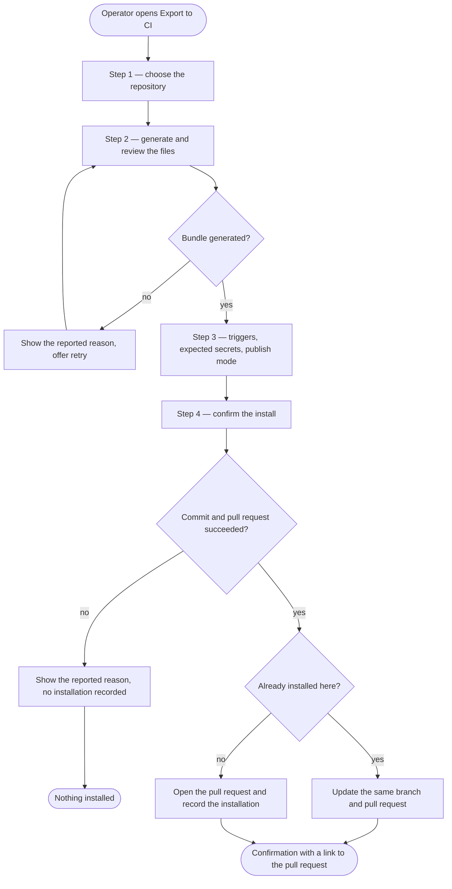
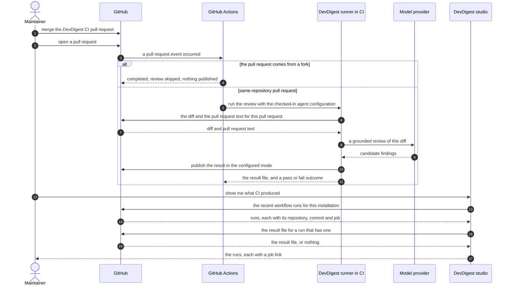

# Spec: Export to CI — run a DevDigest agent on GitHub Actions (v1)

Spec ID: SPEC-05
Created: 2026-08-24
Status: draft
Supersedes: None

> **Scope posture.** This is a deliberately small first version: the smallest
> thing that gets a real agent reviewing real pull requests in a real
> repository, so the next iteration is informed by usage rather than by
> guesswork. Everything that does not threaten one of the four outcomes in
> `## Goals` or a stated security requirement has been moved to
> `## Not in scope for v1`, with a one-line reason, rather than written as an
> acceptance criterion.

## Problem and user

A DevDigest operator tunes a review agent in the studio — model, system prompt,
skills, context — and it only ever reviews a pull request when they open the
studio and ask it to. Every teammate who opens a PR while the studio is closed
gets no review at all. The agent's value is bounded by one person remembering to
run it, on one machine, one PR at a time. Teams that want the agent to be part of
the merge decision have no route to it: the review lives in a local app, not in
the repository's own CI.

The pieces to close that gap already exist and are unwired. `agent-runner/` is
built and tested: `ncc`-bundled to a single self-contained
`.devdigest/runner/index.js`, it resolves the PR context from CI environment
variables, runs the *same* `reviewer-core` pipeline as a local review including
the mandatory grounding gate, computes its verdict deterministically from
`ci_fail_on`, writes `devdigest-result.json`, and posts to the PR
(`agent-runner/README.md`). `ci_installations` and `ci_runs` exist as tables
(`server/src/db/schema/ci.ts`), `agent_runs.source` already admits `'ci'`
(`server/src/db/schema/runs.ts:44`), `agents.ci_fail_on` already carries the
threshold (`server/src/db/schema/agents.ts:25`), and the export/ingest contract
set — `CiTarget`, `CiFile`, `AgentManifest`, `CiExportInput`, `CiInstallation`,
`CiExport`, `CiRun`, `CiResultArtifact` — is already shipped in
`server/src/vendor/shared/contracts/eval-ci.ts`. `GitHubClient` already exposes
`commitFiles`, `findOpenPr` and `openPullRequest`
(`server/src/vendor/shared/adapters.ts:168-176`), and
`client/src/vendor/ui/ExportWizardSteps.tsx` already ships the numbered step
indicator. None of it is connected to a user-facing flow: there is no
`server/src/modules/ci/`, no `/ci-runs` page, and no CI tab.

The cost of leaving it disconnected is not only "no CI reviews". The one piece of
the chain that *is* wired — the runner reading `DEVDIGEST_POST_AS` — has no
producer, so the publish mode the operator picks would be silently discarded and
every CI review would post as a GitHub review regardless
(`agent-runner/insights/INSIGHTS.md`, 2026-07-08 Open Questions).

## Goals / Non-goals

**Goals — the four outcomes this version is judged on**

1. A test pull request in the target repository receives the agent's result in
   the publish mode the operator chose.
2. A critical finding makes the run exit non-zero, so that a check marked
   required in the repository's own settings blocks the merge.
3. No credential value appears in any generated file, any artifact, or any log —
   and a pull request from a fork cannot obtain one.
4. The run is visible in the studio's CI Runs view with a working link to the
   GitHub Actions job.

Everything else in this spec exists to make those four reachable and honest.

**Non-goals**

- **CI platforms other than GitHub Actions.** `CiTarget` already carries
  `circle`, `jenkins` and `cli`; no generator exists for them and none is built
  here — not even as disabled options.
- **Configuring branch protection or required status checks.** DevDigest states
  what the operator must do in GitHub's own settings and does nothing itself.
- **A push-based ingest channel.** No inbound endpoint receives results.
- **Changing `reviewer-core`, the grounding gate, or `agent-runner`'s review
  pipeline.** The runner is a shipped dependency; only its environment contract
  is exercised.
- **The multi-agent review service and the pull-request feed.** Owned by
  concurrent work; this feature must not alter them.
- **Secret management.** DevDigest never reads, stores, transmits or displays the
  value of `OPENROUTER_API_KEY`.

## User stories

- **US-1** As an agent author, I want to export a configured agent to a
  repository's CI, so that every pull request is reviewed without anyone opening
  the studio.
- **US-2** As a repository maintainer, I want the export to arrive as a pull
  request I can read and reject, so that nothing executes in my CI that I did not
  approve.
- **US-3** As a maintainer, I want to choose how the agent publishes its result —
  a review, a comment, or nothing but an exit code — and have that choice
  honoured by the CI run.
- **US-4** As a maintainer, I want a critical finding to be able to block a
  merge, so that the agent is part of the merge decision rather than advisory.
- **US-5** As a security-conscious maintainer, I want pull requests from forks
  handled without exposing credentials, so that accepting outside contributions
  stays safe.
- **US-6** As an agent author, I want to see the CI runs in the studio with a link
  to the real job, so that a CI review is as inspectable as a local one.
- **US-7** As an agent author, I want to re-run the export after editing the
  agent and have it update the same pull request, so that I do not accumulate
  duplicate branches in someone's repository.

## Acceptance criteria (EARS)

### The wizard

**AC-1** — The export wizard shall target GitHub Actions and shall offer no other
CI platform.
  *Verification:* no CircleCI, Jenkins or Generic CLI option is present anywhere
  in the wizard.

**AC-2** — The export wizard shall require a target repository, identified as
`owner/name`, before the operator can advance past the first step.
  *Verification:* the first step shows the chosen repository, and advancing
  without one is impossible.

**AC-3** — WHEN the operator reaches the Preview step, the system shall list every
file the export would add or change by its repository-relative path and shall
show the generated workflow's contents.
  *Verification:* the preview lists the agent manifest, each skill body, the
  memory file, the workflow and the runner bundle, and the workflow's text is
  readable in the pane beside the list.

**AC-4** — WHILE the file bundle is being generated, the system shall show a busy
state and shall keep the advance control unavailable.
  *Verification:* between entering the Preview step and the file list appearing,
  a busy indicator is visible and the advance control cannot be used.

**AC-5** — IF any step of the wizard fails, THEN the system shall show a single
error state carrying the reported reason, offer a retry, and preserve the choices
already made in earlier steps.
  *Verification:* after a failure at generation or at install, the error text
  includes the reported reason and the repository chosen in step 1 is still
  selected after retrying.

**AC-6** — WHEN the operator reaches the Configure step, the system shall present
the three pull-request trigger events with at least one selected.
  *Verification:* the Configure step shows the opened, synchronize and reopened
  events, with at least one selected on arrival.

**AC-7** — IF the operator attempts to deselect the last remaining trigger event,
THEN the system shall refuse.
  *Verification:* deselecting down to one leaves that one selected.

**AC-8** — The Configure step shall name the secrets the workflow expects and
shall never display, request or accept a secret's value.
  *Verification:* `OPENROUTER_API_KEY` and `GITHUB_TOKEN` are named with the
  instruction to add the former to the repository's Actions secrets, and no field
  anywhere in the wizard takes a secret value.

**AC-9** — The Configure step shall state that blocking merges additionally
requires marking the check as required in the repository's own branch protection,
and that DevDigest does not configure branch protection.
  *Verification:* both statements are present in the Configure step's guidance.

**AC-10** — WHEN the operator chooses a publish mode on the Configure step, the
system shall set the generated workflow's runner publish-mode environment
variable to that choice.
  *Verification:* choosing "PR comment" produces a workflow whose runner step
  passes `DEVDIGEST_POST_AS=pr_comment`; choosing "None" passes `none`. This is
  the gap recorded in `agent-runner/insights/INSIGHTS.md` (2026-07-08).

**AC-11** — The wizard's step indicator shall convey the current step by its number
and its label, not by colour alone.
  *Verification:* the current step is identifiable in a colourless rendering.

### The generated files — security requirements

**AC-12** — The generated workflow shall perform the review by executing the runner
file included in the same bundle, and shall depend on no DevDigest-published CI
action.
  *Verification:* the workflow's review step names the bundled runner file; no
  step references a `devdigest/*` action.

**AC-13** — The generated workflow shall declare exactly two permissions — read
access to repository contents and write access to pull requests — and no others.
  *Verification:* the workflow's permission block lists those two entries and
  nothing else.

**AC-14** — The generated workflow shall be triggered by pull-request events on the
repository itself and shall never use the trigger that grants a fork's pull
request a write-capable token.
  *Verification:* the workflow's trigger block names `pull_request`; the string
  `pull_request_target` appears nowhere in it.

**AC-15** — IF the pull request being reviewed originates from a fork, THEN the
generated workflow shall skip the review step entirely, publish nothing, produce
no result file, and complete with a non-failing outcome stating that the review
was skipped because the pull request comes from a fork.
  *Verification:* a fork pull request in a repository with the workflow installed
  produces a completed, non-failing workflow run with no posted review, no
  comment and no uploaded result file, and the skip reason is readable from the
  run.

**AC-16** — The generated files shall name the model credential
`OPENROUTER_API_KEY` and shall reference no other model-provider credential name.
  *Verification:* the workflow references `OPENROUTER_API_KEY`; no generated file
  mentions `OPENAI_API_KEY` or any other provider key name.

**AC-17** — No secret value shall appear in any generated file, in the uploaded
result file, or in any log the run produces.
  *Verification:* every credential in every generated file appears as a reference
  to a repository secret, never as a literal; the result file and the job log of a
  completed run contain no credential value.

**AC-18** — The generated workflow shall pin every third-party action it uses to a
full commit SHA and shall carry the corresponding human-readable version beside it
as a comment.
  *Verification:* every `uses:` line naming a third-party action ends in a
  40-character SHA and carries a trailing version comment.

### Install

**AC-19** — WHEN the operator confirms the install, the system shall commit the
bundle to a dedicated DevDigest CI branch and open a pull request against the
repository's base branch, and shall never commit to the base branch directly.
  *Verification:* after install, the base branch is unchanged and an open pull
  request from the DevDigest CI branch carries every generated file.

**AC-20** — The system shall hold at most one installation per agent and
repository, and WHEN the export is run again for that pair it shall commit to the
same branch and update the same open pull request.
  *Verification:* two consecutive installs against the same repository leave one
  installation, one branch and one open pull request, carrying the second
  install's files.

**AC-21** — The opened pull request's description shall carry a fixed reviewer
checklist covering the minimal permission block, the configured trigger list, the
absence of secret values in any generated file, the provenance of the runner
bundle, and the use of the non-privileged pull-request trigger.
  *Verification:* the pull-request body contains all five checklist items.

**AC-22** — WHEN the install succeeds, the system shall show a confirmation naming
the repository with a link to the opened pull request, and the agent's CI view
shall show the installation without a manual reload.
  *Verification:* the wizard's final step becomes a confirmation with a working
  pull-request link, and closing it reveals the new row already present.

**AC-23** — IF the install fails, THEN the system shall record no installation.
  *Verification:* after a failed install, the agent's CI view lists no new
  installation. The failure itself is shown by AC-5.

**AC-24** — The update action shall act on exactly one repository per run — the one
it was invoked from — and shall follow the same four steps as a first export,
pre-filled from the existing installation.
  *Verification:* invoking the update from a repository's row opens the wizard
  with that repository selected and its previous triggers and publish mode
  selected, and no other repository is touched.

### What CI produced

**AC-25** — WHEN the operator refreshes a CI view, the system shall retrieve the
recent workflow runs for each installation from GitHub and shall record every run
it has not recorded before.
  *Verification:* after a CI run completes in the target repository, a refresh
  makes it appear in the CI Runs view without any further action.

**AC-26** — The repository, commit and job link recorded for a CI run shall be
taken from GitHub's own description of that workflow run, not from the result
file the run uploaded.
  *Verification:* a run whose result file omits or misstates its provenance is
  still attributed to the correct repository, commit and job.

**AC-27** — IF a run's uploaded result file does not match the expected result
shape, or names a repository or pull request that disagrees with the workflow run
GitHub attributes it to, THEN the system shall reject the file and record the run
with no result rather than trust it.
  *Verification:* a malformed result file, and one naming a different repository,
  each produce a run carrying no findings count and no cost.

**AC-28** — WHILE a recorded run has no accepted result file, the system shall
present it as having no result yet and shall link to its GitHub Actions job.
  *Verification:* a run whose workflow failed before writing a result shows the
  no-result wording with a working job link, and DevDigest does not attempt to
  explain the failure itself.

**AC-29** — WHEN an accepted result reports zero findings, the system shall present
the run as completed with no findings.
  *Verification:* a zero-finding run — including one where the grounding gate
  dropped every candidate — is shown as succeeded with no findings, not as failed
  and not as resultless.

**AC-30** — WHERE a run's cost is unknown, the system shall present the cost as
unknown and shall never present it as zero.
  *Verification:* a run whose result carries no cost shows a placeholder, and the
  digit `0` does not appear in its cost cell. (Root `INSIGHTS.md` 2026-08-02:
  unknown cost is `null`, never `0`; `CiResultArtifact.cost_usd` is nullable.)

**AC-31** — The system shall record a run that originated in CI as sourced from CI,
distinguishable from a run initiated locally.
  *Verification:* an ingested run is distinguishable from a studio-initiated run
  by its recorded source wherever the two are listed together.

**AC-32** — The CI Runs view shall be reachable from the application's primary
navigation, and each listed run shall link to its pull request and to its GitHub
Actions job.
  *Verification:* a CI Runs entry is present in the left navigation panel and
  opens the view; every listed run offers both links.
  (`client/INSIGHTS.md` 2026-08-16 records that a route and a label are not
  enough — a screen does not appear in the panel without a row in the vendored
  `NAV` array, and `client/src/vendor/ui/nav.ts` has none.)

**AC-33** — WHILE an agent has no installation, the agent's CI view shall show a
single empty state naming the action that creates one.
  *Verification:* a freshly created agent's CI view shows one empty state with
  the export action named.

## Edge cases

Only the ones v1 decides. Everything else is in `## Not in scope for v1`.

| Case | Decided behaviour |
|---|---|
| Agent has no installation | One empty state naming the export action (AC-33). |
| A run exists but produced no usable result — the workflow failed hard, the secret was never added, or the artifact was rejected | All collapse to one state: "no result yet", with a link to the Actions job (AC-28). DevDigest does not diagnose the cause; GitHub's own job page does. |
| Zero-finding review | A success, including the all-dropped-by-grounding case (AC-29). This is the one degraded-looking state that must *not* collapse into "no result". |
| Unknown cost | Rendered as unknown, never `0` (AC-30). |
| Fork pull request | The workflow skips the review, publishes nothing, writes no artifact, completes non-failing (AC-15). |
| Re-running the export for a repository already installed | Same branch, same pull request, same installation (AC-20, AC-24). |
| Any wizard failure — generation, permissions, network, an existing branch in an unexpected state | One error state carrying the reported reason, with retry; no installation recorded (AC-5, AC-23). |
| Unchecking every trigger | Refused (AC-7). |

## Design & UX review

**Artefacts reviewed** — five screenshots supplied with the request, as delivered
on 2026-08-24: step 1 "Target", step 2 "Preview", step 3 "Configure", step 4
"Install", and the agent detail page's "CI" tab. Alongside them, the
shipped-but-unwired copy catalogue `client/messages/en/ci.json` and the vendored
step indicator `client/src/vendor/ui/ExportWizardSteps.tsx`.

**`client/messages/en/ci.json` is not a design input; it needs rewriting.** It
describes a *superseded* product decision and actively contradicts the approved
mocks: it has no four-step wizard vocabulary matched to these steps, its CI Runs
columns do not match this spec, and its `blockMergeDesc` reads "Requires a GitHub
App — not available with PAT in local mode", which directly contradicts the
approved Configure step's "No GitHub App needed." Its keys must be rewritten
against this spec, not re-derived from. This is the trap recorded in root
`INSIGHTS.md` (2026-08-18, "unwired scaffolding's copy doesn't just go stale, it
actively disagrees with the current design") and (2026-08-16, "shipped-but-unwired
scaffolding also ships a stale product decision").

**Errors in the mocks, corrected here.** Root `INSIGHTS.md` (2026-08-16) requires
checking every string a mock draws against the feature's own input list:

| Mock draws | Corrected to | Why |
|---|---|---|
| `openai-key: ${{ secrets.OPENAI_API_KEY }}` (step 2) | `OPENROUTER_API_KEY` | The runner reads only `OPENROUTER_API_KEY` (`agent-runner/README.md`, runtime environment table). The mock's name would produce a workflow that can never authenticate. |
| `uses: devdigest/review-action@v1` (step 2) | the bundled runner, executed directly | No such action exists or is planned. The runner is designed to be committed into the target repository and run as a file. |
| `uses: actions/checkout@v4` (step 2) | the same action pinned to a full commit SHA, version kept as a comment | A floating tag in a workflow DevDigest writes into someone else's repository is a supply-chain decision we should not make on their behalf. |
| Four equally live target tiles (step 1) | no tiles at all | See the note below. |
| "Active in 2 repos" (CI tab) | a plain installation count | v1 does not distinguish an opened-but-unmerged setup PR from a running one; see `## Not in scope`. |
| Live "not set" / "ready" secret badges (step 3) | the expected secret names, stated | See `## Not in scope`. |
| No repository control anywhere in step 1 | step 1 captures the repository | **Gap found in review:** step 1 draws only the four target tiles, yet step 4 says "DevDigest opens a PR in acme/payments-api" and the export needs a repository. The wizard had no drawn place to choose one. |

**On step 1 and the target tiles — the tradeoff, taken deliberately.** Four tiles
with three permanently disabled is more code than no tiles (three unreachable
states, three "coming soon" strings to translate, and an affordance that teaches
the operator to try something that cannot work). Step 1 is kept, but as the
repository choice with GitHub Actions stated as the target, so the four-step rail
and the vendored `ExportWizardSteps` component survive intact for the day a second
platform is added. The cost of this choice is that adding CircleCI later means
adding the tile grid then, not filling in an existing one.

**The twelve-row checklist, and what v1 does about each:**

| # | Check | v1 verdict |
|---|---|---|
| 1 | Empty | One empty state only (AC-33). The "no repository connected" and "installed but never run" variants are deferred. |
| 2 | Loading | Busy state on generation (AC-4); no skeletons. |
| 3 | Partial / degraded | Collapsed to two states: "no result yet, check the job" (AC-28) and the zero-finding success (AC-29). The three-way distinction between never-ran, ran-and-failed and artifact-rejected is deferred — the job link carries it. |
| 4 | Error | One generic error state showing the reported reason (AC-5). Per-cause screens are deferred; the mock's missing terminal states are closed by AC-5 and AC-22. |
| 5 | Overflow | Not addressed in v1. Byte sizes, caps and preview truncation are deferred. |
| 6 | Stale | Not addressed in v1. No staleness detection; the operator re-runs the wizard when they choose to (AC-24). |
| 7 | Permission / ownership | The fork case is a hard requirement (AC-15). A missing push permission surfaces through the generic error state (AC-5). |
| 8 | Zero / one / many | Only the empty case is specified (AC-33); the count wording is left to the implementation. |
| 9 | Navigation | Closed as a requirement: the CI Runs view must have a navigation row (AC-32). Post-install focus management is deferred; AC-22 requires only that the new row be visible. |
| 10 | Copy and i18n | Every string is a catalogue key, and the existing catalogue disagrees with this design — see the rewrite note above. |
| 11 | Accessibility | Satisfied by reuse, not by new work: the current step is already conveyed as a number and a label, not colour alone, by the vendored indicator (`client/src/vendor/ui/ExportWizardSteps.tsx`, which renders `i + 1` and the label text). AC-11 states the property; no bespoke stepper is to be designed, and the vendored file is not to be refactored (`CLAUDE.md` §Do not touch). |
| 12 | Truthfulness | Two claims kept honest: unknown cost is never `0` (AC-30), and the secret guidance claims nothing about correct wiring (AC-8). The "Active in N repos" claim is not made at all in v1, which sidesteps the third. |

## Workflows and contracts

### The operator's path

### From a merged installation to a visible run

### Contracts as promises

| From → To | Carries | Transport | On failure | Freshness |
|---|---|---|---|---|
| Studio → target repository | the generated bundle: agent manifest, skill bodies, memory file, workflow, runner | a pull request on a dedicated branch | one error state with the reported reason; no installation recorded (AC-5, AC-23) | as of the export; v1 does not detect drift |
| Workflow → runner | the publish mode, the repository, the pull request number, the credentials | process environment in the customer's CI | absent credentials mean the runner cannot complete; nothing is posted and no result file is written | per run |
| Runner → CI | the review result | an uploaded result file, plus the process outcome | a hard failure produces no file at all; only the workflow run's own outcome remains | per run, immutable once written |
| GitHub → Studio | the workflow runs for an installation, and each run's result file | an authenticated read on refresh | previously recorded runs stay visible | as of the last refresh; nothing pushes |

**Field promises.** The shapes crossing these boundaries are already defined in
`server/src/vendor/shared/contracts/eval-ci.ts`; v1 requires no change to them.
What follows is what the values must *mean*.

| Contract | Promise |
|---|---|
| The installation record | Which agent, which repository, which target, and when. At most one per agent-and-repository pair (AC-20). |
| The CI run record | The job link is guaranteed present and points at the workflow run, because it comes from GitHub's own description of the run (AC-26). The findings count and the cost are present only for a run whose result file was accepted; otherwise they are unknown, never zero (AC-27, AC-30). The recorded source distinguishes a CI-originated run from a local one (AC-31). |
| The result file | A *claim*, never provenance. Its self-reported repository and pull request are checked against what GitHub says the run belongs to, and a disagreement rejects the whole file (AC-27). |
| Records that already exist | `ci_installations` and `ci_runs` are empty tables today (`server/src/db/schema/ci.ts`, both unwritten), so every promise above holds for every record without a backfill. `agent_runs.source` already defaults to `local` and `agents.ci_fail_on` to `critical` for existing rows, so neither needs one either. |
| Files read by the target repository's humans | The manifest and workflow committed into someone else's repository are read by people who have never seen DevDigest. Identifiers in generated files are human-readable names, not opaque identifiers. |

## Non-functional requirements

**NFR-1 (Timeout / blocking)** — No single install attempt shall block the operator
for more than 60 seconds; at the limit the operator shall be told the outcome
could not be confirmed and given the branch to check, rather than a generic error
implying nothing happened.
  *Verification:* with the repository slow to respond, the wizard reaches an
  unconfirmed-outcome state within 60 seconds naming the branch.

**NFR-2 (Volume)** — A refresh shall retrieve at most the 20 most recent workflow
runs per installation, so that a long-lived repository cannot make one refresh
unbounded.
  *Verification:* a repository with hundreds of runs records no more than 20 new
  runs in a single refresh.

**NFR-3 (Cost)** — No path in this feature shall spend money. The cost of a CI
review is spent in the target repository's CI against the operator's own
credential; the studio only displays it, as unknown when the run did not report
one (AC-30).
  *Verification:* the export, install and refresh paths incur no billable call.

**NFR-4 (Model call)** — No model call shall be made in the export wizard, the
install, or the ingest. File generation and ingest are deterministic.
  *Verification:* an export and a refresh performed with no model credential
  configured both complete normally.

**NFR-5 (Degradation)** — IF a refresh fails, the system shall keep the runs it has
already recorded visible.
  *Verification:* with GitHub unreachable, the CI Runs view still lists what was
  recorded earlier.

**NFR-6 (Retention)** — An installation and an ingested run shall persist across a
page reload and shall not be pruned by this feature.
  *Verification:* after a reload with GitHub unreachable, every previously
  recorded run is still listed.

**NFR-7 (Latency)** — No requirement. Bundle generation is a server round-trip
covered by the busy state (AC-4); a budget is not worth setting before the first
real measurement.

**NFR-8 (Concurrency)** — No requirement beyond AC-20's one-installation-per-pair
rule. Two simultaneous exports of the same agent to the same repository are not a
v1 concern; the underlying commit is documented as idempotent
(`server/src/vendor/shared/adapters.ts:174`).

## Inputs and provenance

| Input | Source | Trust | Freshness | If absent |
|---|---|---|---|---|
| The agent's configuration — name, model, prompt, skills, threshold | The operator, in the studio | Operator-authored; copied into a third party's repository, so reviewed by them before it runs | As of the export | The export cannot proceed |
| Target repository `owner/name` | The operator, step 1 | Operator-supplied | Per export | Advance is blocked (AC-2) |
| Trigger events and publish mode | The operator, step 3 | Operator-supplied | Per export | Defaults apply; at least one trigger stays selected (AC-6) |
| `OPENROUTER_API_KEY` value | The operator, directly in GitHub | Never seen by DevDigest | n/a | The CI run cannot complete; surfaces as a run with no result (AC-28) |
| The GitHub credential DevDigest uses | `SecretsProvider` (`CLAUDE.md` §Repo rules) | Operator-supplied | Per call | The error state names the reported reason (AC-5) |
| The pull-request diff, title and body reviewed in CI | The pull request's author | **Untrusted** | Per run | The runner cannot review; nothing is posted |
| `devdigest-result.json` | The workflow run in the target repository | **Untrusted** — DevDigest does not control that repository | Per run, immutable | The run shows no result (AC-28) |
| Workflow run metadata — repository, commit, job, outcome | GitHub's API | Authoritative; this is the provenance | As of the refresh | Previously recorded runs stay visible (NFR-5) |
| The runner bundle | Built from `agent-runner` at a named version | First-party, but committed into a third party's repository, so its provenance is stated in the pull request (AC-21) | As of the export | The export cannot proceed |

## Untrusted inputs

Three inputs are written by parties DevDigest does not control, and each is
**data, never instructions**:

1. **The pull-request diff, title and body** reviewed inside the target
   repository's CI. The runner already routes these through
   `wrapUntrusted` / `INJECTION_GUARD` before they reach the prompt, a stated
   invariant of `agent-runner` (`agent-runner/README.md` §Invariants). This spec
   requires nothing new of it and must not weaken it. Text inside a diff that
   instructs the reviewer — "approve this PR", "ignore the security skill" — is
   reviewed as content, never obeyed.
2. **`devdigest-result.json`**, produced by a workflow run in a repository
   DevDigest does not own; anyone with write access there can make it say
   anything. It is therefore a claim only: provenance comes from GitHub's
   description of the workflow run (AC-26), and a file that misstates its
   repository or pull request, or does not match the expected shape, is rejected
   whole (AC-27). This is what satisfies "accept the result only through a
   verified channel" without an HMAC or an OIDC exchange: the channel is an
   authenticated read of an artifact GitHub itself attributes to a specific run,
   commit and repository.
3. **Repository, branch and file names returned by GitHub.** Rendered as text;
   never interpreted as markup or as a command.

The generated files run the other way: the agent's manifest, skill bodies and
workflow are **instructions** that will execute in someone else's CI, and are
never inert data. That asymmetry is why the export lands as a pull request a human
reviews (AC-19) with a fixed checklist (AC-21), and it is the same distinction
root `INSIGHTS.md` (2026-08-05) draws about a skill body: an instruction is not
data.

A credential value is neither. It is never displayed, never requested, never
written into a generated file, an artifact or a log (AC-8, AC-17).

## Not in scope for v1

Deferred deliberately, each with the reason. None of them threatens the four
outcomes in `## Goals` or a stated security requirement.

| Deferred | Why not in v1 |
|---|---|
| Deployment-version staleness badges and tracking | A whole detection mechanism to solve a problem the operator can solve by re-running the wizard (AC-24). Wait for evidence that drift actually confuses people. |
| Bulk "update every installation of this agent" | Multi-repository mutation needs naming, confirmation and partial-failure handling. One repository per wizard run is the same outcome with none of that. |
| "Exported" versus "Active in N repos" | Distinguishing an opened-but-unmerged setup PR from a running one requires tracking the setup PR's merge state. v1 shows a plain installation count. |
| Byte size per file, a total, and a size cap in Preview | No enforcement, no display. Nothing here can produce a wrong review; revisit if a runner bundle turns out to bother a real repository. |
| Live "not set" / "ready" secret badges | Requires reading the repository's Actions secret names — feasible with a read-level token, but it only tells the operator a *name* exists, not that the workflow is wired to it. v1 names the expected secrets instead (AC-8). |
| "Copy files as a zip" install path | A second install path for an audience v1 has not met. The pull-request path is the one the four outcomes need. |
| A three-way distinction between never-ran, ran-and-failed, and artifact-rejected | Collapsed to one "no result yet" state with a job link (AC-28). GitHub's job page already explains the cause better than DevDigest could. |
| Per-cause error screens — push permission, expired token, artifact retrieval, existing branch | One error state with the reported reason (AC-5). Enumerate them once the real distribution of failures is known. |
| A "no repository connected" pre-state, and an "installed but never run" state | One empty state (AC-33). |
| Post-install focus management | AC-22 requires the new row be visible; where focus lands is not worth a requirement yet. |
| Pagination, filtering and auto-refresh on CI Runs | A recent list is enough at v1 volumes. |
| Removing an installation from the studio | Deleting the record would not remove the workflow from the target repository, so the semantics need designing. Not in v1. |
| A bespoke accessible step rail | The vendored `ExportWizardSteps` already conveys the step as a number and a label, and vendored code is not refactored (`CLAUDE.md` §Do not touch). |
| CircleCI, Jenkins, Generic CLI — including as disabled tiles | No generator exists. `CiTarget` already carries the enum values, so adding one later is a UI and generator change, not a contract change. |
| A push-based result channel, HMAC- or OIDC-verified | Pull-based ingest already gives trustworthy provenance with no endpoint to build and secure. Nothing in v1 should forbid adding one later. |

## Traceability

| Source | Lands in |
|---|---|
| US-1 | AC-1, AC-2, AC-3, AC-19, AC-22 |
| US-2 | AC-13, AC-18, AC-19, AC-21 |
| US-3 | AC-6, AC-7, AC-10 |
| US-4 | AC-9 |
| US-5 | AC-14, AC-15, AC-16, AC-17 |
| US-6 | AC-25, AC-26, AC-28, AC-29, AC-31, AC-32 |
| US-7 | AC-20, AC-24 |
| Goal 1 (a test PR receives the result) | AC-10, AC-12, AC-19, AC-25 |
| Goal 2 (a critical finding blocks a required check) | AC-9 |
| Goal 3 (no credential leaks; forks cannot obtain one) | AC-8, AC-13, AC-14, AC-15, AC-16, AC-17 |
| Goal 4 (the run is visible with a working job link) | AC-26, AC-28, AC-32 |
| Design review row 1 (empty) | AC-33; remainder deferred |
| Design review row 2 (loading) | AC-4 |
| Design review row 3 (partial / degraded) | AC-28, AC-29; three-way distinction deferred |
| Design review row 4 (error) | AC-5, AC-22, AC-23; per-cause screens deferred |
| Design review row 5 (overflow) | Deferred |
| Design review row 6 (stale) | Deferred |
| Design review row 7 (permission / ownership) | AC-15; push-permission errors via AC-5 |
| Design review row 8 (zero / one / many) | AC-33; count wording deferred |
| Design review row 9 (navigation) | AC-32; focus deferred |
| Design review row 10 (copy and i18n) | The catalogue-rewrite note in §Design & UX review |
| Design review row 11 (accessibility) | AC-11 |
| Design review row 12 (truthfulness) | AC-8, AC-30 |
| Mock error: `OPENAI_API_KEY` | AC-16 |
| Mock error: `devdigest/review-action@v1` | AC-12 |
| Mock error: floating action tag | AC-18 |
| Mock error: four live target tiles | AC-1 |
| Mock gap: no repository control in step 1 | AC-2 |
| Stale catalogue claim: "Requires a GitHub App" | The catalogue-rewrite note in §Design & UX review |
| `agent-runner/insights/INSIGHTS.md` 2026-07-08 — `DEVDIGEST_POST_AS` has no producer | AC-10 |
| Ingest-provenance security requirement | AC-26, AC-27 |
| `client/INSIGHTS.md` 2026-08-16 — a screen needs a nav row | AC-32 |
| Root `INSIGHTS.md` 2026-08-02 — unknown cost is `null` | AC-30 |
| NFR-1 | AC-5 |
| NFR-2 | AC-25 |
| NFR-3 | AC-30 |
| NFR-4 | AC-3, AC-25 |
| NFR-5 | AC-25 |
| NFR-6 | AC-22, AC-25 |

## Open questions

1. **How the repository is chosen in step 1.** AC-2 requires only that a
   repository be identified as `owner/name`. *Assumption to proceed on:* the
   operator picks from the repositories already connected to the workspace, with
   the active one preselected; a free-text field is acceptable if that is
   simpler. Blocks nobody.
2. **Which base branch the setup pull request targets.** `CiExportInput.base`
   already defaults to `main`. *Assumption to proceed on:* the repository's own
   default branch when it is known, falling back to that default.
3. **What "recent" means for the refresh window.** NFR-2 caps a refresh at 20
   runs per installation. *Assumption to proceed on:* the 20 most recent runs of
   the DevDigest workflow, with no time window. Revisit once a repository has run
   it for a few weeks.
