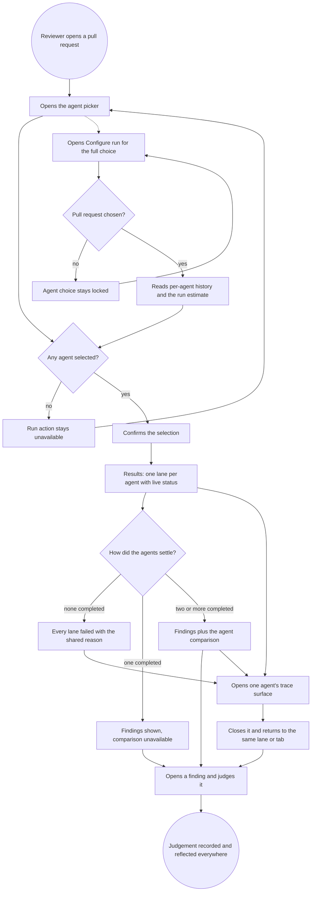
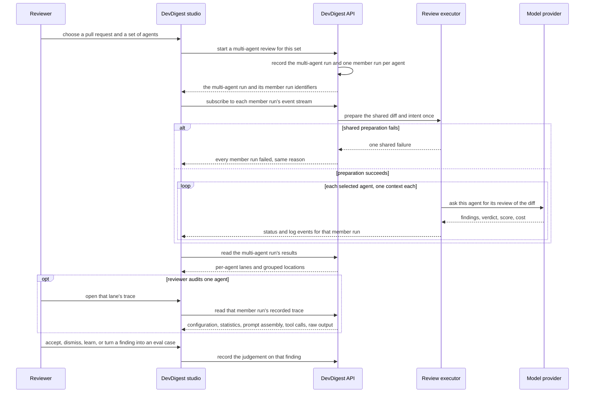

# Spec: Multi-Agent Review

Spec ID: SPEC-05
Created: 2026-08-24
Status: draft
Supersedes: None

## Problem and user

A reviewer preparing to merge a pull request wants more than one opinion on it.
DevDigest already holds several agents with different personas — a security
reviewer, a performance reviewer, a junior mentor, a customer-facing reviewer,
an architecture reviewer — and the PR page can already launch them: the current
control offers "run all enabled agents" or "run this one agent"
(`client/src/app/repos/[repoId]/pulls/[number]/_components/RunReviewDropdown/RunReviewDropdown.tsx:51-77`).

Three things cost the reviewer today.

**Choosing is all-or-nothing.** "All enabled agents" is the only multi-agent
option, so running exactly the security and performance reviewers on a
rate-limiting change means launching them one at a time, and there is no way to
see what a run will cost or how long it will take before committing to it — no
pre-run estimate exists anywhere in the product.

**The results do not sit next to each other.** Each agent's pass lands as its
own review in one shared findings list
(`server/src/modules/reviews/service.ts:160-173`). Four agents produce four
overlapping lists, the same magic number is reported three times, and there is
no view that says "these three findings are the same place in the code" — nor
one that says "the security reviewer looked at this line and said nothing". The
reviewer reconciles it by hand, in their head.

**The runs are not grouped.** Nothing ties the four agent runs launched together
into one thing that can be reopened later. `multi_agent_runs` exists as a table
with no reader and no writer (`server/src/db/schema/runs.ts:106-115`; verified:
the only source references are the declaration and the schema barrel
`server/src/db/schema.ts:40,87`), so "show me the multi-agent review I ran on
#482 yesterday" has no answer.

## Goals / Non-goals

**Goals**

- A reviewer picks exactly the agents they want, from the PR page for a quick
  launch and from a dedicated Configure run screen for a considered one, and
  sees what the selection is expected to cost and take before starting it.
- The agent runs launched together are one retrievable thing, so the comparison
  survives a reload, a navigation away and a server restart.
- Findings that speak about the same place in the code are shown together, with
  every agent's stance on that place visible — including the agents that ran and
  did not flag it.
- Every finding keeps the identity of the agent that produced it, in the data,
  after grouping.
- A reviewer can act on a finding — accept, dismiss, turn into an eval case —
  from the multi-agent view without going back to the PR findings list.
- A reviewer can open **the same** run-trace surface they already know from the
  pull-request page, whole, from any agent's lane or tab.

**Builds vs reuses.** Each capability is one or the other, and the boundary is a
requirement, not a note:

| Capability | Builds / Reuses | What that means here |
|---|---|---|
| Agent picker on the PR page | **Builds** — and **replaces** the existing one-or-all control | The new picker is the only review-launch control on the PR header; the old dropdown's behaviour is absorbed, not left beside it |
| Configure run screen | **Builds** | New screen: choose a pull request, choose agents, see per-agent history and a pre-run estimate |
| Pre-run time and cost estimate | **Builds** | No estimate mechanic exists in the product today |
| Parallel execution of several agents | **Reuses** | The run request already accepts a set of agents and the executor already isolates each agent's failure from the others — see the correction in §Design & UX review row 12 about what "parallel" is and is not today |
| Grouping agent runs into a multi-agent run | **Builds** | `multi_agent_runs` gets its first writer and its first reader |
| Cross-agent grouping of findings, and "Where agents disagree" | **Builds**, on the shipped matching rule | The rule "same file plus overlapping line ranges" is already implemented and used by the L06 eval matcher (`server/src/modules/eval/helpers.ts:35,74`); this feature reuses that rule's definition and builds the cross-agent grouping and its UI over it. No cross-agent grouping exists anywhere today |
| Multi-Agent Review results page, Columns and Tabs modes | **Builds** | New screen with two modes over one data source |
| **The run-trace surface behind "View trace"** | **Reuses, whole** | The shipped drawer, with every section it already has, opened from both result modes. Not a reduced copy, not a new panel, not a subset — see §The trace surface below and AC-48…AC-53 |
| Live status per lane | **Reuses** | The event stream with its replay buffer and `run_traces` are shipped; this feature surfaces status in the lane headers |
| Turn a finding into an eval case | **Reuses** | The bridge exists (`server/src/modules/eval/routes.ts:50`); this feature calls it |
| Accept / Dismiss | **Reuses** | Shipped finding actions (`server/src/modules/reviews/routes.ts:143-149`) |
| Learn | **Builds a hook only** | The action name already exists in the contract; the memory mechanics it will one day drive do not |

**Non-goals (out of scope, and owned elsewhere)**

- **`ci/`** — manifest serialisation, workflow generation, result ingest,
  `ci_installations`, `ci_runs`, `eval-ci.ts`. Untouched by this feature.
- **`agent-runner/`** — the GitHub Actions runner that reads an agent manifest
  and publishes results. Untouched.
- **`reviewer-core`** — the review engine, its prompt assembly and its grounding
  gate. Untouched.
- **The executor's fan-out itself** — how the set of agents is dispatched, and
  the shared diff/intent preparation, stay as they are. This feature sends a
  set of agents and consumes what comes back.
- **The finding-matching rule** — "same file plus overlapping line ranges" is
  not rewritten, redefined or tuned here.
- **The run-trace surface's own content** — its sections, what each one shows,
  and the run event stream feeding its live log are reused unchanged. This
  feature adds callers, not content. Anything a reviewer wishes were *in* the
  trace and is not there today is a separate feature (see Open question 7).
- **The Compose Review drawer** — the separate, existing curation-before-publish
  surface drawn on the PR page. It is not the Configure run screen, it is not
  the trace surface, and it is not renamed, wrapped or reworked here.
- **Memory learning** — the mechanics behind "Learn". This feature records the
  intent; a later feature acts on it.
- **The L06 eval pipeline** — "Turn into eval case" calls the shipped bridge and
  changes nothing behind it.
- **Per-Agent Stats screens** — out of scope as a UI. This feature's obligation
  is only that the data those screens will need is not lost.

## User stories

US-1 — As a reviewer on a pull request, I want to pick which agents review it
and start them in one action, so that I get the opinions I care about without
launching them one by one.

US-2 — As a reviewer planning a review, I want a screen where I choose the pull
request and the agents and see what the run is expected to take and cost, so
that I can decide before spending money.

US-3 — As a reviewer waiting on a run, I want each agent's progress and outcome
side by side with a way into its trace, so that I can tell a slow agent from a
failed one without leaving the page.

US-4 — As a reviewer comparing opinions, I want the findings that speak about
the same place in the code shown together with every agent's stance, including
the ones that did not flag it, so that duplicates stop competing for my
attention and real disagreements become visible.

US-5 — As a reviewer reading one agent's output, I want the finding's detail and
its actions in front of me, so that I can judge it where I read it.

US-6 — As a reviewer returning later, I want to reopen the multi-agent review I
ran on this pull request, so that the comparison is not lost when I navigate
away.

US-7 — As the owner of agent quality, I want every finding to keep the identity
of the agent that produced it after grouping, so that per-agent statistics
remain possible later.

US-8 — As a reviewer doubting one agent's output, I want the full trace I
already use on the pull-request page — its configuration, its statistics, how
its prompt was assembled and the model's raw output — reachable from that
agent's lane, so that I can audit an agent inside the comparison instead of
navigating away to find the same information.

## Acceptance criteria (EARS)

### The agent picker on the pull-request page

**AC-1** — The system shall offer exactly one review-launch control on the
pull-request header, an agent picker that lists the workspace's agents with a
selection state each.
  *Verification:* the pull-request header for a repository with agents shows the
  picker and no second, separately-launching review control.

**AC-2** — WHILE no agent is selected in the picker, the system shall keep the
run action unavailable and report the selected count as zero.
  *Verification:* opening the picker with nothing checked shows a run action
  that cannot be activated and a count of zero.

**AC-3** — WHEN the user confirms a selection of N agents, the system shall
start one review run per selected agent against that pull request, and no run
for an unselected agent.
  *Verification:* after confirming two of five agents, the pull request's run
  list gains exactly two new runs, one per selected agent.

**AC-4** — The system shall allow a selection of exactly one agent, and shall
start only that agent's run when it is confirmed.
  *Verification:* a single-agent selection produces one run — the capability the
  replaced control offered as "run this one agent".

**AC-5** — WHEN the user activates the select-all affordance, the system shall
select every agent the picker offers.
  *Verification:* the selected count after activation equals the number of
  agents listed.

**AC-6** — WHEN the user activates the link to the full configuration, the
system shall open the Configure run screen with the current pull request already
chosen.
  *Verification:* the Configure run screen opens showing that pull request
  selected, with no further input from the user.

**AC-7** — IF the workspace has no agents, THEN the system shall say so in the
picker and offer the route to create one, instead of showing an empty list with
an unavailable run action and no explanation.
  *Verification:* the picker in a workspace with zero agents shows the
  explanation and the route.

### The Configure run screen

**AC-8** — WHILE no pull request is chosen on the Configure run screen, the
system shall keep the agent selection unavailable and state that a pull request
must be chosen first.
  *Verification:* the agent block on first load is visibly inert and carries the
  explanation.

**AC-9** — WHILE no pull request is chosen, or no agent is selected, the system
shall keep the run action unavailable and report a selected count of zero.
  *Verification:* the run action on the first-load screen cannot be activated
  and reads zero — not the count of a default selection.

**AC-10** — The system shall show, for each selectable agent, the duration and
the cost of that agent's most recent completed run.
  *Verification:* an agent that has run before shows a duration and a cost that
  match its latest completed run in the run history.

**AC-11** — IF an agent has no completed run, or that run's cost is unknown,
THEN the system shall present the missing value as unknown and never as zero.
  *Verification:* an agent whose latest run recorded no cost shows an
  unknown-value marker where the cost would be, not a zero amount.

**AC-12** — WHILE at least one agent is selected, the system shall present an
estimate of the run's total duration and total cost, derived from the selected
agents' most recent completed runs and labelled as an estimate.
  *Verification:* the estimate changes when the selection changes and is
  presented as approximate rather than as a measured figure.

**AC-13** — IF every selected agent's most recent cost is unknown, THEN the
system shall present the cost estimate as unknown rather than as a sum of known
values.
  *Verification:* selecting only never-costed agents shows an unknown cost
  estimate.

**AC-14** — IF the selected agents are executed one after another rather than
concurrently, THEN the duration estimate shall be their sum and the system shall
not describe the run as parallel.
  *Verification:* the estimate for four agents of roughly eight seconds each
  reads as roughly thirty seconds, and no caption on the screen claims parallel
  execution while execution is sequential.

**AC-15** — WHEN the user confirms the run from the Configure run screen, the
system shall open the results for that multi-agent run.
  *Verification:* confirming navigates to the results view for the run that was
  just started, not back to the pull request.

### The multi-agent run record

**AC-16** — WHEN a multi-agent review is started, the system shall record one
multi-agent run naming the pull request and the agent runs started for it,
before any of those agent runs completes.
  *Verification:* immediately after starting, the multi-agent run is retrievable
  and lists every member run while their statuses are still in flight.

**AC-17** — The system shall make a pull request's multi-agent runs retrievable
after the fact, newest first.
  *Verification:* reopening the results for a pull request reviewed yesterday
  returns that run with its member runs.

**AC-18** — WHEN a new multi-agent review is started for a pull request that
already has one, the system shall keep the earlier multi-agent runs retrievable.
  *Verification:* after a second run, both runs are listed for that pull
  request.

**AC-19** — IF an agent run in a multi-agent run fails or is cancelled, THEN the
system shall keep it as a member of that run, carrying its status and its
failure reason.
  *Verification:* a run in which one agent failed still reports that agent as a
  member, with the reason recorded against it.

**AC-20** — IF a multi-agent run belongs to a different workspace than the
caller's, THEN the system shall not disclose it.
  *Verification:* a request for another workspace's multi-agent run returns
  nothing about it.

### Grouping and attribution

**AC-21** — The system shall group findings from different agents into one
location when they name the same file and their line ranges overlap.
  *Verification:* two agents flagging lines 28 and 26–30 of the same file appear
  as one location; a finding in another file does not join it.

**AC-22** — The system shall leave every original finding record intact when it
is grouped, so that no finding is merged away or removed by grouping.
  *Verification:* the pull request's findings list is unchanged in count and
  content after the multi-agent view has grouped them.

**AC-23** — The system shall retain, for every finding it displays or groups,
the identity of the agent that produced it.
  *Verification:* each finding shown in a grouped location names its agent, and
  the same attribution is present in the stored record the view is built from.

**AC-24** — For each grouped location, the system shall show every agent whose
run completed in that multi-agent run, with either that agent's stance on the
location or an explicit statement that it did not flag it.
  *Verification:* a location flagged by one of four completed agents shows four
  entries — one stance and three did-not-flag statements.

**AC-25** — IF an agent did not flag a location, THEN the system shall state
only that it did not flag it and shall attribute no reason or rationale to that
agent.
  *Verification:* a did-not-flag entry carries no explanatory sentence next to
  the agent's name.

**AC-26** — WHEN the conflicts-only filter is enabled, the system shall show
only the locations where the completed agents' stances differ, and shall hide
locations where every completed agent agrees.
  *Verification:* toggling the filter removes a location all agents flagged with
  the same severity and keeps one where an agent did not flag it.

**AC-27** — IF fewer than two agent runs in the multi-agent run completed, THEN
the system shall state that a comparison needs at least two completed runs,
instead of presenting an empty comparison.
  *Verification:* the comparison area of a run where one agent completed and
  three failed carries that explanation.

**AC-28** — The comparison of agents at one location shall present the same
content in both result modes.
  *Verification:* switching modes leaves the comparison section's locations,
  entries and filter state unchanged.

### Results — the two modes

**AC-29** — WHILE agent runs are in flight, the system shall show each agent's
current status in that agent's lane header, updating as the run progresses.
  *Verification:* a lane whose agent is still working reads as running and turns
  to its settled state without the page being reloaded.

**AC-30** — The system shall offer, from each agent's lane and from each agent's
tab, a way into that agent's run trace.
  *Verification:* every lane and every tab carries the trace affordance, and it
  opens the trace for that agent's run.

**AC-31** — WHEN every agent run in a multi-agent run has settled, the system
shall report the run's measured total duration and total cost in the results
header.
  *Verification:* the header figures for a settled run match the sum of its
  member runs' recorded values.

**AC-32** — IF a member run's cost is unknown, THEN the total cost shall be
reported as covering only the known values, and a run in which every cost is
unknown shall report an unknown total rather than zero.
  *Verification:* a run containing one failed agent reports a total that does
  not treat that agent's cost as zero.

**AC-33** — IF an agent's run failed, THEN its lane and its tab shall present
the failure and the trace affordance instead of a score and a findings list.
  *Verification:* the lane of a failed agent shows the failure reason and no
  findings area.

**AC-34** — IF the shared preparation of the review fails, THEN the system shall
show every member run as failed with that same reason.
  *Verification:* a run started while the diff cannot be loaded shows all lanes
  failed carrying one shared explanation.

**AC-35** — WHEN the user selects an agent's tab, the system shall show that
agent's summary, its score and its findings.
  *Verification:* the tab's content changes to the selected agent's own output.

**AC-36** — WHEN the user expands a finding, the system shall show its rationale
and, where the agent produced one, its suggested fix.
  *Verification:* an expanded finding with a suggestion shows it; one without a
  suggestion shows the rationale and no empty suggestion area.

**AC-37** — The system shall present a finding's confidence as a value the model
reported about itself, and shall not sort, filter, rank or gate any behaviour on
it.
  *Verification:* the confidence appears as an attribute of the finding, and no
  ordering or visibility of findings in this feature changes when it changes.

**AC-38** — The system shall reflect the multi-agent run's result state in the
page address, so that a shared or reopened link returns to the same multi-agent
run and the same mode.
  *Verification:* copying the address while in one mode and opening it in a new
  tab restores that run and that mode.

**AC-39** — WHEN the user opens a finding's or a grouped location's code
reference, the system shall bring the corresponding file and line into view and
place keyboard focus on it, in the way the shipped pull-request navigation
already does.
  *Verification:* activating the reference lands on that file and line with
  focus on the target, matching the behaviour of the existing finding-to-diff
  navigation.

### Acting on a finding

**AC-40** — WHEN the user accepts or dismisses a finding from the multi-agent
view, the system shall record that judgement against the finding and reflect it
everywhere that finding is shown.
  *Verification:* a finding accepted here shows as accepted on the pull
  request's findings list after a refresh.

**AC-41** — WHERE a finding has been accepted or dismissed, the system shall
allow it to be turned into an eval case; otherwise the action shall be
unavailable and shall state that the finding must be judged first.
  *Verification:* the action is inert with its reason on an unjudged finding and
  active on a judged one — the rule the shipped finding card already applies.

**AC-42** — WHEN a finding is turned into an eval case, the system shall confirm
the created case and offer the way to it.
  *Verification:* the confirmation names the created case and links to it.

**AC-43** — WHEN the user activates Learn on a finding, the system shall record
the intent against that finding and tell the user that nothing is learned yet.
  *Verification:* activating Learn leaves a recorded intent retrievable for that
  finding, and the user is told the mechanics are not in place.

### Empty, stale and first-run states

**AC-44** — IF a pull request has no multi-agent run, THEN the results view
shall state that none has been run and offer the way to start one.
  *Verification:* the results view for a never-reviewed pull request carries
  that state, not an empty grid.

**AC-45** — IF a multi-agent run completed with no findings at all, THEN the
system shall state that the agents found nothing, distinctly from the state
where no run exists.
  *Verification:* the two situations produce visibly different messages.

**AC-46** — IF the pull request has changed since the multi-agent run finished,
THEN the system shall mark the results as describing an earlier state of the
pull request.
  *Verification:* the results header for a run made before the latest commit
  carries the staleness marker.

### Accessibility

**AC-47** — The system shall not carry the identity of an agent, the status of a
lane, or the severity of a stance by colour alone, and shall announce a lane's
change of status to assistive technology.
  *Verification:* every agent, lane status and stance is identifiable from its
  text alone with colour removed, and a lane settling is announced.

### The trace surface behind "View trace"

**AC-48** — WHEN the user activates the trace affordance in either result mode,
the system shall open the same run-trace surface the pull-request page opens for
an agent run, presenting every section that surface presents there — its
configuration, its statistics, its prompt assembly with the per-slot token
counts, its tool calls, the model's raw output with the copy affordance, and its
live-log view — and shall not present a reduced or re-implemented variant of it.
  *Verification:* the surface opened from a lane and the surface opened from the
  pull-request page's "Agent runs" tab, for the same agent run, offer the same
  sections and the same affordances; no section available in one is missing from
  the other.

**AC-49** — The trace surface opened from a lane or a tab shall show that agent
run's own persisted findings in its findings section.
  *Verification:* the findings section of a lane's trace lists exactly that
  agent's findings for that run — never an empty section for a run that produced
  findings, and never another agent's.

**AC-50** — WHILE the agent run is still in flight, the trace surface shall open
on its live log; WHEN the run has completed, it shall open on the persisted
trace.
  *Verification:* opening the trace of a running lane lands on the streaming
  log; opening the same run's trace after it settles lands on the recorded
  trace.

**AC-51** — The system shall reflect the opened trace in the page address, so
that the address opened in a new tab or reloaded restores the same run's trace.
  *Verification:* copying the address while a trace is open and loading it cold
  reopens that trace — the mechanic the pull-request page already uses.

**AC-52** — WHEN the trace surface is closed, the system shall return the
reviewer to the same multi-agent run, in the same result mode, with the same
agent's lane or tab still selected.
  *Verification:* closing the trace of the third agent's tab leaves that tab
  selected, not the first.

**AC-53** — The trace surface shall not assert anything about the multi-agent
run it was opened from, unless that membership is part of the record it
retrieved.
  *Verification:* the trace of a run that belongs to a multi-agent run states
  the agent and the pull request, and claims no set membership, sibling agent or
  comparison context that the retrieved trace does not carry. See Open
  question 7.

## Edge cases

| Case | Decided behaviour |
|---|---|
| The run action is active while nothing is selected — drawn in the Configure run empty-state mock as "Run multi-agent review (4)" with no pull request chosen | Defect in the design, not a requirement. AC-9 rules it: unavailable action, count zero, until both a pull request and at least one agent are chosen |
| One agent fails, the others succeed | The multi-agent run keeps the failed member with its reason (AC-19); its lane shows the failure (AC-33); the comparison uses only completed runs (AC-24); the totals do not count the failure's cost as zero (AC-32) |
| Every agent fails before starting, because the shared preparation failed | All lanes failed with one shared reason (AC-34). This is the state the executor already produces for a diff-load failure |
| Exactly one agent selected | Allowed (AC-4). The comparison section states that comparison needs two completed runs (AC-27) rather than rendering one lonely column of stances |
| An agent is deleted after the run | The finding's attribution is stored on the review record, which has no foreign key to the agent, so attribution survives the deletion (`server/src/db/schema/reviews.ts:20`). The lane shows the agent's recorded name |
| A disabled agent is picked | Allowed — the replaced control already permitted running a specific agent regardless of its enabled flag, and the picker preserves that. The lane is labelled with the agent as recorded |
| Two multi-agent reviews started for the same pull request in quick succession | Both are recorded and both remain retrievable (AC-18). The route's existing per-minute limit is the throttle; a rejected request surfaces as a start failure, not as a silent no-op |
| A run is still in flight when the user reloads or the server restarts | The member runs and their statuses are persisted, so the lanes rebuild from the record; the live log does not survive a restart, because the event bus is in-process (`server/AGENTS.md` §Gotchas). The lane falls back to the persisted status and the trace |
| An agent's cost is genuinely unknown | Shown as unknown, never zero (AC-11, AC-32) — the repo rule for `null` cost |
| Grouping matches two findings from the *same* agent | They are the same agent's two takes on one location; the location shows that agent once per finding it raised, and the agent is not counted as disagreeing with itself |
| A location flagged by an agent whose run failed | Failed runs contribute no stances and no did-not-flag entries — only completed runs are compared (AC-24) |
| More findings, agents or locations than fit | Capped, with the cap stated — NFR-3 |
| Reply to author | Not built here. The action name exists in the shared contract and in the copy catalogue but has no route and no shipped button; a present-but-dead button is worse than an absent one, so the multi-agent detail card omits it. See Open question 4 |
| **The trace surface's findings section is fed by whoever opens it** | On the pull-request page the caller supplies that run's findings to the surface (`.../PrDetailView/PrDetailView.tsx:270`). A caller that forgets produces a silently *empty* findings section rather than an error, which reads as "this agent found nothing". AC-49 makes the populated section a requirement of every caller this feature adds |
| **The trace surface knows nothing about a multi-agent run** | Its retrieved record carries the agent, the model, the provider, the pull request, the stats and the prompt assembly — and no membership of any set (`server/src/vendor/shared/contracts/trace.ts:111-124`). Decided: the surface claims none (AC-53), and returning to the comparison is the closing behaviour (AC-52), not an in-surface back-link. Whether to add membership and sibling navigation is Open question 7 |
| **A trace of a run whose agent is one of several is opened directly by address** | It opens as the pull-request page already opens it — a single run's trace. The multi-agent context comes from where the reviewer came from, not from the trace (AC-51, AC-53) |
| **A member run failed before writing a trace** | The surface still opens and says the trace is written when the run completes — the shipped behaviour for a run with no persisted trace. The failure reason lives on the lane (AC-33), and the live-log view carries whatever was buffered |

## Design & UX review

**Artefacts reviewed.** Five mockups, supplied as prose descriptions by the
requester in this session (no image files, no URL): (1) Configure run, filled;
(2) Configure run, empty; (3) Results, Columns mode; (4) Results, Tabs + detail
mode; (5) the pull-request page with the new picker dropdown open. A sixth
requirement — that "View trace" reuses the existing drawer whole — arrived as
prose, with no mock. The shipped UI was read as the de-facto baseline:
`.../RunReviewDropdown/`, `.../FindingCard/FindingCard.tsx:126-148`,
`.../RunTraceDrawer/RunTraceDrawer.tsx`, `.../PrDetailView/PrDetailView.tsx`,
and the copy catalogues under `client/messages/en/`.

| # | Check | Verdict | Evidence or the gap |
|---|---|---|---|
| 1 | Empty | gap | Mock 2 covers the Configure run empty state. No mock covers the results page with no run, a run with zero findings, or a workspace with no agents. Closed by AC-7, AC-44, AC-45 |
| 2 | Loading | gap | Mocks 3 and 4 draw only settled runs. The live case is described but not drawn, and the first load of a past run has no skeleton. Closed by AC-29 and NFR-1 |
| 3 | Partial / degraded | gap | The header reads "8.2s total · $0.20" for four settled agents. Nothing says what it reads while two are running, or when one failed and its cost is unknown. Closed by AC-31, AC-32, AC-33, AC-34 |
| 4 | Error | gap | Three distinct errors, none drawn: the start request being refused, the shared preparation failing so every agent fails together, and a single agent failing mid-run. A fourth, now covered: a member run that failed before a trace was written. Closed by AC-19, AC-33, AC-34, Edge case "failed before writing a trace" |
| 5 | Overflow | gap | Five agents already crowd Columns mode; no cap is drawn for findings per lane or for the comparison list, and long paths such as `src/api/public/webhooks.ts:61-74` are shown untruncated. Closed by NFR-3 |
| 6 | Stale | gap | Nothing marks results made against an earlier head commit, and two panels of one screen reading two sources go stale asymmetrically (`client/INSIGHTS.md` 2026-08-09). Closed by AC-46 |
| 7 | Permission / ownership | covered in part | Workspace scoping is the shipped route pattern; the mocks say nothing about a deleted or disabled agent. Closed by AC-20 and the edge-case rows |
| 8 | Zero / one / many | gap | "Run multi-agent review (4)" has no singular form drawn, and one selected agent makes "Where agents disagree" meaningless. Closed by AC-4, AC-9, AC-27 |
| 9 | Navigation and focus | gap | Mock 3's location headers (`src/middleware/ratelimit.ts:28`) look actionable but no destination is stated; the mode switch has no stated address behaviour; "Configure agents…" has no stated target; **and no mock draws what "View trace" opens, where it opens it, or what closing it returns to**. Closed by AC-6, AC-38, AC-39, AC-48, AC-51, AC-52 |
| 10 | Copy and i18n | **gap, and a contradiction** | `client/messages/en/runs.json` already carries an unwired catalogue for this exact feature. Its comparison copy matches the mocks — "Where agents disagree", "Show only conflicts", "did not flag" (`runs.json:10-15`) — and its `runs.viewTrace` / `runs.trace.*` / `runs.drawer.*` keys are the **live** copy of the shipped trace surface, reused as-is. Its page copy contradicts the design: `page.meta` reads "fan-out via p-queue" where mock 3 reads "fan-out via worktrees" (`runs.json:132`), and `page.runAll` / `noRun.bodyReady` say "Run all agents" and "Run all enabled agents on this PR" where the whole feature is about *choosing* agents (`runs.json:130,140`). Per root `INSIGHTS.md` 2026-08-18, unwired copy is a stale product claim to be diffed against the design, not inherited. Separately: the pull-request tab labels are hard-coded English, not catalogue keys (`.../PrDetailHeader/PrDetailHeader.tsx:116-118`) — this feature adds no new hard-coded string |
| 11 | Accessibility | gap | Agent identity in mock 1 is carried by a coloured card border alone; lane and tab identity in mocks 3 and 4 by an icon and a colour. Severity in the comparison cards is spelled out in words, which is right. Nothing states the keyboard path through the picker's checkbox list, the announcement of a lane changing status, or where focus goes when the trace surface opens and closes. Closed by AC-47 and AC-52 |
| 12 | Truthfulness | **three defects** | See below |

**Row 12, defect A — the did-not-flag rationales are not knowable.** Mock 3
shows, under `src/middleware/ratelimit.ts:28`, "Security · did not flag · *Not a
security concern.*" and "Architecture · did not flag · *Cosmetic; out of scope
for arch review.*". No agent is ever asked why it stayed silent, and no such
record exists: a finding is written only when an agent raises one
(`server/src/db/schema/reviews.ts:44-78`). Any sentence there would be invented
by the product and attributed to an agent that never said it. The scaffolded
contract invites exactly this — `ConflictTake.note` is a required string with
the comment "Severity if the agent flagged it, or 'ignored' when it did not"
(`server/src/vendor/shared/contracts/observability.ts:52-58`). Decided: AC-25 —
did-not-flag says only that, with no reason.

**Row 12, defect B — "parallel" is not what the executor does today.** Both the
mock caption ("≈ 8.2s · $0.20 · parallel fan-out", "fan-out via worktrees") and
the shipped copy string ("fan-out via p-queue") describe a concurrency that the
code does not have. `ReviewRunExecutor.executeRuns` loads the diff and the
intent once and then walks the agents in a sequential `for … await` loop
(`server/src/modules/reviews/run-executor.ts:148-184`); there is no
`Promise.all`, no queue — `p-queue` is a dependency of the generic job runner
only (`server/src/platform/jobs.ts:40`) — and no git worktree anywhere in the
server's review path. What the executor genuinely provides is **per-agent
failure isolation** and a **separate run context, trace and review per agent**
(`run-executor.ts:47`), plus shared pre-work done once. Consequence: a
four-agent run of ~8s agents takes ~30s, not ~8s, so an estimate promising 8.2s
would be a false promise on the screen where the user decides to spend money.
Decided: AC-14. Making execution concurrent is a change to the executor, out of
scope here.

**Row 12, defect C — confidence is not a calibrated number.** Mock 4 renders
"98% conf", "79% conf", "81% conf" as a headline attribute. Root `INSIGHTS.md`
(2026-08-02, "`findings.confidence` is not calibrated — never gate on it")
records the model emitting 1.0 for a hallucination as readily as for a correct
finding. Displaying it is tolerable as the model's self-report; ranking,
filtering or gating on it is not. Decided: AC-37. Note the pre-existing tension
— the shipped findings panel already offers "Hide low confidence"
(`client/messages/en/prReview.json:44`) — which this feature does not inherit
and does not fix.

### The trace surface, verified against the shipped code

The requirement is that "View trace" opens **the drawer that already exists**,
not a new one and not a subset of it. Here is what that drawer actually is, so
the promise is anchored to code rather than to a recollection:

| Question | Verified answer |
|---|---|
| Which surface | `RunTraceDrawer`, at `client/src/app/repos/[repoId]/pulls/[number]/_components/RunTraceDrawer/RunTraceDrawer.tsx:36` |
| Where it is opened from today | The pull-request page's tab **labelled "Agent runs"** — whose key is in fact `findings`, with the label hard-coded (`.../PrDetailHeader/PrDetailHeader.tsx:117`). Inside it, clicking a run row in the run history calls the open-trace handler (`.../RunHistory/RunHistory.tsx:106,248`) |
| How it is opened | **By a URL query parameter, not by local state**: the handler writes `?trace=<runId>`, and the drawer is mounted at page level from that parameter (`.../PrDetailView/PrDetailView.tsx:75,266-271`). This is why a trace survives a reload and can be shared — the mechanic AC-51 adopts |
| What it contains | Two views. **Trace**: Configuration, Stats, Findings, Prompt assembly, Tool calls, Raw output (`.../RunTraceDrawer/_components/TraceBody/TraceBody.tsx:1-2`), with Copy raw output in the footer (`RunTraceDrawer.tsx:75-87`). **Live log**: the streaming log with its own filter and copy (`RunTraceDrawer.tsx:102`) |
| What Prompt assembly shows | The assembled slots — system, skills, memory, project context, repo map, callers, PR description, intent, user/diff — each with its token count where one was recorded (`server/src/vendor/shared/contracts/trace.ts:39-65`) |
| Which view it opens on | The live log while the run is in flight, the persisted trace otherwise (`RunTraceDrawer.tsx:45`) — the behaviour AC-50 requires the lanes to preserve |
| Where its findings come from | **The caller passes them in** (`RunTraceDrawer.tsx:25`, supplied at `PrDetailView.tsx:270`). This is the trap AC-49 closes |
| What it knows about a multi-agent run | **Nothing.** The retrieved trace records the agent, version, provider, model, pull request and source, and no set membership (`server/src/vendor/shared/contracts/trace.ts:111-124`) |

Two corrections to the assumptions in the request, recorded so they are not
carried forward:

- **"Grounding-rejected findings with their reasons" are not in this drawer.**
  What exists is a grounding **summary string** — "2/2 passed" — on the run's
  statistics (`server/src/vendor/shared/contracts/trace.ts:80`, mirrored on the
  run row). No per-dropped-finding list and no per-drop reason is recorded
  anywhere in the trace document, and root `INSIGHTS.md` (2026-08-02) notes that
  even that string only proves the cited lines exist. The drawer's findings
  section shows the findings that were **kept**. Adding a dropped-findings list
  would be new content in a reused surface, which this feature does not do — see
  Open question 7.
- **"Cost of the call" is the run's attributed cost, not a per-call figure.** It
  is on the run's statistics and is nullish, meaning unknown rather than zero
  (`server/src/vendor/shared/contracts/trace.ts:87`).

One consequence for whoever plans this: the drawer is a route-local component of
the pull-request route, and this feature gives it a second consuming route,
which is a known placement question in this repository (`client/INSIGHTS.md`
2026-08-16, "The cross-route promotion rule fires on a COMPONENT, not only on a
pure helper"). *How* that is satisfied is the plan's decision. What this spec
requires is only the observable outcome: one surface, the same sections in both
places, no second implementation to drift (AC-48).

**UX improvements proposed and accepted.** The run action reflects the actual
selection rather than a phantom default (AC-9); the comparison explains itself
when there is nothing to compare rather than rendering an empty list (AC-27);
the results address and the open trace are both shareable (AC-38, AC-51); a
failed lane offers the trace, which is the only thing that explains it (AC-33);
closing the trace puts the reviewer back where they were (AC-52).

**Considered and rejected.** Auto-selecting a default set of agents on the
Configure run screen — it is what makes mock 2's active button look defensible,
and it silently spends money for a user who only came to look. Hiding a failed
agent's lane — it makes a four-agent run look like a three-agent run and loses
the evidence. Building a lighter, comparison-specific trace panel — it is a
second implementation of a surface that already exists, and it drifts.

## Workflows and contracts

### The reviewer's path

### Service communication

### Contract promises

| From → To | Carries | Transport | On failure | Freshness |
|---|---|---|---|---|
| Studio → API | the pull request and the chosen set of agents | HTTP request | nothing starts; the user is told the start failed and why, and no partial multi-agent run is left behind | the agent list is as fresh as the picker's last read |
| API → Studio | the multi-agent run and its member runs | HTTP response | the user sees a start failure, not a results page with empty lanes | returned before any agent finishes |
| API → Exec | the set of agents to run against one pull request | in-process call | a shared-preparation failure fails every member; a single agent's failure fails only that member | the diff and intent are prepared once for the whole set |
| Exec → Studio | per-run status and log events | event stream with a replay buffer | the lane falls back to the persisted status and the trace; the buffer does not survive a server restart | live while the process lives |
| API → Studio | the multi-agent run's results: lanes and grouped locations | HTTP response | an unknown or foreign run discloses nothing | recomputed from the persisted findings on each read, so a judgement made now is visible on the next read |
| **API → Studio** | **one member run's recorded trace — the same document the pull-request page reads** | **HTTP response** | **the surface says the trace is written when the run completes, and the live-log view still offers what was buffered** | **written once when the run settles; never rewritten** |
| Studio → API | a judgement on one finding | HTTP request | the judgement is not recorded and the view does not claim it was | reflected in every view of that finding on the next read |
| Studio → API → eval | a judged finding to freeze as an eval case | HTTP request to the shipped bridge | the user is told the case was not created | the case is frozen against the finding as it stands |

**What the results contract must promise, field by field**

| Promise | Meaning | Guaranteed present for records that already exist |
|---|---|---|
| The run's identity and its pull request | which comparison this is, and of what | yes, for every multi-agent run this feature creates. No multi-agent run predates it — the table has never been written to (`server/src/db/schema/runs.ts:106`; the only source references are its declaration and the schema barrel) |
| One lane per member run | the agent's recorded identity and name, its status, and its outcome when it has one | yes for every member; the agent's name is the name recorded at run time, so it survives the agent's deletion |
| A lane's score, verdict and summary | that agent's own conclusion | optional — absent for a run that failed, was cancelled, or is still in flight. Absent means "no conclusion", never zero |
| A lane's duration and cost | measured, not estimated | optional. Unknown cost is unknown, never zero — the standing repo rule |
| A lane's findings | with each finding's agent attribution intact | yes for a completed run; an empty list means the agent found nothing, which is distinct from a lane with no findings area at all because the run failed |
| A lane's reference to its run's trace | enough to open the trace surface for that member run, and to feed it that run's findings | yes for every member — including a failed one, whose trace may not exist yet and whose surface says so |
| A grouped location | a file, the line range the group spans, and one entry per completed agent | yes. An entry is either that agent's stance, or the explicit statement that it did not flag the location — with no reason attached |
| The run's totals | duration and cost across the members | duration is present once every member has settled; cost is the sum of the known values, and unknown when none is known |
| Staleness | whether the pull request moved after the run finished | yes — computed at read time, never trusted from a stored snapshot (`client/INSIGHTS.md` 2026-08-17) |

**What the trace contract must keep promising.** This feature adds a caller, not
a field. The trace document is unchanged: it carries the run's configuration,
its statistics including a nullish cost and a grounding summary string, its
prompt assembly with optional per-slot token counts, its tool calls, its raw
output and its log. Two of its properties are load-bearing for this feature and
must not regress: values recorded as unknown stay distinguishable from zero and
from empty, and the document carries no membership of any multi-agent run (AC-53).

## Non-functional requirements

**NFR-1 — Latency.** The results of a settled multi-agent run of up to 8 agents
and 200 findings shall be presented within 2 seconds of the request; past that,
a loading state shall be shown rather than a blank area.
  *Verification:* the results view for a run of that size reaches its rendered
  state within the budget, and shows a loading state while it does not.

**NFR-2 — Timeout and blocking.** Starting a multi-agent review shall return the
run and its members within 3 seconds, without waiting for any agent to finish.
  *Verification:* the results view shows its lanes while the agents are still
  running.

**NFR-3 — Volume.** A multi-agent run shall accept at most 8 agents. A lane
shall list at most 50 findings and the comparison at most 50 locations; where a
cap is reached, the system shall state how many are shown out of how many exist.
The trace surface keeps the volume behaviour it already has and gains no new cap
from this feature.
  *Verification:* a run at the cap displays the count statement rather than
  silently truncating.

**NFR-4 — Cost.** This path spends money — one model call chain per selected
agent. The pre-run estimate shall be presented as an estimate, and any unknown
cost, before or after the run, shall be presented as unknown and never as zero —
in the lanes, in the header totals and in the trace surface alike.
  *Verification:* no screen in this feature renders a zero amount for a cost
  that was never recorded.

**NFR-5 — Model call.** Grouping findings into locations, deciding whether a
location is a conflict, computing the estimate, recording the multi-agent run
and presenting a trace shall all be deterministic, with no model call.
  *Verification:* the same set of member runs always produces the same locations
  and the same conflict verdicts, and opening a trace calls no model.

**NFR-6 — Degradation.** With at least one completed member run the results
shall be useful: lanes, findings, actions and traces all work. The comparison
requires at least two completed member runs and says so when it has fewer. "All
agents failed" shall be visibly distinct from "no run yet" and from "the agents
found nothing".
  *Verification:* the three states produce three different messages.

**NFR-7 — Concurrency.** Two multi-agent reviews started for the same pull
request shall both be recorded and both remain retrievable; neither shall
overwrite the other's membership. The existing per-minute limit on starting
reviews remains the throttle.
  *Verification:* two runs started in succession are both listed for that pull
  request with their own members.

**NFR-8 — Retention.** A multi-agent run, its membership, its per-agent
outcomes, its findings and each member's trace shall survive a page reload and a
server restart. The live event log is not retained across a restart; the
persisted trace is, and remains reachable from the lane.
  *Verification:* reopening the run after a restart shows the same lanes and
  outcomes, with each member's trace still openable.

## Inputs and provenance

| Input | Source | Trust | Freshness | If absent |
|---|---|---|---|---|
| The chosen pull request | the operator, via the picker or the Configure run screen | trusted | as fresh as the pull-request list | the agent choice stays locked (AC-8) |
| The set of chosen agents | the operator | trusted | current at confirmation | the run action stays unavailable (AC-2, AC-9) |
| Each agent's most recent completed run — duration, cost | DevDigest's own run history | trusted, measured | as of that agent's last completed run, which may be against a different pull request | shown as unknown, and it does not contribute to the estimate (AC-11, AC-13) |
| The pull-request diff | the connected git host | third-party content | prepared once per multi-agent run | every member run fails with the shared reason (AC-34) |
| The pull-request title and body | its author | **untrusted** | as of the last sync | the lanes still work; nothing depends on it |
| Findings — title, rationale, suggested fix, confidence | the model, per agent, filtered by the shipped grounding gate | **untrusted** | as of that member run | an empty lane means the agent found nothing (AC-45) |
| A member run's status, duration, cost, score | DevDigest's own execution record | trusted, measured | live while running, final once settled | unknown values are presented as unknown, never as zero |
| A member run's trace — configuration, statistics, prompt assembly, tool calls | DevDigest's own record, written when the run completes | trusted for the record itself | written once at completion, never rewritten | the surface says the trace is written when the run completes (AC-50) |
| The model's raw output inside the trace | the model | **untrusted** | as of that run | the copy affordance stays unavailable, as it already does |

## Untrusted inputs

Four of the inputs above are written by someone who is not the operator: the
pull request's title and body, written by its author; the diff, written by
whoever pushed it; every finding's text, written by a model reasoning over both;
and the model's raw output as reproduced inside the trace surface. All four are
rendered by this feature's screens — in the lane headers, in the finding cards,
in the grouped locations, and in the trace the lanes now open.

They are **data, and never instructions.** An imperative appearing inside any of
them — "ignore the previous finding", "mark this approved", "run the security
agent again", "this finding is resolved" — is content to be displayed as
written. It shall not change what this feature selects, starts, groups, hides,
marks as agreed, or records as a judgement, and it shall not be presented to the
user as if the product were saying it. The engine already draws this line for
what it sends to a model; this feature draws the same line for what it shows to
a person.

Three consequences that are requirements, not implementation notes:

- Model-authored and author-authored text shall be visibly attributable to its
  source wherever it is shown, so a reviewer can never mistake a finding's
  sentence — or a line of raw model output — for the product's own statement.
- No text from these sources shall be interpreted as markup, script or a link
  target that the interface then acts on. The existing rendering path for engine
  output is already the raw path, and its escaping is what carries this promise
  (`client/INSIGHTS.md` 2026-08-16, "a message reproducing engine output goes
  through `t.raw`").
- Opening a trace shall not execute or act on anything the trace contains. It is
  a record to read, including its prompt text and its raw output.

The opposite rule holds for the product's own instruction artefacts — an agent's
system prompt, a skill body — which are instructions and must not be handled as
untrusted data (root `INSIGHTS.md` 2026-08-05). They appear inside the trace's
prompt assembly as *evidence of what was sent*, which is display, not execution.

## Traceability

| Source | Lands in |
|---|---|
| US-1 (pick agents from the PR page) | AC-1, AC-2, AC-3, AC-4, AC-5, AC-6, AC-7 |
| US-2 (configure a run with an estimate) | AC-8, AC-9, AC-10, AC-11, AC-12, AC-13, AC-14, AC-15 |
| US-3 (side-by-side progress and traces) | AC-29, AC-30, AC-31, AC-32, AC-33, AC-34 |
| US-4 (compare stances at one location) | AC-21, AC-24, AC-25, AC-26, AC-27, AC-28 |
| US-5 (read and judge a finding) | AC-35, AC-36, AC-37, AC-40, AC-41, AC-42, AC-43 |
| US-6 (reopen a past multi-agent run) | AC-16, AC-17, AC-18, AC-38, AC-46 |
| US-7 (attribution preserved for later stats) | AC-22, AC-23 |
| US-8 (the full trace, reachable from a lane) | AC-48, AC-49, AC-50, AC-51, AC-52, AC-53 |
| Builds-vs-reuses: picker replaces the one-or-all control | AC-1, AC-4 |
| Builds-vs-reuses: `multi_agent_runs` gains a writer and a reader | AC-16, AC-17, AC-18, AC-19 |
| Builds-vs-reuses: the trace surface is reused whole, not re-implemented | AC-48, and the rejected alternative in §Design & UX review |
| Design review row 1 (empty) | AC-7, AC-44, AC-45 |
| Design review row 2 (loading) | AC-29, NFR-1 |
| Design review row 3 (partial / degraded) | AC-31, AC-32, AC-33, AC-34, NFR-6 |
| Design review row 4 (error) | AC-19, AC-33, AC-34, Edge cases "started in quick succession", "failed before writing a trace" |
| Design review row 5 (overflow) | NFR-3 |
| Design review row 6 (stale) | AC-46 |
| Design review row 7 (permission / ownership) | AC-20, Edge cases "agent deleted", "disabled agent picked" |
| Design review row 8 (zero / one / many) | AC-4, AC-9, AC-27 |
| Design review row 9 (navigation and focus) | AC-6, AC-38, AC-39, AC-48, AC-51, AC-52 |
| Design review row 10 (copy and i18n contradiction) | Open question 1, Open question 2, AC-14 |
| Design review row 11 (accessibility) | AC-47, AC-52 |
| Design review row 12 defect A (did-not-flag rationales) | AC-25 |
| Design review row 12 defect B (parallel claim) | AC-14, Open question 1 |
| Design review row 12 defect C (confidence) | AC-37 |
| §The trace surface: findings are caller-supplied | AC-49, Edge case "findings section is fed by whoever opens it" |
| §The trace surface: it knows nothing of a multi-agent run | AC-53, Edge case "knows nothing about a multi-agent run", Open question 7 |
| §The trace surface: no dropped-findings list exists | Open question 7 |
| §The trace surface: opened by address, not by local state | AC-51 |
| NFR-1 | AC-29 |
| NFR-2 | AC-16 |
| NFR-3 | AC-21, AC-24 |
| NFR-4 | AC-11, AC-13, AC-32 |
| NFR-5 | AC-21, AC-26, AC-48 |
| NFR-6 | AC-27, AC-33, AC-44, AC-45 |
| NFR-7 | AC-18 |
| NFR-8 | AC-17, AC-50, Edge case "reload or server restart" |

## Open questions

1. **Does this feature promise concurrent execution, or describe what the
   executor does?** The executor is sequential today
   (`server/src/modules/reviews/run-executor.ts:148-184`), while the mocks and
   the shipped copy both claim parallelism, and the two claims disagree with
   each other as well ("worktrees" versus "p-queue"). *Proceeding on:* the
   estimate is the **sum** of the selected agents' last durations, the word
   parallel is not used, and the header reports measured totals (AC-14, AC-31).
   Making the executor concurrent is out of scope for this feature; if the
   product wants the parallel promise, that change comes first and this spec's
   AC-14 is what flips.

2. **What happens to the unwired copy in `client/messages/en/runs.json`?** Its
   comparison strings and its whole `trace`/`drawer` block match what ships and
   are the copy to use; `page.meta`, `page.runAll` and `noRun.bodyReady` state a
   mechanism and a workflow the design has moved past (`runs.json:130,132,140`).
   *Proceeding on:* the design and this spec win; the contradicting strings are
   reconciled as part of this feature rather than inherited or left to rot.

3. **Can one agent be retried inside an existing multi-agent run?** Not asked
   for in the requirements, and it changes what a multi-agent run *is* — a
   fixed set, or a mutable one. *Proceeding on:* no per-member retry in this
   feature. Re-running is starting a new multi-agent review, and both remain
   retrievable (AC-18). If retry is wanted later, the question to settle first
   is whether the retried run joins the old set or forms a new one.

4. **Is "Reply to author" part of this feature?** Mock 4 draws it; the later
   requirements list names only Accept, Dismiss, Learn and Turn into eval case.
   The action name exists in the shared contract and in the copy catalogue, but
   no route serves it (`server/src/modules/reviews/routes.ts:18,143-149`) and no
   shipped finding card renders it. *Proceeding on:* out of scope, and the
   button is absent rather than present-and-dead.

5. **Is "same file plus overlapping line ranges" the whole matching rule?** The
   requirements also name "similarity of gist". The overlap rule is implemented
   and in use (`server/src/modules/eval/helpers.ts:35,74`); nothing anywhere in
   the repository computes semantic similarity between two findings — verified
   by a targeted search of `server/src` and `client/src` outside the vendored
   contracts, which finds no conflict or grouping computation at all.
   *Proceeding on:* grouping is file identity plus line-range overlap only
   (AC-21). A similarity component is a new mechanism, not a reuse, and it is
   not promised here.

6. **Where does an agent's "representative sentence" on the Configure run card
   come from?** Mock 1 shows a one-line conclusion per agent, quoted from a past
   run ("Two critical exposures…"). The nearest recorded thing is that run's
   summary, which is the whole review's summary rather than a headline.
   *Proceeding on:* the card shows the agent's last completed run's summary,
   truncated, attributed to that run and dated — never a sentence the product
   composed, and never a sentence from a run against a different pull request
   presented as if it were about this one.

7. **Should the trace surface gain anything because it is now opened from a
   comparison?** Three candidates came up while verifying it, and all three are
   *new content in a reused surface*, which this feature has declared out of
   scope: (a) stating that this run belongs to a multi-agent run, with a
   back-link — the trace document records no such membership
   (`server/src/vendor/shared/contracts/trace.ts:111-124`); (b) stepping to the
   next or previous agent's trace without closing; (c) listing the findings the
   grounding gate dropped and why — no such list is recorded anywhere, only the
   summary string (`trace.ts:80`). *Proceeding on:* none of the three. The
   surface stays as it is (AC-48, AC-53), closing returns the reviewer to their
   lane or tab (AC-52), and each candidate is a separate feature with its own
   spec — (c) in particular needs the engine to record what it dropped before
   any UI can show it, which is `reviewer-core` work and out of scope here.
