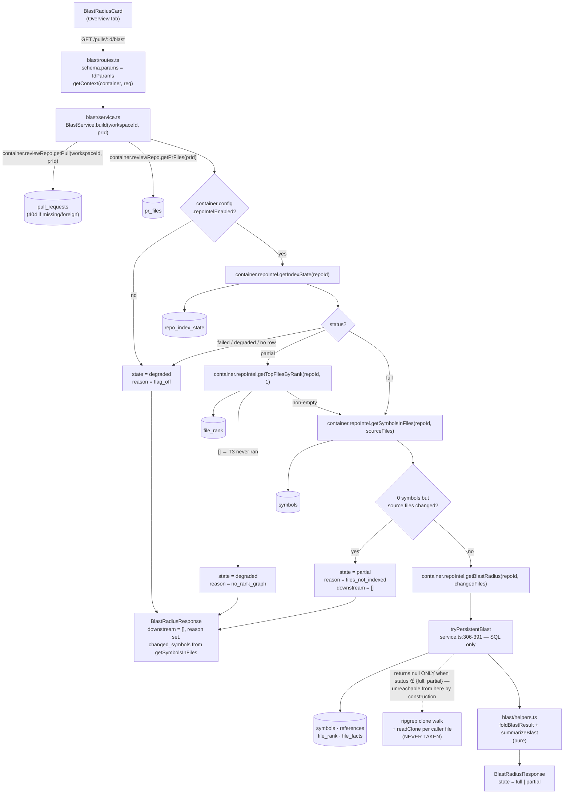

# Blast Radius (L06)

## Task

Add a reviewer-facing Blast Radius map to DevDigest: a `GET /pulls/:id/blast` endpoint that answers "what else could this diff touch?" — which symbols the PR's changed files declare, who calls them, and which HTTP endpoints and crons those callers serve — served entirely from the already-persisted `repo-intel` index (no LLM call anywhere, no AST or import-graph rebuild during the request), rendered as a Blast Radius card on the PR Overview tab whose caller rows jump to the Diff tab at that line, and exposed over MCP by turning the `get_blast_radius` placeholder into a real implementation.

## Context read

**This spec's filename is `specs/l06-blast-radius.md`.** Numbering note, not a blocker: root `README.md:86` and `server/src/modules/repo-intel/README.md:9-12,41` both tag Blast Radius as **L04** (paired with the MCP server), while `specs/l03-intent-layer.md` and `specs/l04-smart-diff.md` are already taken by Intent and Smart Diff and `specs/l05-mcp-server.md` by the MCP server. The spec directory's numbering is the one that reflects what actually shipped; the two READMEs keep the course's original lesson map. Do **not** renumber either README as part of this change — it would touch the course narrative for no functional reason. If the divergence is ever closed, that is its own commit.

Insights, decisions and specs that bind this change:

- root `INSIGHTS.md` (2026-08-05, "A lesson feature is mostly already scaffolded: inventory Part 0 before writing a line") — confirmed again here: the contract, the facade method, the i18n copy file and the MCP tool definition all already exist. The real work is one slice, one card, one wire.
- root `INSIGHTS.md` (2026-08-09, "Phrase an acceptance criterion over FIELDS, never over serialized bytes") — every criterion in `## Acceptance` names a field and a permitted carrier; `trace_url` is the only permitted UUID carrier in an MCP response, and this feature adds no UUID-carrying field at all.
- root `INSIGHTS.md` (2026-08-09, "Purity is not an address: a pure function does NOT belong in `reviewer-core` just because it has no I/O") — the deterministic folding, the state truth table and the summary template live in `server/src/modules/blast/helpers.ts` (ring 2). Flip condition: only if `reviewer-core` itself ever needs to compute a blast radius for a prompt slot, and then it takes the folded data as a parameter.
- root `INSIGHTS.md` (2026-08-02, "A field added to a persisted-jsonb contract must be `.nullish()`") — decisive for where `state` goes. `BlastRadius` is embedded in `PrBrief`, which is the declared shape of the `pr_brief.json` jsonb column (`server/src/db/schema/reviews.ts:122-127`), so adding a **required** field to `BlastRadius` itself is exactly the trap. The plan therefore adds `state` on a new **response** schema (`BlastRadiusResponse`), leaving the persisted shape byte-identical. See `## Contracts`.
- root `INSIGHTS.md` (2026-08-01 / 2026-08-08, "`@devdigest/shared` drifts silently between server and client" / `diff -r` is the wrong check) — the contract edit is applied to both copies in the same commit and verified with `./scripts/check-shared-sync.sh`, never `diff -r`.
- root `INSIGHTS.md` (2026-08-02, "Stacking convention blocks into an agent's `system_prompt` made the review worse") — cited as the reason `summary` is a deterministic template and no agent prompt is touched.
- root `INSIGHTS.md` (2026-08-09, "`mcp/vitest.config.ts` has no `resolve.alias`, and that absence IS the enforcement") — do not add one; MCP tests stay hermetic and `@devdigest/shared` stays type-only through `.shared-dts`.
- root `INSIGHTS.md` (2026-08-02, Open Questions, "The `pnpm arch` boundary gate is not wired into CI") — `cd server && pnpm arch` must be run by hand; a green PR check proves nothing about ring direction.
- `server/INSIGHTS.md` (2026-08-09, "A value that is returned but rendered NOWHERE has no UI that can notice it breaking — assert it at the boundary that returns it") — applies to `state`/`reason` and to per-symbol `crons_affected`: assert them on the service's returned object, not only on the helper.
- `server/INSIGHTS.md` (2026-08-08, "A never-throw facade is untestable through its production caller … test the guarantee at the service") — the degraded-path proof is written against `BlastService`/the route with failures driven in through `ContainerOverrides`, and each case asserts a **distinguishing** value (`reason`), not just "empty came back".
- `server/INSIGHTS.md` (2026-08-08, "`no-cross-slice-import` scopes its `from` to `^src/modules/`") — with `.dependency-cruiser.cjs:65`, `SLICE_PRIVATE = ^src/modules/[^/]+/(service|repository|routes|helpers|run-executor)`: `blast/*` may import `repo-intel/constants.ts` and `repo-intel/types.ts` (public surface) and must reach data only through `container.repoIntel` / `container.reviewRepo`.
- `server/INSIGHTS.md` (2026-08-05, "`pnpm test` is red here for an environmental reason: 8 `*.it.test.ts` files start 8 Postgres containers at once") and (2026-08-03, "`--no-file-parallelism` makes the integration suite deterministic AND faster") — the verification plan runs the new IT file alone.
- `server/INSIGHTS.md` (2026-08-02, "`*.it.test.ts` SKIPPING silently reads as passing") — read the test **count**; `N skipped` on `blast.it.test.ts` means unverified.
- `client/INSIGHTS.md` (2026-08-09, "Two panels of one screen reading two query keys go stale ASYMMETRICALLY — and the hook's docblock claimed a mitigation that was never built") — the new `["blast", prId]` key must be added to the invalidation site that can change its answer (`useResyncRepoIntel`), and no docblock may claim a mitigation the code does not implement.
- `client/INSIGHTS.md` (2026-08-09, "jsdom implements NO `Element.prototype.scrollIntoView`") and (2026-08-09, "`mock.contexts[0]` is how you assert WHICH element a prototype-stubbed DOM method was called on") — the scroll test stubs the prototype locally and asserts the element identity.
- `client/INSIGHTS.md` (2026-08-09, "A `retry: false` query … caches the 404 forever") — **does not apply**: the blast endpoint never 404s for a missing sub-resource, only for a missing/foreign PR, and the plan adds no `retry: false`.
- `client/INSIGHTS.md` (2026-08-05, "Promoting a component to `src/components/` must move its CONSTANTS too") — relevant to Step 7's promotion of the scroll orchestration.
- `client/INSIGHTS.md` (2026-08-08, "`@testing-library/user-event` is NOT installed here") — **contradicts** current state and is superseded: `client/package.json:31` has `@testing-library/user-event@^14.6.3` and `SmartDiffViewer.test.tsx:17` imports it. Use `userEvent`, and fall back to `fireEvent` only for hover-gated controls (2026-08-09 entry).
- `mcp/INSIGHTS.md` (2026-08-10, inspector install warnings) — informational only; nothing in this change alters `mcp/package.json` dependencies.
- `AGENTS.md` §Repo rules, §Do not touch, §Session protocol; `server/AGENTS.md` §Conventions; `client/AGENTS.md` §Conventions; `mcp/AGENTS.md` §Conventions/§Gotchas (the "`get_blast_radius` makes no HTTP call" gotcha becomes false in this change and must be rewritten in the same commit).
- `specs/l05-mcp-server.md:592` — "The placeholder is the deliverable. The real implementation reads repo-intel and belongs to its own lesson." This spec is that lesson. `specs/l05-mcp-server.md` itself is **not** edited (`specs/README.md`: a shipped spec stays as the record of what was agreed).
- `specs/l04-smart-diff.md` — the closest structural precedent, and the source of the "deterministic, no model call, no repository, recompute per request" shape this slice copies.
- `docs/l02-experiment.md` — cited only to say what this feature does *not* claim: nothing here changes review quality, so no measurement is owed.

## Inventory — what already exists

Every row below was verified this session at the path given. Corrections to the researchers' findings are called out in bold.

| Thing | Where | Verdict |
|---|---|---|
| `BlastRadius` / `DownstreamImpact` / `BlastCaller` / `ChangedSymbol` contracts | `server/src/vendor/shared/contracts/brief.ts:17-44` | **reuse unchanged** — `BlastRadius` stays byte-identical; `state` goes on a new response schema (see below) |
| `BlastRadius` embedded in a jsonb-persisted contract | `PrBrief` at `brief.ts:116-122`; column `pr_brief.json` at `server/src/db/schema/reviews.ts:122-127` (table exists, **no code writes it**) | reuse — and the reason `BlastRadius` itself must not gain a required field |
| Response-wrapper precedent (`X.extend({...})` in `review-api.ts`) | `server/src/vendor/shared/contracts/review-api.ts:84-111` (`PrIntentRecord`, `SmartDiffResponse = SmartDiff`) | extend — `BlastRadiusResponse` is added here |
| Shared barrel | `server/src/vendor/shared/index.ts:17-27` uses `export *` | reuse — **no barrel edit needed** |
| `RepoIntel.getBlastRadius(repoId, changedFiles)` | interface `server/src/modules/repo-intel/types.ts:147`; `BlastResult` at `types.ts:74-87`; impl `service.ts:220-304` | reuse |
| `tryPersistentBlast` — pure Postgres reads, "NO clone parsing on the hot path" | `server/src/modules/repo-intel/service.ts:306-391`; returns `null` **only** when there is no `repo_index_state` row or its status is neither `full` nor `partial` (`:319-320`) | reuse — this is the branch the blast slice must guarantee it lands in |
| The expensive degraded fallback: `container.codeIndex.symbols(ref)` (`service.ts:244`), `.references()` per symbol (`:267`), `readClone` per caller file (`:291-294`); `RipgrepCodeIndex.symbols()` walks every file in the clone (`server/src/adapters/codeindex/ripgrep.ts:99-126`) | same file | **avoid** — never call `getBlastRadius` when the index is unusable. **Correction/addition:** the ripgrep path is also taken when `config.repoIntelEnabled` is `false` (`service.ts:223`), so the flag must be part of the predicate, not just the index status |
| Combined (not per-symbol) caller clamp | `server/src/modules/repo-intel/service.ts:386` — `callers.slice(0, MAX_CALLERS_PER_SYMBOL)` over the flattened list; constant `= 20` at `repo-intel/constants.ts:30` | **extend** (Step 2) — no test pins the current semantics (`rg -n MAX_CALLERS_PER_SYMBOL src test` → 4 hits, all in `src/modules/repo-intel/`) |
| Callers are **not** filtered against their own declaration file on the persistent path | `service.ts:356-371` has no `fromPath === declFile` skip; the ripgrep path does (`:273`) | **new work in `blast/helpers.ts`** — requirement 6's "declaration file excluded" is currently only true on the path we never take |
| `nameSet.size === 0` early return omits `factsByFile` | `service.ts:337-339` | reuse, handled — the fold treats a missing `factsByFile` as `{}` |
| `BlastCallerRow.rank` is the raw PageRank double (`file_rank.rank`, `repo-intel.ts:112-115`), `0` on the degraded path; the wire `BlastCaller` carries only `name/file/line` | `types.ts:63-72`, `brief.ts:24-29` | reuse — **decision: rank stays a sort key and is NOT added to the wire.** It is an uncalibrated absolute PageRank number with no units a reviewer could read, and `BlastCaller` has no field for it |
| `getIndexState` — always works, synthesises `status:'degraded'`, `reason:'no_data'` when no row | `server/src/modules/repo-intel/service.ts:189-205`; `tryGetIndexState` at `repository.ts:205-239` (marks `degraded` only for status `degraded`/`failed`; **`partial` is not flagged degraded**, `:215-218`) | reuse — this is the first probe |
| `getTopFilesByRank(repoId, n)` — `ORDER BY rank DESC LIMIT max(10n,100)` over `file_rank`, junk-filtered, `[]` when the flag is off | `service.ts:639-656`; query `repository.ts:449-459`; index `file_rank_repo_rank_idx` on `(repoId, rank)` | reuse — this is the rank-graph capability probe, and it needs **no new SQL** |
| `getSymbolsInFiles(repoId, paths)` — indexed read of `symbols` | `service.ts:425-438` | reuse — fills `changed_symbols` on the degraded branch and answers "are these files in the index at all?" |
| `SUPPORTED_EXT = ['.ts','.tsx','.js','.jsx','.mjs','.cjs']` | `server/src/modules/repo-intel/constants.ts:14` | reuse — importable from `blast/` (a slice's `constants.ts` is public surface; `.dependency-cruiser.cjs:65` excludes it from `SLICE_PRIVATE`) |
| `stats.ranked` as a rank-capability signal | written by `pipeline/full.ts:260`, **not** written by `pipeline/incremental.ts:245-255`, and not projected by `tryGetIndexState` | **rejected** — a healthy incremental refresh writes rank rows and drops `ranked` from `stats`, so this signal would report "no rank graph" on a perfectly good index. This is the correction that decides Step 4's predicate |
| `status='full'` ⇒ the T3 block ran | `pipeline/full.ts:214,252-253` (`full` requires `!softBudgetReached && !graphFailed`); `pipeline/incremental.ts:243` (`full` requires the prior state be `full` and the graph/rank try-block to have succeeded) | reuse — so the rank probe is only needed when status is `partial` |
| `status='partial'` can mean the whole T3 block was skipped → `file_edges`/`file_rank`/`file_facts` never written → `getResolvedCallers`' INNER JOIN to `file_rank` (`repository.ts:503-531`) yields zero rows, indistinguishable from "no callers" | `pipeline/full.ts:214,246` | **new work** — the state truth table in Step 3 exists to tell these apart |
| `file_edges` + reverse index `file_edges_repo_to_idx` on `(repoId, toFile)` | `server/src/db/schema/repo-intel.ts:51-67`; only reader is `getEdges(repoId)` (`repository.ts:432-437`, **every edge, unfiltered**), consumed only by `getCriticalPaths` walking **forward** | **not used by this plan** — see `## Scope` Out and Risk 3. The index stays unused |
| `extractEndpoints` → `"METHOD /path"`; `extractCrons` → a raw cron expression **or** `"job:<kind>"` | `server/src/adapters/codeindex/extract.ts:182-195`, `:201-215`; computed at index time (`pipeline/full.ts:186-190`, `pipeline/incremental.ts:193-197`) | reuse — and the reason the mockup's `reset-rate-buckets (hourly)` cron label is **not achievable**; see Risk 6 |
| `server/src/modules/blast/` | does not exist; `server/src/modules/index.ts:24-26` already names `blast` in its "each lesson adds its own module" comment | **new** |
| `GET /pulls/:id/blast` | nowhere. `pulls/routes.ts` serves `/repos/:id/pulls`, `/pulls/:id`, `/pulls/:id/comments` + one POST. The literal `'/pulls/:id/blast'` appears **only** as a regex fixture in `server/test/extract.test.ts:82-90` | **new** |
| Structural precedent: a slice with no `repository.ts`, nothing persisted, no LLM port resolved | `server/src/modules/smart-diff/{constants,helpers,routes,service}.ts`; the two guarantees are stated verbatim in `smart-diff/service.ts:14-26`; the "spends no money so the app-wide limiter suffices" note is `smart-diff/routes.ts:17-18` | copy — blast follows smart-diff, **not** `intent` (which has `repository.ts` + a persisted cache). Justification in `## Constraints that bind` |
| `:id` is always the `pull_requests.id` uuid; `IdParams` validates it | `server/src/modules/_shared/schemas.ts:11` | reuse |
| Ownership check → `container.reviewRepo.getPull(workspaceId, prId)` then `getPrFiles(prId)`; `PullRow.repoId` gives the repo | facade `server/src/modules/reviews/repository.ts:30-39`; impl `reviews/repository/pull.repo.ts:9-34`; `PullRow` = `pullRequests.$inferSelect` (`db/rows.ts:15`) | reuse |
| `getContext(container, req)` → `{workspaceId, userId}` | `server/src/modules/_shared/context.ts:16-27` | reuse |
| `ContainerOverrides` has `repoIntel` and `codeIndex` and `llm`, and **no** `reviewRepo` | `server/src/platform/container.ts:43-59` | reuse — so a route test touching `getPull`/`getPrFiles` must be `*.it.test.ts` |
| Hermetic fake-container trick for the facade | `server/test/repo-intel-facade-degraded.test.ts:19-40` (patches `svc.repo`) | reuse — Step 2's clamp test uses it |
| `ExplodingLLM` — every method throws, proving no model call | `server/test/smart-diff.it.test.ts:38-46` | reuse |
| DB fixture pattern for repo-intel tables | `server/test/repo-intel-symbol-clamp.it.test.ts:26-38` | reuse |
| `contracts.test.ts` round-trips a `BlastRadius` **literal**; nothing builds one from server code | `server/test/contracts.test.ts:121-138` | extend |
| `client/messages/en/blast.json` — `stat.symbols/callers/endpoints/crons`, `view.tree/graph`, `callerCount`, `noDownstream`, `graph.empty`, `graph.ariaLabel` | file exists, unused | reuse — plan the UI against this copy |
| `brief.block.blast = "Blast radius"` | `client/messages/en/brief.json:2-6` | reuse — the `SectionLabel` title, mirroring `IntentCard`'s `t("block.intent")` |
| Tabs `overview / findings / diff`, tab in the URL, inactive tab bodies **unmounted** | `PrDetailHeader.tsx:115-119`; `PrDetailView.tsx:74,164,196` | reuse |
| Overview renders `IntentCard` + PR body only | `OverviewTab/OverviewTab.tsx:27-45` | extend |
| `?trace=` — the only "open X regardless of tab" precedent; its drawer renders **outside** the tab bodies | `PrDetailView.tsx:75,206-214` | reference only, not a precedent for scrolling inside an unmounted tab |
| `setParam(key, val)` — one key per `router.replace` | `PrDetailView.tsx:76-82` | **extend** — a two-key update (`tab` + `goto`) needs one `replace`, not two |
| `lineAnchorId(path, line)` — the ONE definition of a rendered line's DOM id, barrel-exported | `client/src/components/diff-viewer/helpers.ts:19-21`, `index.ts:10`; the id is set only when `ln.newNo != null` (`CodeLine/CodeLine.tsx`) | reuse — and the reason only lines present in the PR's patch are scrollable |
| The open-card + `scrollIntoView` orchestration (`ScrollTarget`, one Effect, `goToFinding`) inlined in one component | `SmartDiffViewer/SmartDiffViewer.tsx:41-77` | **promote** (Step 7) — Blast Radius is the second consumer, `frontend-ui-architecture` §2 |
| `FileCard` supports controlled `open` + `onOpenChange` | `client/src/components/diff-viewer/FileCard/FileCard.tsx:33-64` | reuse |
| `DiffViewer` owns no per-file open state | `client/src/components/diff-viewer/DiffViewer/DiffViewer.tsx:13-31` | extend |
| Overlay-API prop pattern (`DiffCommentApi`, `DiffFindingsApi`) | `diff-viewer/index.ts:8-9` | copy — `DiffLineTargetApi` follows it |
| `githubBlobUrl(fullName, sha, file, startLine)` | `client/src/lib/github-urls.ts:22-36` | reuse — the fallback for a caller file that is not in the PR's diff |
| Query hook shape (`queryKey`, `api.get`, `enabled: !!prId`) | `client/src/lib/hooks/smart-diff.ts:22-27`; barrel `client/src/lib/hooks/index.ts` | copy |
| `useResyncRepoIntel` invalidates only `["repo-intel-state", repoId]` | `client/src/lib/hooks/repo-intel.ts:41-49` | extend |
| No rendered degraded/partial badge anywhere; `RepoIntelState.status` has zero `.tsx` consumers; closest visual precedent is `IntentCard`'s inline `stale` `Badge` | `client/src/lib/hooks/repo-intel.ts:14-24`; `IntentCard.tsx:60-68` | **new**, modelled on the `stale` badge |
| Query defaults `retry: 1`, `staleTime: 30_000`, `refetchOnWindowFocus: false` | `client/src/lib/providers.tsx:20-30` | reuse, no override |
| `get_blast_radius` placeholder: definition `mcp/src/tools.ts:107-123`, `BLAST_RADIUS_PLACEHOLDER` `handlers.ts:65-68`, handler `:270`, registration `:277`; makes zero HTTP calls, asserted at `mcp/test/errors.test.ts:139-149` (`expect(api.calls).toEqual([])`) | — | **replace**; that test is rewritten in the same step |
| `Resolver.resolveRepoId/resolvePullId`, `ApiClient.get`, `ok`/`fail`, `mapError`, `clean`, hand-rolled guards, response caps | `mcp/src/{resolve,api-client,handlers,sanitize,types,constants}.ts` (`MAX_FINDINGS` etc. at `constants.ts:33-40`) | reuse |
| `TOOL_DEFINITION_TOKEN_BUDGET = 1200`, sized with explicit headroom for "a later lesson implementing `get_blast_radius` for real" | `mcp/src/constants.ts:44-55` | reuse — re-run the budget test, do not raise the ceiling |
| `docs/blast-radius.md`, `AGENTS.md` §Read when row | do not exist (`rg -l blast --glob '*.md'` → no `docs/blast-radius.md`) | **new** (Step 12) |
| A design mockup file for this card | not in the repo (grep over `*.md` finds no blast mock) | n/a — the UI is planned from the user's decision 5 plus the existing copy keys |

## Scope

### In

1. `GET /pulls/:id/blast` returning `BlastRadiusResponse` = the existing `BlastRadius` fields + a required `state: 'full' | 'partial' | 'degraded'` + a `reason` code, served from persisted index reads only.
2. A new `server/src/modules/blast/` slice: `constants.ts`, `helpers.ts` (pure), `service.ts`, `routes.ts`. **No `repository.ts`, nothing persisted, nothing cached.**
3. A per-symbol (not combined) caller clamp of 20 in the `repo-intel` facade, plus per-symbol clamping and declaration-file exclusion in `blast/helpers.ts`.
4. A deterministic `summary` template. **No LLM call, and no opt-in LLM path.**
5. A Blast Radius card on the **Overview** tab beside `IntentCard`: a header row of counts, a Tree/Graph toggle, per-symbol expandable nodes with a caller-count badge, caller rows as `file:line`, endpoint and cron badges, a clear empty state, and a distinct partial/degraded state.
6. A cross-tab handoff `?tab=diff&goto=<path>:<line>` that opens the Diff tab and scrolls to that line, built on a promoted `useDiffLineTarget` hook shared by `SmartDiffViewer` and `DiffViewer`.
7. `mcp/` `get_blast_radius` implemented against the same route, returning a concise structured result with no UUID, `confidence` or `rationale` field.
8. Tests: hermetic helper/clamp tests, one `blast.it.test.ts`, client component tests, MCP handler tests; plus `docs/blast-radius.md` registered in `AGENTS.md` §Read when.

### Out

- **Prior PRs touching these files (`PrHistory`).** Explicitly excluded by the user's decision 3. `PrHistory` in `brief.ts:65-78` stays unused.
- **Any LLM involvement**, including an opt-in "explain this blast radius" path.
- **The 2-level reverse import-graph traversal.** Reasoning in Risk 3; the endpoint/cron attribution comes from `factsByFile` on direct callers only.
- **Persisting the response** (`pr_brief` stays empty, no new table, no migration, no `db/schema` edit).
- **A `state` field on the persisted `BlastRadius`** — the response wrapper carries it instead.
- **The PR Brief card / Project Context / onboarding** (later lesson per `README.md:87`).
- **A new dependency for graph rendering** — the Graph view is inline SVG, capped.
- **`e2e/` coverage**, CI wiring for `mcp/`, and a `pnpm arch` rule for `mcp/` (`specs/l05-mcp-server.md` §Out of scope already owns those).
- **Renumbering the L04/L06 lesson tags** in `README.md` / `repo-intel/README.md`.

## Constraints that bind

| Rule | Applies? | What the implementation must do |
|---|---|---|
| `@devdigest/shared` exists twice | **yes** | Add `BlastState`, `BlastStateReason`, `BlastRadiusResponse` to `server/src/vendor/shared/contracts/review-api.ts` **and** `client/src/vendor/shared/contracts/review-api.ts` in the same commit; verify with `./scripts/check-shared-sync.sh` (which fails only on NEW drift and compares comment-stripped content, so the added lines must match in both). Never `diff -r`. |
| A field on a **jsonb-persisted** contract must be `.nullish()` | **yes, and it decides the design** | `BlastRadius` is inside `PrBrief` = `pr_brief.json`. Do **not** add a required field to it. `state` is required on the new non-persisted `BlastRadiusResponse`; `reason` is `.nullish()` there because it is absent on the `full` path. `contracts.test.ts:126`'s existing `BlastRadius.parse` literal keeps passing untouched. |
| A DB-backed test ends `*.it.test.ts` | **yes** | The only DB-backed new test is `server/test/blast.it.test.ts`. Everything else (`blast-helpers.test.ts`, `repo-intel-blast-clamp.test.ts`, client, MCP) is hermetic and must **not** carry the suffix — `mcp/AGENTS.md` §Conventions makes that explicit for `mcp/`. |
| A migration | **no** | No `db/schema` change and no new query that joins or filters `findings`. Every read used already exists and is already indexed (`file_rank_repo_rank_idx`, `symbols`/`references` btrees, `file_facts` PK). `server/src/db/migrations/**` is untouched. |
| Ring / import direction (`backend-onion-architecture` §2, `pnpm arch`) | **yes** | `blast/routes.ts` = HTTP + Zod only; `blast/service.ts` = no SQL, no `container.db`, no `fastify` import; `blast/helpers.ts` = pure, no container; literals in `blast/constants.ts`. Cross-slice access only via `container.repoIntel` / `container.reviewRepo`, plus type/constant imports from `repo-intel/{types,constants}.ts` (permitted: `.dependency-cruiser.cjs:65`). Run `cd server && pnpm arch` by hand — it is not in CI. |
| `reviewer-core` | **no** | Not touched. Zero files under `reviewer-core/` change; the folding helpers stay in ring 2 (root `INSIGHTS.md` 2026-08-09). |
| New file placement in `client/` | **yes** | `BlastRadiusCard/` is route-local under `.../[number]/_components/` (one consumer). `useDiffLineTarget` is promoted into the shared `components/diff-viewer/` module because a second consumer appears in this same change (`frontend-ui-architecture` §1, §2). The hook is exported from the module's single shallow barrel; no barrel-of-barrels (§7). |
| A secret | **no** | No secret, no `SecretsProvider` use, no new env var. `mcp/` still reads only `DEVDIGEST_API_BASE`. |
| Any `CLAUDE.md` / `AGENTS.md` | **yes** | Edit `AGENTS.md` (root, and `mcp/AGENTS.md`). Never replace a `CLAUDE.md` symlink (mode `120000`). |
| Empty tables reserved for later lessons | **yes, as a prohibition** | `pr_brief`, `ci_*`, `eval_*`, `memory`, `digests`, `onboarding` are not written, not dropped, not "cleaned up". |
| A new rule in an agent `system_prompt` | **no** | No agent prompt, no `docs/agent-prompts/` file, and no `agents.system_prompt` row is touched. |

## Modules touched

| Package | Path | Ring / layer | Why |
|---|---|---|---|
| server | `src/vendor/shared/contracts/review-api.ts` | 0 · contracts | `BlastState`, `BlastStateReason`, `BlastRadiusResponse` |
| client | `src/vendor/shared/contracts/review-api.ts` | 0 · contracts (manual copy) | same edit, same commit |
| server | `src/modules/repo-intel/service.ts` | 2 · application (facade impl) | per-symbol caller clamp |
| server | `src/modules/blast/constants.ts` | 2 · application | caps and thresholds |
| server | `src/modules/blast/helpers.ts` | 2 · application (pure) | state truth table, fold, deterministic summary |
| server | `src/modules/blast/service.ts` | 2 · application | orchestration; reads only through the container |
| server | `src/modules/blast/routes.ts` | 5 · delivery | `GET /pulls/:id/blast`, Zod `params`, `getContext` |
| server | `src/modules/index.ts` | 4 · composition | one import + one registry entry |
| server | `test/{blast-helpers,repo-intel-blast-clamp}.test.ts`, `test/blast.it.test.ts`, `test/contracts.test.ts` | outside the rings | hermetic + DB-backed proofs |
| client | `src/lib/hooks/blast.ts`, `src/lib/hooks/index.ts`, `src/lib/hooks/repo-intel.ts` | data layer | the query hook, the barrel entry, the paired invalidation |
| client | `src/components/diff-viewer/{useDiffLineTarget.ts,index.ts,DiffViewer/DiffViewer.tsx}` | shared module | promoted hook + the second consumer |
| client | `.../[number]/_components/SmartDiffViewer/SmartDiffViewer.tsx` | route-local | consumes the promoted hook instead of its inlined copy |
| client | `.../[number]/_components/DiffTab/DiffTab.tsx` | route-local | owns the hook instance, consumes `?goto=` |
| client | `.../[number]/_components/PrDetailView/PrDetailView.tsx` | route-local | `setParams` (multi-key), `goto` plumbing, new Overview props |
| client | `.../[number]/_components/OverviewTab/OverviewTab.tsx` | route-local | fetches the blast query, renders the card |
| client | `.../[number]/_components/BlastRadiusCard/**` | route-local | the card, the graph view, its constants/styles/tests |
| client | `messages/en/blast.json` | i18n catalogue | the few genuinely missing keys |
| mcp | `src/{tools,handlers,shape,types,constants}.ts`, `test/errors.test.ts`, `AGENTS.md` | thin HTTP client | the real tool |
| repo | `docs/blast-radius.md`, `AGENTS.md` | docs | the document + its §Read when row |

## Skills — read by the planner, to be loaded by the implementer

| Path glob | Skill | Sections | `routing.md` row | Rule it imposes on this plan |
|---|---|---|---|---|
| `server/src/modules/**` (service, helpers, constants, `index.ts`) | `backend-onion-architecture` **(preloaded)** | §1 rings, §2 dependency rule, §8 placement table, §12 | "`server/src/modules/**` (service, helpers, anything else)" | Blast is a slice, not a layer: `service.ts` may read `container.<port>` but **never `container.db`**; the pure fold goes in `helpers.ts`, literals in `constants.ts`; do not copy `modules/pulls/routes.ts` (§12 debt) as a template. |
| `server/src/modules/blast/routes.ts` | `backend-onion-architecture` **(preloaded)** | §6 the Fastify edge | "`server/src/modules/**/routes.ts`" | Validation lives in the route `schema:`; a hand-rolled `Schema.parse(req.params)` is forbidden; throw `NotFoundError`, never `reply.code(404).send(...)`; registration is static in `modules/index.ts`, not autoload. |
| `server/src/modules/blast/routes.ts` | `fastify-best-practices` | `rules/routes.md`, `rules/schemas.md`, `rules/error-handling.md` | "same → `fastify-best-practices`" | Declare `schema.params` and let Fastify reject before the handler. **Deviation to hold:** the skill's `schemas.md` prescribes **TypeBox**; this repo uses Zod through `fastify-type-provider-zod` (`smart-diff/routes.ts:26`) and `server/AGENTS.md` §Conventions mandates Zod — do not introduce `@sinclair/typebox`. |
| `server/src/modules/blast/routes.ts`, `mcp/src/**` | `security` | A01 access control, A05 injection, A08 mass assignment, A09 logging | "same → `security`" and "`mcp/src/**` → `security`" | The only user input is `:id`; authorize with `getContext` → workspace-scoped `getPull` **first** (A01/IDOR), exactly as `smart-diff/routes.ts:19-22` documents. In `mcp/`, named fields only — never spread `arguments` into a URL; the base URL stays env-derived; `clean()` every string that enters the model's context. |
| `server/test/**` | `backend-onion-architecture` **(preloaded)** | §9 testing per ring | "`server/test/**`" | Ring-2 pure helpers tested directly; the service/route through `buildApp({ overrides })` + `ContainerOverrides`; a DB-backed test is `*.it.test.ts` and its **count** must be read, not its exit code. |
| `server/src/vendor/shared/contracts/review-api.ts`, `client/src/vendor/shared/contracts/review-api.ts` | `zod` | `object-extend-for-composition`, `object-optional-vs-nullable`, `schema-use-enums`, `type-export-schemas-and-types` | "`*/src/vendor/shared/**` → `zod`" and "any `z.object(` added or changed" | Use `.extend()` on `BlastRadius` rather than redeclaring it; `state` is a `z.enum` (fixed value set); `reason` is `.nullish()` (may be absent **and** may be null), never `.nullable()`; export the schema **and** the inferred type. |
| `client/src/app/**/*.tsx`, `client/src/components/**/*.tsx` | `frontend-ui-architecture` **(preloaded)** | §1 placement, §2 promotion, §3 boundaries, §5 business-logic placement, §7 barrels | "`client/src/app/**/*.tsx`, `client/src/components/**/*.tsx`" | The card is route-local (one consumer); the scroll orchestration is promoted to `components/diff-viewer/` in the same change that adds its second consumer; one shallow barrel per shared module; no `../../../` reach across trees. |
| same | `react-best-practices` | Derive-Don't-Store, `useEffect` rules, Key props, Conditional rendering, Accessibility | "same → `react-best-practices`" | Counts and the changed-path set are derived during render, never stored; the only Effect is the DOM `scrollIntoView` sync; `{count > 0 && …}` never `{count && …}`; the view toggle and icon-only controls carry `aria-label`. **Demoted per `routing.md` §Demotion list:** "container components fetch data" and "max 200 lines" are MEDIUM at most and are superseded by `frontend-ui-architecture` §4. |
| `client/src/lib/hooks/blast.ts`, `.../repo-intel.ts` | `frontend-ui-architecture` **(preloaded)** | §1 placement, §2 promotion, §6 constants | "`client/src/lib/**`" | Every fetch is a hook in the matching domain file, through `api`; a query key that another action can invalidate is a property of the **screen** — pair it. |
| `client/src/components/diff-viewer/index.ts` | `frontend-ui-architecture` **(preloaded)** | §7 barrel files | "`client/**/index.ts` (a barrel)" | Add one export line to the existing shallow barrel; never import the module through its own barrel from inside it (`SmartDiffViewer` is outside, so `@/components/diff-viewer` is correct there). |
| `client/src/**/*.test.tsx` | `react-testing-library` | query priority, `userEvent`, async, anti-patterns | "`client/src/**/*.test.tsx`" | `getByRole` first, `userEvent.setup()` before `render`, `findBy` over `waitFor` for single elements. **Deviations to hold:** this repo does **not** use MSW (`SmartDiffViewer.test.tsx:5-6`) — component tests are props-only; and `fireEvent` is the correct tool for hover-gated controls (`client/INSIGHTS.md` 2026-08-09). |
| `mcp/test/**` | — | — | "`mcp/test/**` → —" | No skill; tests are `*.test.ts`, never `*.it.test.ts`. |
| `**/*.md`, `specs/**`, `docs/**`, `*AGENTS.md` | — | — | "`**/*.md`", "`scripts/**`, `docs/**`, `specs/**`", "`*CLAUDE.md`, `*AGENTS.md`" | English only; edit `AGENTS.md`, leave `CLAUDE.md` a symlink. |
| `*.ts`, `*.tsx` anywhere | `typescript-expert` | — | "lowest priority, and only for a type-level change" | **Not loaded and not needed** — nothing here is type-level programming. |

Skills deliberately **not** opened because no row selects them for any path in this plan: `drizzle-orm-patterns` and `postgresql-table-design` (no `db/schema/**`, no `*.repo.ts`, no `repository/**`, and no new SQL), `next-best-practices` (no `page`/`layout`/`route` file and no `'use client'` boundary moves), `mermaid-diagram` and `dataviz` (not in the routing table at all).

## Contracts

### 1. Wire contract — added to `review-api.ts`, both copies

```ts
// server/src/vendor/shared/contracts/review-api.ts
// (add BlastRadius to the existing brief.js import)
import { BlastRadius, Intent, SmartDiff } from './brief.js';

/** How much of the answer the persisted index could actually support. */
export const BlastState = z.enum(['full', 'partial', 'degraded']);
export type BlastState = z.infer<typeof BlastState>;

/**
 * WHY the state is not 'full'. A machine code, not prose: the UI maps it to its
 * own i18n string. Absent on the 'full' path.
 */
export const BlastStateReason = z.enum([
  'flag_off',          // REPO_INTEL_ENABLED=false
  'no_index',          // no repo_index_state row for the repo
  'index_failed',      // repo_index_state.status = 'failed' | 'degraded'
  'no_rank_graph',     // status='partial' AND file_rank is empty: the T3 block never ran,
                       // so resolved callers CANNOT be read (INNER JOIN to file_rank)
  'files_not_indexed', // the PR's source files carry no symbols in the index yet
  'index_partial',     // a working but incomplete index
]);
export type BlastStateReason = z.infer<typeof BlastStateReason>;

/**
 * Response of `GET /pulls/:id/blast`.
 *
 * `BlastRadius` itself is NOT extended in place: it is embedded in `PrBrief`,
 * the declared shape of the `pr_brief.json` jsonb column, and every document a
 * later lesson writes there would lack a newly-required key (root `INSIGHTS.md`
 * 2026-08-02). So the transport shape extends it here — `state` is required
 * because the server always computes it, and `reason` is `.nullish()` because it
 * is absent on the 'full' path.
 */
export const BlastRadiusResponse = BlastRadius.extend({
  state: BlastState,
  reason: BlastStateReason.nullish(),
});
export type BlastRadiusResponse = z.infer<typeof BlastRadiusResponse>;
```

The shared barrel (`vendor/shared/index.ts:18`) re-exports `contracts/review-api.js` with `export *` — no barrel edit.

### 2. Endpoint

```
GET /pulls/:id/blast          → 200 BlastRadiusResponse
                                404 { error: { code, message } }  (missing or foreign PR)
                                422                               (`:id` not a uuid)
```

No `config.rateLimit` override: the endpoint spends no money and makes no model call, so the app-wide limiter is enough (same reasoning as `smart-diff/routes.ts:17-18`).

### 3. The state decision — one pure, ordered truth table

`decideBlastState(facts)` in `server/src/modules/blast/helpers.ts`, first match wins:

| # | Condition | `state` | `reason` |
|---|---|---|---|
| 1 | `!flagOn` | `degraded` | `flag_off` |
| 2 | `indexStatus === 'failed'` | `degraded` | `index_failed` |
| 3 | `indexStatus === 'degraded'` and `lastIndexedSha === ''` | `degraded` | `no_index` |
| 4 | `indexStatus === 'degraded'` | `degraded` | `index_failed` |
| 5 | `indexStatus === 'partial'` and `!rankGraphPresent` | `degraded` | `no_rank_graph` |
| 6 | `sourceFileCount > 0` and `indexedSymbolCount === 0` | `partial` | `files_not_indexed` |
| 7 | `indexStatus === 'partial'` | `partial` | `index_partial` |
| 8 | otherwise | `full` | `null` |

`facts = { flagOn, indexStatus, lastIndexedSha, rankGraphPresent, sourceFileCount, indexedSymbolCount }`. The facade is called **only** when the resulting `state !== 'degraded'` **and** the reason is not `files_not_indexed` (nothing to compute). `rankGraphPresent` is probed **only** when `indexStatus === 'partial'`, because `status='full'` already implies the T3 block ran (`pipeline/full.ts:252-253`, `pipeline/incremental.ts:243`) — so the happy path pays for it not at all.

### 4. Request path



### 5. MCP tool — the verbatim definition

`mcp/AGENTS.md` §Conventions requires tool descriptions to be verbatim from a spec. For `get_blast_radius`, **this spec is that source**. Copy these strings byte-for-byte into `mcp/src/tools.ts`:

- `name`: `get_blast_radius`
- `description`:
  `Map what else a pull request can affect: the symbols its changed files declare, who calls them, and which HTTP endpoints or scheduled jobs those callers serve. Served from a prebuilt index — no code is parsed and no model is called. When the index is missing or incomplete the result says so instead of guessing.`
- `properties.repo.description`: `Repository as owner/name.`
- `properties.pr.description`: `Pull request number.`
- `required`: `['repo', 'pr']`, `additionalProperties: false`
- `annotations`: `{ readOnlyHint: true, openWorldHint: false }`

Success shape (concise; no UUID, no `confidence`, no `rationale` — `specs/l05-mcp-server.md` §Acceptance, root `INSIGHTS.md` 2026-08-09):

```json
{
  "state": "full",
  "summary": "2 changed symbols reach 14 callers in 9 files; 3 HTTP endpoints and 1 cron may be affected.",
  "changed_symbols": [
    {
      "symbol": "rateLimit",
      "file": "server/src/platform/limiter.ts",
      "kind": "function",
      "caller_count": 11,
      "callers": ["server/src/app.ts:96", "server/src/modules/pulls/routes.ts:49"],
      "endpoints": ["GET /pulls/:id", "POST /pulls/:id/review"],
      "crons": ["job:poll_repos"]
    }
  ],
  "truncated": "showing 10 of 23 changed symbols"
}
```

`state: 'partial'` adds `"note": "<explanatory sentence>"`. `state: 'degraded'` returns `fail(MESSAGES.blastUnavailable(repo))` — `isError: true` with actionable text, mirroring `MESSAGES.noConventions` (`mcp/src/handlers.ts` + `test/errors.test.ts:127-136`), because the fix is a user action ("Re-analyze the repository in the web UI, then retry"), not a retry.

### 6. Client copy — keys to add to `client/messages/en/blast.json`

Reuse as-is: `stat.symbols`, `stat.callers`, `stat.endpoints`, `stat.crons`, `view.tree`, `view.graph`, `callerCount`, `noDownstream`, `graph.empty`, `graph.ariaLabel`. Add only:

```json
"title": "Blast radius",
"state": { "partial": "Partial index", "degraded": "Index unavailable" },
"reason": {
  "flag_off": "Code indexing is switched off for this installation.",
  "no_index": "This repository has not been indexed yet.",
  "index_failed": "The last index run failed.",
  "no_rank_graph": "The index is incomplete: the import graph was never built, so callers cannot be resolved.",
  "files_not_indexed": "The changed files are not in the index yet — re-analyze the repository.",
  "index_partial": "The index is incomplete, so some callers may be missing."
},
"empty": { "title": "Nothing downstream", "body": "No callers were found for the symbols this PR changes." },
"openInDiff": "Open {path} line {line} in the diff",
"openOnGitHub": "Open {path} line {line} on GitHub",
"viewLabel": "Blast radius view"
```

The card's section title uses `brief.block.blast` (mirroring `IntentCard`'s `t("block.intent")`); `blast.title` is the fallback for the graph's `aria`/heading text. The server's `summary` is rendered as data (same class as `intent.intent` in `IntentCard.tsx:79`), not as an i18n string.

## Steps

### Step 1 — Add `BlastRadiusResponse` to both `vendor/shared` copies

- **Files:** `server/src/vendor/shared/contracts/review-api.ts`, `client/src/vendor/shared/contracts/review-api.ts`, `server/test/contracts.test.ts`
- **Change:** add `BlastRadius` to the existing `./brief.js` import; add `BlastState`, `BlastStateReason`, `BlastRadiusResponse` exactly as in `## Contracts` §1, with the docblock explaining why `BlastRadius` is not extended in place. Apply the identical addition to the client copy. In `contracts.test.ts`, add to the existing `'Intent / BlastRadius / Risks / PrHistory'` block: (a) the current `BlastRadius.parse` literal **without** `state` still passes; (b) `BlastRadiusResponse.parse({...literal, state: 'degraded', reason: 'no_rank_graph'})` passes; (c) `BlastRadiusResponse.safeParse({...literal})` **fails** (`state` is required); (d) `BlastRadiusResponse.parse({...literal, state: 'full'})` passes with `reason` absent.
- **Skill:** `zod` §`object-extend-for-composition` (extend, don't redeclare), §`object-optional-vs-nullable` (`reason` is `.nullish()` — absent *and* null must both parse), §`schema-use-enums`; plus the repo rule from `routing.md` "Contracts, and everything else" — canon first, copy in the same commit.
- **Verify:** `cd server && pnpm typecheck && pnpm exec vitest run contracts` · `./scripts/check-shared-sync.sh` · `cd client && pnpm typecheck`
- **Done when:** `check-shared-sync.sh` exits 0, and the four assertions above pass.

### Step 2 — Make the facade's caller clamp per-symbol

- **Files:** `server/src/modules/repo-intel/service.ts` (the `tryPersistentBlast` return at `:384-390`), `server/test/repo-intel-blast-clamp.test.ts` (new, hermetic)
- **Change:** replace `callers: callers.slice(0, MAX_CALLERS_PER_SYMBOL)` with a clamp **per `viaSymbol`**: group the already-rank-sorted list by `viaSymbol`, keep the first `MAX_CALLERS_PER_SYMBOL` of each group, and flatten preserving the incoming (rank-descending) order. Make the sort total and deterministic first — `rank` DESC, then `file` ASC, then `line` ASC — so the clamp is reproducible when ranks tie (they do: every rank is `0` whenever hotness-free PageRank collapses, and identical for symmetric files). Update the docblock at `:306-314` to state that the cap is per changed symbol, matching the constant's name.
  **Why this option, not the alternatives:** clamping only in `blast/helpers.ts` (option a) cannot work — a combined cap of 20 means later symbols arrive with *zero* callers, which the UI would render as "no callers found", i.e. exactly the masking the requirement forbids. Adding an options argument (option c) still requires this same per-symbol grouping inside the facade, plus a parameter no other caller wants. `getBlastRadius` has **no production consumer today** (`rg -n getBlastRadius server/src server/test` → the interface at `types.ts:147`, the impl, a docblock and one shape test), so fixing the semantics here costs nothing and removes a latent bug rather than working around it. Worst case size is bounded by Step 3's `MAX_CHANGED_SYMBOLS`.
- **Skill:** `backend-onion-architecture` §1 (a facade impl is ring 2 — no SQL added, the existing repository methods are reused unchanged) and §9 (ring 2 is tested with a fake, not Postgres).
- **Verify:** `cd server && pnpm typecheck && pnpm arch && pnpm exec vitest run repo-intel-blast-clamp repo-intel-facade-degraded`
- **Done when:** a hermetic test — built with the `buildDegradedService` pattern from `server/test/repo-intel-facade-degraded.test.ts:19-40`, patching `svc.repo` with `tryGetIndexState` → `{status:'full', …}`, `getSymbolRows`, `getResolvedCallers` (25 callers for each of two symbols) and `getFileFacts` — asserts each `viaSymbol` group has exactly 20 rows, that the retained rows are the 20 highest-ranked of their own group, and that ordering is stable across two calls. `repo-intel-facade-degraded.test.ts` still passes untouched.

### Step 3 — `blast/constants.ts` + `blast/helpers.ts` (pure) and their hermetic test

- **Files:** `server/src/modules/blast/constants.ts`, `server/src/modules/blast/helpers.ts`, `server/test/blast-helpers.test.ts` (all new)
- **Change:**
  - `constants.ts` — every literal the feature has: `MAX_CALLERS_PER_SYMBOL = 20`, `MAX_CHANGED_SYMBOLS = 50` (bounds the response and the fold's worst case at 1000 caller rows), `MAX_ENDPOINTS_PER_SYMBOL = 20`, `MAX_CRONS_PER_SYMBOL = 20`. No literal in `helpers.ts`, `service.ts` or `routes.ts`.
  - `helpers.ts`, all pure, no container, no I/O:
    - `isSourceFile(path: string): boolean` — extension in `SUPPORTED_EXT`, imported from `../repo-intel/constants.js` (a slice's `constants.ts` is public surface; permitted by `.dependency-cruiser.cjs:65`).
    - `decideBlastState(facts): { state: BlastState; reason: BlastStateReason | null }` — the ordered truth table in `## Contracts` §3, written as an explicit sequence of early returns so the order is the code.
    - `toChangedSymbols(rows: SymbolRow[]): ChangedSymbol[]` — dedupe on `name+file`, **drop qualified `Class.method` dual-emits** (`name.includes('.')`, matching `service.ts:329`), cap at `MAX_CHANGED_SYMBOLS`, stable sort by `(file, name)`.
    - `foldBlastResult(result: BlastResult): DownstreamImpact[]` — group `result.callers` by `viaSymbol`; **exclude any caller whose `file` equals the declaring file of that symbol** (`result.changedSymbols`), which the persistent path does not do (`service.ts:356-371` has no such filter, unlike the ripgrep path at `:273`); sort each group by `rank` DESC then `(file, line)` ASC; clamp to `MAX_CALLERS_PER_SYMBOL`; map each caller to the wire `BlastCaller` (`{ name: row.symbol, file, line }` — `rank` is a sort key only and is not on the wire); union `factsByFile[callerFile]` (treating a missing `factsByFile` as `{}`, which `service.ts:337-339` can produce) into deduped, sorted `endpoints_affected` / `crons_affected` capped by their constants. Emit one `DownstreamImpact` per changed symbol, including symbols with zero callers, so the UI can show a symbol with a `0` badge rather than dropping it.
    - `summarizeBlast(changed, downstream, state, reason): string` — the deterministic template. `full`/`partial` with callers: `"{S} changed symbol(s) reach {C} caller(s) in {F} file(s); {E} HTTP endpoint(s) and {R} cron(s) may be affected."` Zero callers: `"{S} changed symbol(s); no downstream callers found in the index."` Zero symbols: `"No code symbols changed in this PR."` `degraded`: `"Blast radius unavailable: {plain-English reason}."` Pluralisation is not localized here — this string is server-side data, and the UI's own labels come from `blast.json`.
- **Skill:** `backend-onion-architecture` §8 placement table ("A pure transform → `modules/<name>/helpers.ts` — no I/O, no DB, no container"; "A literal → `modules/<name>/constants.ts`") and §4 (a sibling slice's `constants.ts`/`types.ts` may be imported; its `service`/`repository`/`routes`/`helpers` may not).
- **Verify:** `cd server && pnpm typecheck && pnpm arch && pnpm exec vitest run blast-helpers`
- **Done when:** `blast-helpers.test.ts` covers, hermetically: all eight rows of the state table (one case each, asserting both `state` **and** `reason`); a caller in the symbol's own declaring file is excluded; 25 callers clamp to 20 and the retained set is the top 20 by the total order; `factsByFile` attribution lands on the right symbol and is deduped; a symbol with zero callers still appears in `downstream` with empty arrays; `undefined` `factsByFile` does not throw; and every `summarizeBlast` branch returns a non-empty string.

### Step 4 — `blast/service.ts` + `blast/routes.ts` + registration

- **Files:** `server/src/modules/blast/service.ts`, `server/src/modules/blast/routes.ts`, `server/src/modules/index.ts` (all edits additive)
- **Change:**
  - `service.ts` — `export class BlastService { constructor(private container: Container) {} async build(workspaceId: string, prId: string): Promise<BlastRadiusResponse> }`. Order of operations, and a docblock stating the three guarantees this class exists to keep true (no LLM call and no LLM port resolved; reads only through `container.reviewRepo` / `container.repoIntel`, never `container.db`; **and never a code path that re-parses the clone or rebuilds the import graph**):
    1. `const pull = await this.container.reviewRepo.getPull(workspaceId, prId)`; `if (!pull) throw new NotFoundError('Pull request not found')` — the ownership check for the whole endpoint (closes the IDOR; every later read is keyed by `prId`/`repoId` alone).
    2. `const files = (await this.container.reviewRepo.getPrFiles(prId)).map(r => r.path)`; `const sourceFiles = files.filter(isSourceFile)`. `patch` is dropped — the response carries no diff text.
    3. `const flagOn = this.container.config.repoIntelEnabled` (reading `container.config` is ring-2 legal; reading `container.db` is not).
    4. `const indexState = flagOn ? await this.container.repoIntel.getIndexState(pull.repoId) : null`.
    5. `const rankGraphPresent = indexState?.status === 'partial' ? (await this.container.repoIntel.getTopFilesByRank(pull.repoId, 1)).length > 0 : true` — probed only for `partial`, because `full` already implies the T3 block ran.
    6. `const symbolRows = flagOn ? await this.container.repoIntel.getSymbolsInFiles(pull.repoId, sourceFiles) : []`.
    7. `const { state, reason } = decideBlastState({ flagOn, indexStatus: indexState?.status ?? 'degraded', lastIndexedSha: indexState?.lastIndexedSha ?? '', rankGraphPresent, sourceFileCount: sourceFiles.length, indexedSymbolCount: symbolRows.length })`.
    8. `const changed_symbols = toChangedSymbols(symbolRows)`.
    9. **Only if** `state !== 'degraded' && reason !== 'files_not_indexed' && changed_symbols.length > 0`: `const result = await this.container.repoIntel.getBlastRadius(pull.repoId, files)` and `downstream = foldBlastResult(result)`. Otherwise `downstream = []`. Add a comment naming the invariant that makes this safe: with the flag on and `status ∈ {full, partial}`, `tryPersistentBlast` (`repo-intel/service.ts:315-320`) cannot return `null`, so the ripgrep/`readClone` fallback at `:236-303` is unreachable — that is the whole reason for the gate.
    10. return `{ changed_symbols, downstream, summary: summarizeBlast(...), state, reason }`.
  - `routes.ts` — default Fastify plugin, `withTypeProvider<ZodTypeProvider>()`, `app.get('/pulls/:id/blast', { schema: { params: IdParams } }, async (req): Promise<BlastRadiusResponse> => { const { workspaceId } = await getContext(app.container, req); return service.build(workspaceId, req.params.id); })`. A docblock mirroring `smart-diff/routes.ts:9-22`: validation is in `schema:`, the only user input is `:id`, its authorization is `getContext` → workspace-scoped lookup, and no `config.rateLimit` override because the endpoint spends no money.
  - `modules/index.ts` — one import (`import blast from './blast/routes.js'`) and one registry entry (`blast,`).
- **Skill:** `backend-onion-architecture` §6 (routes are HTTP + Zod, validation in `schema:`, throw `NotFoundError`, static registration) and §4 (never `new` an adapter; cross-slice reads go through `container.<sharedRepo>`; a ring-2 service may read `container.<port>` but never `container.db`); `fastify-best-practices` `rules/routes.md` + `rules/error-handling.md` — **with Zod, not TypeBox** (`server/AGENTS.md` §Conventions); `security` A01 (workspace-scoped lookup first).
- **Verify:** `cd server && pnpm typecheck && pnpm arch && pnpm exec vitest run --exclude '**/*.it.test.ts'`
- **Done when:** `pnpm arch` exits 0 (in particular `no-sql-in-service`, `no-http-below-the-edge`, `no-cross-slice-import` and `no-adapter-impl-outside-root` are silent for `src/modules/blast/**`), and `rg -n "container.db|drizzle-orm|from '\.\./(reviews|repo-intel)/(service|repository|routes|helpers)" server/src/modules/blast` returns nothing.

### Step 5 — `server/test/blast.it.test.ts`

- **Files:** `server/test/blast.it.test.ts` (new, DB-backed)
- **Change:** one integration file, built on `startPg`/`dockerAvailable` from `test/helpers/pg.js` + `seed()` + `buildApp({ overrides })`, following `smart-diff.it.test.ts:1-80`. Fixtures inserted by hand (the seed has no index rows): a repo, a PR with `pr_files`, plus `symbols`, `references` (with `declFile` set to a changed file so `getResolvedCallers`' INNER JOIN can match), `file_rank` and `file_facts` rows, and a `repo_index_state` row whose `status` each case rewrites. Overrides for every case:
  - `llm: { openai: new ExplodingLLM(), anthropic: new ExplodingLLM(), openrouter: new ExplodingLLM() }` — every method throws (copy the class from `smart-diff.it.test.ts:38-46`).
  - `codeIndex`: a stub whose `symbols()` and `references()` **throw** — this is the proof that the AST/ripgrep walk is never entered, because that stub is exactly what `repo-intel/service.ts:244,267` would call.
  Cases: (1) `status='full'` → 200, `state:'full'`, `reason` absent, per-symbol `callers` populated, `endpoints_affected` matching the caller file's `file_facts`; (2) `status='partial'` with `file_rank` rows → `state:'partial'`, `reason:'index_partial'`, `downstream` non-empty; (3) `status='partial'` with `file_rank` **deleted** → `state:'degraded'`, `reason:'no_rank_graph'`, `downstream: []`, non-empty `summary`; (4) no `repo_index_state` row → `state:'degraded'`, `reason:'no_index'`; (5) a PR whose files are all `.md` → `state:'full'`, `downstream: []`, `changed_symbols: []`; (6) source files present but no `symbols` rows for them → `state:'partial'`, `reason:'files_not_indexed'`; (7) 25 `references` rows per symbol → each `downstream[i].callers.length === 20` and no caller `file` equals that symbol's declaring file; (8) a PR in another workspace → 404; (9) `:id` = `'not-a-uuid'` → 422; (10) every case's body satisfies `BlastRadiusResponse.parse(...)`.
- **Skill:** `backend-onion-architecture` §9 (route tests use `buildApp({ overrides })` + `app.inject()`; a DB-backed test **must** be named `*.it.test.ts`; read the test count, not the exit code).
- **Verify:** `cd server && pnpm exec vitest run blast.it.test --no-file-parallelism`
- **Done when:** the run reports ten passing tests and **zero skipped** (a skip means Docker was unavailable and nothing was verified — `server/INSIGHTS.md` 2026-08-02).

### Step 6 — Client data hook, barrel entry, and the paired invalidation

- **Files:** `client/src/lib/hooks/blast.ts` (new), `client/src/lib/hooks/index.ts`, `client/src/lib/hooks/repo-intel.ts`
- **Change:** `useBlastRadius(prId)` — `queryKey: ["blast", prId]`, `queryFn: () => api.get<BlastRadiusResponse>(`/pulls/${prId}/blast`)`, `enabled: !!prId`, no other option (the provider defaults at `providers.tsx:20-30` are correct here). Add `export * from "./blast";` to the hooks barrel. In `useResyncRepoIntel.onSuccess`, add `qc.invalidateQueries({ queryKey: ["blast"] })` beside the existing `["repo-intel-state", repoId]` invalidation — a resync is the only user action that can change this endpoint's answer, and a prefix invalidation is correct because blast is keyed by `prId` while resync is keyed by `repoId`. The hook's docblock states two things and **claims no mitigation the code does not implement** (`client/INSIGHTS.md` 2026-08-09): that a resync is asynchronous (202), so the first refetch may still report the old state and the card will correct itself on the next one; and that no review action affects this key.
- **Skill:** `frontend-ui-architecture` §1 placement ("Data fetching of any kind → a query hook in the data layer") and the repo row "A new endpoint means a new hook in the matching domain file"; `react-best-practices` §Data Fetching.
- **Verify:** `cd client && pnpm typecheck && pnpm lint`
- **Done when:** `rg -n '"blast"' client/src/lib/hooks` shows the key in exactly two places — its own hook and the resync invalidation.

### Step 7 — Promote the scroll orchestration into the `diff-viewer` module

- **Files:** `client/src/components/diff-viewer/useDiffLineTarget.ts` (new), `client/src/components/diff-viewer/index.ts`, `client/src/components/diff-viewer/DiffViewer/DiffViewer.tsx`, `.../_components/SmartDiffViewer/SmartDiffViewer.tsx`
- **Change:** extract the `ScrollTarget` state, the single `scrollIntoView` Effect and `goToFinding` (currently inlined at `SmartDiffViewer.tsx:41-77`) into a hook in the module that already owns `lineAnchorId` and `FileCard`:

  ```ts
  export interface DiffLineTargetApi {
    openByPath: Record<string, boolean>;
    setOpen: (path: string, open: boolean) => void;
    /** Open the file's card and scroll to `line`; a repeat call re-fires. */
    goTo: (path: string, line: number) => void;
  }
  export function useDiffLineTarget(): DiffLineTargetApi
  ```

  Keep the `seq` counter (that is what makes a second click on the same row scroll again) and keep the comment explaining that this is the one legitimate Effect here — it synchronises with the DOM, an external system. Export `useDiffLineTarget` and `type DiffLineTargetApi` from the module's single shallow barrel, matching how `DiffCommentApi`/`DiffFindingsApi` are exposed (`index.ts:8-9`). Refactor `SmartDiffViewer` to accept `lineTarget: DiffLineTargetApi` as a prop and delete its local copy, threading `open`/`onOpenChange` from the API into each `FileCard` and calling `lineTarget.goTo` from the findings badge. Give plain `DiffViewer` the same optional `lineTarget?: DiffLineTargetApi` prop and thread `open`/`onOpenChange` into its `FileCard`s, so the handoff works in **both** order modes; when the prop is omitted `DiffViewer` renders exactly as before.
- **Skill:** `frontend-ui-architecture` §2 promotion rule (a second real consumer appears in this same change, so it moves up now — not earlier, not later), §1 ("Stateful logic reused 2+ times → a custom hook, named for its use case"), §7 (one shallow barrel per shared module; do not import the module through its own barrel from inside it); `react-best-practices` §useEffect Rules (an Effect only for an external-system sync) and §Over-Engineering (the hook must make the caller declarative, which it does — `DiffTab` names *what*, the hook owns *how*).
- **Verify:** `cd client && pnpm typecheck && pnpm lint && pnpm test`
- **Done when:** `SmartDiffViewer.test.tsx` passes unchanged except for the new required prop, `rg -n "scrollIntoView" client/src` shows exactly one production call site (the hook), and `client/src/components/diff-viewer/index.ts` exports the hook and its type.

### Step 8 — The `?goto=` cross-tab handoff

- **Files:** `.../_components/PrDetailView/PrDetailView.tsx`, `.../_components/DiffTab/DiffTab.tsx`
- **Change:**
  - `PrDetailView`: add `setParams(entries: Record<string, string | null>)` beside the existing single-key `setParam` (`:76-82`) and build `setParam` on top of it — two sequential `router.replace` calls would drop one update, and this handoff sets `tab` and `goto` together. Read `const goto = search.get("goto")`. Add `onOpenCaller = (path: string, line: number) => setParams({ tab: "diff", goto: `${path}:${line}` })` and pass it to `OverviewTab`. Pass `goto` and `onGotoConsumed = () => setParam("goto", null)` to `DiffTab`. **Ownership of clearing is stated here:** `PrDetailView` owns every search param on this screen and is the only component that clears `goto`; it does so when `DiffTab` reports the target handed off, which is also what makes a second click on the same caller row work (the param must be absent for the next identical value to register as a change).
  - `DiffTab`: call `useDiffLineTarget()` (it is the owner — it renders whichever viewer applies) and pass the API to `SmartDiffViewer` / `DiffViewer`. Add one Effect keyed on `[goto]` that parses `path:line` (rsplit on the last `:`, ignore a non-numeric line), calls `lineTarget.goTo(path, line)` and then `onGotoConsumed()`. Ignore a `goto` whose path is not in `files` — there is no card to open.
- **Skill:** `frontend-ui-architecture` §5 (URL-dependent state lives in the URL; the Effect exists only to synchronise with the DOM); `react-best-practices` §State Management ("URL-dependent state belongs in URL search params") and §useEffect Rules.
- **Verify:** `cd client && pnpm typecheck && pnpm lint`
- **Done when:** `rg -n '"goto"' client/src` shows it read in `PrDetailView` only, written in `PrDetailView` only, and consumed via props in `DiffTab` only.

### Step 9 — The Blast Radius card on the Overview tab

- **Files:** `.../_components/BlastRadiusCard/{BlastRadiusCard.tsx,BlastGraph.tsx,constants.ts,styles.ts,index.ts}` (new), `.../_components/OverviewTab/OverviewTab.tsx`, `.../_components/PrDetailView/PrDetailView.tsx`, `client/messages/en/blast.json`
- **Change:**
  - `OverviewTab` gains props `repoFullName: string | null`, `headSha: string | null | undefined` (already present), `files: PrFile[]`, `onOpenCaller: (path, line) => void`, passed down from `PrDetailView` (which already holds `repoFullName` at `:109` and `pr.files` at `:200`). It calls `useBlastRadius(prId)` and renders `<BlastRadiusCard …/>` **above** the PR description and **after** `IntentCard`, following the `IntentCard` pattern of fetching in the tab and handing the component resolved data (`client/INSIGHTS.md` 2026-08-02, "A component shared by a fetching and a non-fetching caller takes DATA, not an id").
  - `BlastRadiusCard` takes `{ blast: BlastRadiusResponse | null | undefined, loading: boolean, changedPaths: Set<string>, repoFullName: string | null, headSha: string | null, onOpenCaller }`. Structure:
    - `SectionLabel icon="Radar"` (verify the name against the vendored registry — `client/INSIGHTS.md` 2026-08-05: `IconName` is the registry's key set, not lucide's) with `t("brief.block.blast")`, and on the right the Tree/Graph toggle as two `Chip`s (`view.tree` / `view.graph`, `aria-label={t("viewLabel")}`), mirroring `DiffTab.tsx:77-82`.
    - A state `Badge` when `state !== 'full'`: `IntentCard`'s inline `stale` badge is the visual precedent (`IntentCard.tsx:64-68`) — `var(--warn)`/`var(--warn-bg)` + `icon="AlertTriangle"` for `partial`, and the danger tokens for `degraded` — followed by `t(`reason.${reason}`)` as the explanatory line. Missing/null `state` from an older server is normalized to `'full'` (documented in the component: a server that predates the field cannot report degradation, so the banner is opt-in on an explicit value).
    - A header row of four counts derived during render (never stored): `stat.symbols`, `stat.callers`, `stat.endpoints`, `stat.crons`.
    - The server `summary` rendered as data.
    - Tree view: one expandable node per `downstream[]` entry, header = symbol + file + a `callerCount` badge, body = caller rows and the endpoint/cron badges. Caller row: if `changedPaths.has(caller.file)` → a `<button aria-label={t("openInDiff", …)}>` calling `onOpenCaller(caller.file, caller.line)`; else, when `repoFullName && headSha` → an `<a target="_blank" rel="noreferrer">` to `githubBlobUrl(repoFullName, headSha, caller.file, caller.line)` with `aria-label={t("openOnGitHub", …)}`; else plain text. **This is a deliberate correction to decision 2** — see Risk 1.
    - Empty state: `state === 'full'` and `downstream` has no callers → `EmptyState` with `empty.title`/`empty.body` (or `noDownstream` when symbols exist but no callers).
    - Guard `{count > 0 && …}`, never `{count && …}`.
  - `BlastGraph.tsx` — inline SVG, no new dependency: two columns (changed symbols → callers) with straight connectors, `role="img"` + `aria-label={t("graph.ariaLabel")}`, capped by `GRAPH_MAX_SYMBOLS`/`GRAPH_MAX_CALLERS_PER_SYMBOL` in the card's `constants.ts`, and `graph.empty` when there is nothing to draw. Caller labels stay clickable via the same row callback.
  - Add only the copy keys listed in `## Contracts` §6.
- **Skill:** `frontend-ui-architecture` §1 placement (a component used by one route lives in that route's `_components/<Name>/`; its constants and styles sit beside it) and §8 naming (Pascal folder = one component); `react-best-practices` §Derive-Don't-Store (every count computed during render), §Conditional Rendering, §Accessibility (`aria-label` on icon-only and link-like controls). Note the two `routing.md` §Demotion-list rules — "container fetches / presentational receives" and the 200-line ceiling — are MEDIUM at most and must not drive a split here.
- **Verify:** `cd client && pnpm typecheck && pnpm lint && pnpm test`
- **Done when:** the Overview tab renders the card for a `full` response, an explicit banner + reason line for `partial`/`degraded`, and the empty state for a `full` response with no callers; `rg -n '"[A-Z]' client/src/app/**/BlastRadiusCard/*.tsx` finds no hard-coded user-facing string.

### Step 10 — Client tests: the card and the `file:line` navigation

- **Files:** `.../_components/BlastRadiusCard/BlastRadiusCard.test.tsx` (new), `.../_components/DiffTab/DiffTab.test.tsx` (new or extended)
- **Change:** props-only tests (no MSW — this repo does not use it), wrapped in `NextIntlClientProvider` with the real `messages/en/blast.json` + `brief.json`, counting `../` **from the test file** (`client/INSIGHTS.md` 2026-08-02). Three card tests: (1) a `full` response with two symbols — the four counts render, expanding a node reveals its callers and endpoint badges, and clicking a caller row whose file is in `changedPaths` calls `onOpenCaller` with the exact `(path, line)`; a caller row outside `changedPaths` renders a link whose `href` is the `githubBlobUrl` value and does **not** call `onOpenCaller`; (2) `state:'degraded'`, `reason:'no_rank_graph'` — the reason string from the catalogue is visible and no caller row renders; (3) `state:'full'`, `downstream: []` — the empty-state copy renders and no badge appears. One navigation test on `DiffTab`: stub `Element.prototype.scrollIntoView` **locally** with `vi.fn()` (jsdom does not implement it — `client/INSIGHTS.md` 2026-08-09), render with `goto="server/src/a.ts:5"`, and assert both that the stub was called and that `mock.contexts[0]` is the element with id `lineAnchorId("server/src/a.ts", 5)`, plus that `onGotoConsumed` fired once.
- **Skill:** `react-testing-library` — `getByRole` first, `userEvent.setup()` before `render`, `findBy` for anything async, no assertions on internal state or CSS. Deviations already established in this repo: no MSW; `fireEvent` only for hover-gated controls.
- **Verify:** `cd client && pnpm test`
- **Done when:** all four tests pass and `screen.getByRole` is the primary query in each.

### Step 11 — Implement `get_blast_radius` in `mcp/`

- **Files:** `mcp/src/tools.ts`, `mcp/src/handlers.ts`, `mcp/src/shape.ts`, `mcp/src/types.ts`, `mcp/src/constants.ts`, `mcp/test/errors.test.ts`, `mcp/test/token-budget.test.ts` (re-run only), `mcp/AGENTS.md`
- **Change:**
  - `tools.ts` — replace the placeholder description with the verbatim strings in `## Contracts` §5. Annotations and the input schema stay as they are.
  - `types.ts` — add a narrow local `McpBlast` interface plus an `isBlastPayload` hand-rolled guard checking only the fields read (`state`, `summary`, `changed_symbols[]`, `downstream[]`). **No Zod in `mcp/src/**`** and no import of a server-internal DTO: this mirrors the documented `McpReview` precedent (`mcp/src/types.ts:27-42`). Because `BlastRadiusResponse` *is* a shared contract, a type-only import from `@devdigest/shared` through `.shared-dts` is also legitimate here — use it for the type and keep the runtime guard local. Do **not** add `resolve.alias` to `mcp/vitest.config.ts` (root `INSIGHTS.md` 2026-08-09: its absence is the enforcement).
  - `constants.ts` — `MAX_BLAST_SYMBOLS = 10`, `MAX_BLAST_CALLERS_PER_SYMBOL = 5`, `MAX_BLAST_ENDPOINTS = 10`, each with the reason beside it (response-side caps are where the real token cost lives).
  - `shape.ts` — a pure `toConciseBlast(payload)` producing the shape in `## Contracts` §5: caller entries collapsed to `"file:line"` strings, `caller_count` kept as the untruncated number, a `truncated` marker when a cap bites (following `ConciseReview.truncated`), and `clean()` applied to every string that reaches the model (symbol names, file paths, endpoint/cron strings and `summary` are all repo-authored text, so control characters are stripped and lengths capped — `security` A05/A09).
  - `handlers.ts` — delete `BLAST_RADIUS_PLACEHOLDER`; implement `getBlastRadius` as `validateRepo`/`validatePr` → `resolver.resolveRepoId` → `resolver.resolvePullId` → `api.get(`/pulls/${prId}/blast`)` → `isBlastPayload` or `BadShapeError('/pulls/:id/blast', api.baseUrl)` → on `state === 'degraded'`, `fail(MESSAGES.blastUnavailable(repo))` with actionable text; otherwise `ok(toConciseBlast(...))`, adding `note` when `state === 'partial'`. Errors go through the existing `mapError`. Named fields only — the raw `arguments` object is never spread into a URL.
  - `test/errors.test.ts` — **rewrite** the `'get_blast_radius returns the placeholder without an error and without a call'` case at `:139-149`. It becomes: one happy-path test asserting the calls made are the resolution calls plus exactly one `GET /pulls/<prId>/blast`, and the parsed result's keys are a subset of `{state, summary, changed_symbols, truncated, note}` with no `id`, `pr_id`, `run_id`, `confidence` or `rationale` field anywhere in the tree (a recursive **field** check, never a regex over the serialized text — root `INSIGHTS.md` 2026-08-09); plus a degraded test asserting `isError: true` and the verbatim message.
  - `mcp/AGENTS.md` — delete the "**`get_blast_radius` makes no HTTP call.**" gotcha, add a row/line describing the real tool and its degraded behaviour, and extend the "tool descriptions are verbatim from `specs/l05-mcp-server.md`" convention to name `specs/l06-blast-radius.md` as the source for this one tool.
- **Skill:** `security` — A01/A08 (named arguments only, no argument reaches the base URL), A05 (`clean()` untrusted repo-authored strings before they enter another model's context), A09/A10 (`fail()` with actionable text, never a protocol error, never a stack trace on stdout — every diagnostic goes to stderr). `mcp/test/**` matches a row that loads **no** skill.
- **Verify:** `cd mcp && pnpm typecheck && pnpm test` (by hand — `pr-self-review` does not cover this package, `mcp/AGENTS.md` §⚠)
- **Done when:** `pnpm test` is green including the rewritten error test and `token-budget.test.ts` still passes **without raising `TOOL_DEFINITION_TOKEN_BUDGET`**, and `rg -n 'console\.log' mcp/src` returns nothing.

### Step 12 — Document it and register the document

- **Files:** `docs/blast-radius.md` (new), `AGENTS.md` (root)
- **Change:** a short architecture note: what the feature answers, the request path (reuse the Mermaid diagram from `## Contracts` §4), the `full`/`partial`/`degraded` truth table, why no LLM and no request-time parsing, the per-symbol cap and the declaration-file exclusion, why the reverse import walk is not built, and the two known limitations (caller lines come from the indexed SHA; a caller outside the diff links to GitHub). Add one row to `AGENTS.md` §Read when: `docs/blast-radius.md` — "working on Blast Radius (L06) — the index-state truth table, the per-symbol caller cap, or the caller→diff-line navigation". Edit `AGENTS.md`, never the `CLAUDE.md` symlink. This step may be delegated to `doc-writer`, which owns document placement and registration.
- **Skill:** none — `routing.md` gives `docs/**` and `**/*.md` no skill; the binding rules are "all Markdown is English" and "edit `AGENTS.md`, `CLAUDE.md` stays a symlink (mode `120000`)".
- **Verify:** `git diff --stat` shows no mode change on any `CLAUDE.md`; `ls -l CLAUDE.md` still shows a symlink.
- **Done when:** `docs/blast-radius.md` exists in English and is named in `AGENTS.md` §Read when.

## Verification plan

| Package | Command | Runs when |
|---|---|---|
| server | `cd server && pnpm typecheck` | after Steps 1–5 |
| server | `cd server && pnpm arch` | after Steps 2–4 (by hand — not in CI, root `INSIGHTS.md` 2026-08-02) |
| server | `cd server && pnpm exec vitest run --exclude '**/*.it.test.ts'` | hermetic lane: `contracts`, `blast-helpers`, `repo-intel-blast-clamp`, `repo-intel-facade-degraded`, `routes-smoke` |
| server | `cd server && pnpm exec vitest run blast.it.test --no-file-parallelism` | the **only** DB-backed test added; run it alone — `pnpm test` starts 8+ containers at once and is red for environmental reasons (`server/INSIGHTS.md` 2026-08-05, 2026-08-03). Read the count: `N skipped` = unverified |
| — | `./scripts/check-shared-sync.sh` | after Step 1 (`*/src/vendor/shared/**` changed) |
| client | `cd client && pnpm typecheck && pnpm lint && pnpm test` | after Steps 6–10. `lint` is load-bearing: it is the only gate that catches a deep relative import (`client/INSIGHTS.md` 2026-08-05) |
| mcp | `cd mcp && pnpm typecheck && pnpm test` | after Step 11, **by hand** — `scripts/pr-self-review.sh:220-222` classifies only `server/*`, `client/*`, `reviewer-core/*`, and there is no CI workflow for `mcp/` |

`reviewer-core` is not touched, so no `reviewer-core` command is owed.

## Acceptance

Every criterion is phrased over a **field** or a named observable, with the test that proves it.

1. **The endpoint exists and its shape is the contract.** `GET /pulls/:id/blast` returns 200 whose body satisfies `BlastRadiusResponse.parse(...)`, with `state ∈ {'full','partial','degraded'}` present on every response and `reason` either absent or one of the six `BlastStateReason` values. — *`server/test/blast.it.test.ts`, `server/test/contracts.test.ts`*
2. **The main scenario makes no LLM call.** With an `LLMProvider` whose every method throws injected for all three provider ids via `ContainerOverrides.llm`, the request returns 200 — proving no LLM port was resolved and no completion attempted. No `agent_runs` row and no `reviews` row is created by the request. — *`blast.it.test.ts` (the `ExplodingLLM` pattern from `smart-diff.it.test.ts:38-46`)*
3. **The server rebuilds neither the AST nor the import graph during the request.** With a `codeIndex` override whose `symbols()` and `references()` throw, all of `full`, `partial` and `degraded` still return 200 — the ripgrep clone walk (`adapters/codeindex/ripgrep.ts:99-126`) reached only from `repo-intel/service.ts:244,267` is never entered. No `file_edges` read happens: the blast slice calls only `getIndexState`, `getTopFilesByRank`, `getSymbolsInFiles` and `getBlastRadius`, and `rg -n "getEdges|getCriticalPaths|depgraph" server/src/modules/blast` is empty. — *`blast.it.test.ts` + grep*
4. **A partial or degraded index is reported, never masked.** `repo_index_state.status='partial'` with zero `file_rank` rows yields `state:'degraded'`, `reason:'no_rank_graph'`, `downstream: []` and a non-empty `summary` — not a silent empty array. No `repo_index_state` row yields `reason:'no_index'`; `REPO_INTEL_ENABLED=false` yields `reason:'flag_off'`; source files with no indexed symbols yield `state:'partial'`, `reason:'files_not_indexed'`. — *`blast.it.test.ts` cases 3, 4, 6 + `blast-helpers.test.ts` (all eight truth-table rows)*
5. **The empty state is distinct from the degraded state.** A PR whose changed files contain no `SUPPORTED_EXT` file against a `full` index yields `state:'full'`, `changed_symbols: []`, `downstream: []`, and the card renders the `blast.empty.*` copy with **no** state badge; the degraded response renders a badge plus `blast.reason.*`. — *`blast.it.test.ts` case 5; `BlastRadiusCard.test.tsx` tests 2 and 3*
6. **The per-symbol cap and the declaration-file exclusion hold.** With 25 references per symbol for two symbols, every `downstream[i].callers.length === 20`, and no `downstream[i].callers[].file` equals the `file` of the matching `changed_symbols` entry. — *`blast.it.test.ts` case 7; `repo-intel-blast-clamp.test.ts`; `blast-helpers.test.ts`*
7. **A `file:line` click opens the right line.** Clicking a caller row whose file is in the PR's changed files calls `onOpenCaller(path, line)`; `PrDetailView` then sets `tab=diff` and `goto=<path>:<line>` in one navigation; `DiffTab` calls `scrollIntoView` on the element whose id is `lineAnchorId(path, line)` (asserted via `mock.contexts[0]`) and clears `goto`. A caller row **outside** the PR's changed files renders a GitHub link whose `href` equals `githubBlobUrl(repoFullName, headSha, file, line)` and does not call `onOpenCaller`. — *`BlastRadiusCard.test.tsx` test 1; `DiffTab.test.tsx`*
8. **The card is on Overview, beside `IntentCard`, and is not a tab.** `PrDetailHeader.tsx`'s tab list is unchanged (three tabs), and the card renders inside `OverviewTab`. — *`rg -n "TABS|overview|findings|diff" PrDetailHeader.tsx` unchanged in the diff; `BlastRadiusCard.test.tsx`*
9. **`summary` is deterministic.** Two identical requests return byte-identical `summary`, and `rg -n "llm|complete|completeStructured|LLMProvider" server/src/modules/blast` returns nothing. — *`blast-helpers.test.ts` + grep*
10. **`get_blast_radius` returns a concise structured result over MCP.** A `tools/call` makes exactly one `GET /pulls/<uuid>/blast` beyond resolution, returns `isError` unset, and its parsed JSON has keys ⊆ `{state, summary, changed_symbols, truncated, note}`, where recursively **no field is named** `id`, `pr_id`, `review_id`, `run_id`, `agent_id`, `confidence` or `rationale`. A degraded index returns `isError: true` with the verbatim actionable message. `TOOL_DEFINITION_TOKEN_BUDGET` is unchanged at 1200 and `token-budget.test.ts` passes. — *`mcp/test/errors.test.ts`, `mcp/test/token-budget.test.ts`*
11. **The two shared copies stay in sync.** `./scripts/check-shared-sync.sh` exits 0. — *the gate*
12. **No sentinel and no reserved table is touched.** `git diff --name-only` contains no path under `server/src/db/migrations/`, no `server/src/db/schema/`, not `reviewer-core/src/grounding.ts`, not `reviewer-core/src/prompt.ts`, and no `vendor/**` path other than the two `contracts/review-api.ts` files; `pr_brief` and the other reserved tables are neither written nor dropped. Every `CLAUDE.md` remains mode `120000`. — *`git diff --name-only`, `ls -l`*

## Risks & open questions

1. **A caller file is usually *not* in the PR's diff, so there is no line to scroll to.** This is the one place the plan corrects a user decision. Blast callers are cross-file by construction and the declaration file is excluded, while the Diff tab renders only the PR's `pr_files` patches and `CodeLine` sets an anchor id only for lines with a `newNo`. So "clicking `file.ts:23` opens the Diff tab at that line" is satisfiable **only when the caller file is itself part of the PR**. **Recommended default (planned above):** the row is an in-app button when `changedPaths.has(file)`, and a `githubBlobUrl` link at `headSha` otherwise, with plain text when `repoFullName` is unknown. If instead you want every row to navigate in-app, that needs a source-file viewer the repo does not have — a materially bigger feature.
2. **The rank-graph probe can be wrong in one narrow case.** `getTopFilesByRank(repoId, 1)` filters junk paths (`isJunkPath`) after over-fetching 100 rows, so a repository whose 100 highest-ranked files are *all* tests/config/migrations would be reported `degraded / no_rank_graph` although `file_rank` is populated. **Default: accept**, because it fails safe (an honest "incomplete" rather than a masked empty array) and costs no new SQL. The precise alternative is a `hasFileRank(repoId)` method on `RepoIntelRepository` (`select 1 from file_rank where repo_id = $1 limit 1`) exposed on the facade — that adds a repository edit, which pulls in `drizzle-orm-patterns` per `routing.md`, for a case nobody has observed. Reconsider if it is ever seen.
3. **The 2-level reverse import walk is deliberately not built.** `getEdges(repoId)` returns **every** edge for the repo unfiltered (`repository.ts:432-437`), so a reverse traversal today means loading the whole graph into memory and building an adjacency map per request — which is exactly "rebuild the import graph during the request", the thing the acceptance criterion forbids. And it would be additive at best: `factsByFile` already attributes endpoints and crons to the files that *directly* call a changed symbol, which is the semantics the per-symbol `endpoints_affected` field describes. **Default: not built.** If second-hop endpoints are wanted later, the shape is a new `getReverseEdges(repoId, toFiles: string[])` repository method using the existing `file_edges_repo_to_idx` index, a visited set, a hard hop limit of 2 and a node cap — its own slice of work, with its own justification. Until then `file_edges_repo_to_idx` remains an index no query uses; that is a documented state, not an oversight to "fix" by inventing a consumer.
4. **Changing the facade's clamp semantics affects a future consumer's expectations.** After Step 2, `getBlastRadius` can return up to `20 × changedSymbols` caller rows instead of 20 total. Bounded by the blast slice's `MAX_CHANGED_SYMBOLS = 50` (≤ 1000 rows), and there is no other consumer today. **Default: proceed**, with the new semantics stated in the method's docblock so the next consumer reads it there rather than inferring it.
5. **Caller line numbers come from the indexed commit, not the PR head.** `references.line` is written by the indexer against `repo_index_state.lastIndexedSha` (the repo's default branch), so in a file the PR itself edits the line can be off by the size of the edit. **Default: ship it**, link/scroll to the indexed line, and record the caveat in `docs/blast-radius.md`. A fix would mean re-resolving lines against the PR head at request time — parsing, which this feature forbids.
6. **The mockup's cron label `reset-rate-buckets (hourly)` is not achievable from the stored data.** `extractCrons` (`extract.ts:201-215`) emits either a raw cron expression or `"job:<kind>"` — the human name and the "hourly" cadence exist nowhere in `file_facts`. **Default: render the stored string verbatim in the badge.** Inventing a display name would be a UI-side guess about a job's identity. Making it real means the indexer storing a structured cron fact, which is an indexer change and its own slice.
7. **A `partial` state has two very different flavours the UI collapses.** `index_partial` ("some callers may be missing") and `files_not_indexed` ("this PR's files aren't in the index yet, re-analyze") are both `partial`; the card distinguishes them only by the `reason` line. **Default: accept** — a second badge colour for a distinction the reason string already carries is noise.
8. **An older server would omit `state` entirely.** The client normalizes a missing/null `state` to `'full'`, which means an old server silently loses the banner rather than showing a false alarm. **Default: accept and document in the component.** The client does not Zod-parse responses, so there is no runtime failure either way.
9. **Sentinels:** none touched. No file under `server/src/db/migrations/**`, no `reviewer-core/src/grounding.ts`, no `INJECTION_GUARD` in `reviewer-core/src/prompt.ts`. The only `*/src/vendor/**` edit is the deliberate canon + copy contract change that `AGENTS.md` §Repo rules mandates be done in one commit. If an implementer finds themselves generating a migration, the plan is wrong — stop and escalate.
10. **Worth capturing with `engineering-insights`** (the planner cannot write `INSIGHTS.md`): (a) `repo_index_state.status='partial'` can mean the whole T3 block was skipped, in which case `getResolvedCallers`' INNER JOIN to `file_rank` returns zero rows and "no callers" is indistinguishable from "no data" — the reason this feature needs a capability probe rather than trusting `status`; (b) `stats.ranked` looks like the natural capability signal and is a trap, because `pipeline/incremental.ts` writes rank rows but does **not** write `ranked` into `stats`, so a healthy refresh would report "no rank graph"; (c) `client/INSIGHTS.md`'s 2026-08-08 "`user-event` is not installed" entry is superseded by `client/package.json:31` and should be superseded by a dated entry rather than left to mislead.
11. **Needs `researcher`:** nothing. Every fact this plan rests on was read from the repository at a cited `path:line`; no upstream documentation or external claim is load-bearing.

## Handoff

**For the architecture reviewer:**

- A new slice boundary: `server/src/modules/blast/` with four files and **no `repository.ts`** — the claim to check is that `service.ts` reads only `container.reviewRepo` / `container.repoIntel` / `container.config`, never `container.db`, and that `helpers.ts` is genuinely pure. The two cross-slice imports to look at are `repo-intel/constants.ts` (`SUPPORTED_EXT`) and type-only `repo-intel/types.ts`; both are outside `SLICE_PRIVATE` (`.dependency-cruiser.cjs:65`) but they are the boundary decisions in this change.
- A behavioural change inside another slice's facade impl (`repo-intel/service.ts`, the clamp) made by this feature's author — worth confirming the docblock and the constant now agree.
- `pnpm arch` must be run by hand; it is not in CI.
- The frontend promotion: `useDiffLineTarget` moved into `components/diff-viewer/` and exported from its barrel, with `DiffViewer` gaining an optional overlay-style prop. The question is whether the module boundary still reads as "the diff viewer owns anchoring and scrolling to a line it rendered".
- `OverviewTab` and `PrDetailView` both gain props; check that no route-local component reaches across `_components/` trees and that no deep relative import appeared (only `pnpm lint` catches those).

**For the security reviewer:**

- One new endpoint with one piece of user input (`:id`), validated by `IdParams` in the route `schema:`; authorization is `getContext` → workspace-scoped `getPull` **before** any `prId`-keyed read, which is the IDOR closure. No rate-limit override.
- New outbound calls: none from the server. One new outbound HTTP call from `mcp/` (`GET /pulls/:id/blast`) whose base URL remains env-derived (`DEVDIGEST_API_BASE`) and never argument-derived.
- New data crossing into a third-party model's context: repo-authored file paths, symbol names, endpoint and cron strings, plus the server's deterministic `summary` — all passed through `clean()` with length and count caps. Nothing is fenced with `fenceUntrusted` because these are identifiers, not prose; that judgement is worth a second opinion.
- No new secret, no new env var, no change to `SecretsProvider`, and no `agents.system_prompt` edit.
- No migration and no schema change; `pr_brief` and the other reserved tables are untouched.
- Response fields to scan for over-disclosure: `changed_symbols[].file`, `downstream[].callers[].file/line`, `endpoints_affected`, `crons_affected` — all derived from the caller's own workspace-scoped repository index, but they do reveal repository structure to anyone who can reach the endpoint.
